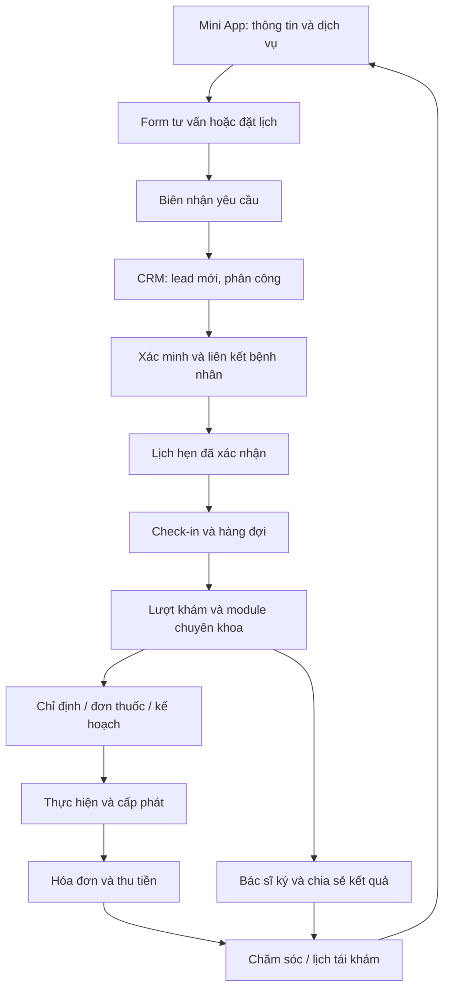
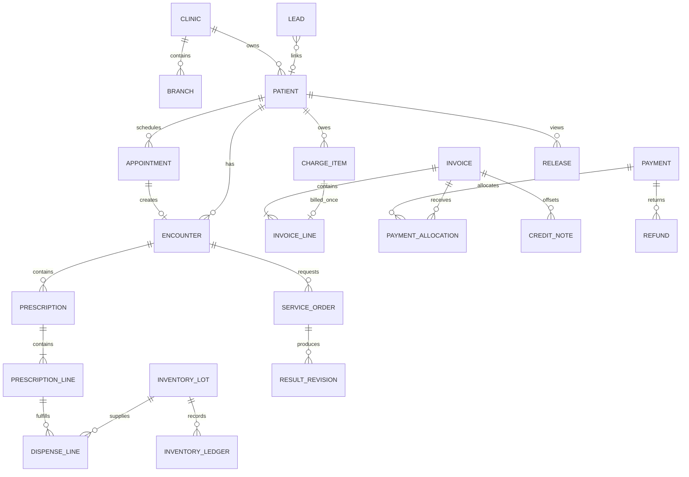

# 01 — Đặc tả Mini App + CRM phòng khám Nha khoa

> Phiên bản: 1.2 • Ngày: 2026-09-21 • Ngôn ngữ UI: tiếng Việt • Tiền tệ: VND • Múi giờ: Asia/Ho_Chi_Minh.
> Đây là đặc tả sản phẩm và phần mềm cho bản demo có backend. Quy tắc chuyên môn, danh mục thuốc, nội dung tư vấn và biểu mẫu ký phải được người phụ trách chuyên môn cấu hình trước khi vận hành thực tế. Không xây tính năng tự chẩn đoán hoặc tự chọn thuốc/liều.

## 1. Mục tiêu, phạm vi và quyết định triển khai

- Xây một hệ thống độc lập cho chuyên khoa trong tiêu đề, gồm Mini App cho bệnh nhân, CRM cho phòng khám và API dùng chung. Người triển khai chỉ cần file này; không phải đọc file chuyên khoa trước.
- Demo phải chạy xuyên suốt: xem dịch vụ → yêu cầu tư vấn/đặt lịch → tiếp nhận → xác minh bệnh nhân → khám → chỉ định/đơn thuốc → thực hiện/cấp phát → thu tiền → chia sẻ kết quả → tái khám. Dữ liệu đổi ở CRM phải xuất hiện trong Mini App sau khi tải lại.
- Ưu tiên Zalo Mini App; có bản web mobile chạy cùng luồng cho demo khi chưa có Mini App ID. Tách adapter danh tính, thông báo, tệp và thanh toán để đổi nhà cung cấp. Không dùng localStorage làm cơ sở dữ liệu nghiệp vụ.
- P0 bắt buộc: tất cả màn hình và luồng mô tả trong tài liệu, lưu DB, phân quyền server, dữ liệu giả, lịch sử thay đổi, báo cáo đối soát và test các invariant. Những phần ghi rõ P1 được phép chưa triển khai, phải có trạng thái “Chưa kết nối” nếu xuất hiện.
- P1: liên thông hệ thống bên ngoài, thanh toán thật, hóa đơn điện tử, chữ ký số có giá trị pháp lý, kết nối LIS/PACS, bảo hiểm, đa ngôn ngữ, ứng dụng native và tự động hóa marketing. Không giả lập thành trạng thái đã kết nối.
- Demo seed một phòng khám/hai chi nhánh để kiểm tra phạm vi; có clinic_id trong schema và fixture clinic thứ hai cho test cách ly. Ba hệ thống không chia sẻ bệnh nhân hoặc session dù có thể tái sử dụng thư viện code.
- Mặc định: lịch 08:00–17:00, nghỉ 12:00–13:00, thứ Hai–thứ Bảy; bước chọn giờ 15 phút; thời lượng theo dịch vụ; hold lịch 5 phút; ngưỡng nhắc việc lead 30 phút trong giờ làm; hủy tự phục vụ trước 2 giờ. Đây là cấu hình demo, không là chính sách bắt buộc cho mọi phòng khám.
- Định nghĩa hoàn tất: luồng chính và nhánh lỗi chạy được bằng thao tác UI, không sửa DB thủ công; không có nút giả thành công; đủ acceptance criteria ở cuối file.

## 2. Persona và phân công công việc

| Persona / role code | Mục tiêu | Quyền công việc chủ yếu |
|---|---|---|
| Khách chưa đăng nhập / guest | Tìm thông tin, hỏi tư vấn | Xem nội dung công khai; gửi form chống spam; không xem hồ sơ |
| Bệnh nhân / patient | Đặt lịch, theo dõi điều trị, xem giấy tờ | Chỉ dữ liệu của mình đã được chia sẻ |
| Người đại diện / guardian | Đặt lịch và theo dõi người được đại diện | Chỉ profile có liên kết đã xác minh, còn hạn và đúng phạm vi |
| Tư vấn / consultant | Xử lý liên hệ, chuyển thành lịch | Lead, ghi chú chăm sóc; không xem toàn bộ bệnh án |
| Lễ tân / receptionist | Xác minh, sắp lịch, check-in | Nhân khẩu học, lịch, hàng đợi; không sửa nội dung khám |
| Bác sĩ / doctor | Khám, lập kế hoạch, ký và chia sẻ | Hồ sơ được phân công; ký đơn/chỉ định trong chuyên môn |
| Điều dưỡng / nurse | Chuẩn bị, nhập đo đạc, hỗ trợ thực hiện | Lượt được phân công; không ký chẩn đoán/đơn thuốc |
| Dược/kho / pharmacist | Duyệt cấp phát và quản lý lô | Đơn đã ký, dị ứng liên quan, kho và phiếu cấp phát |
| Thu ngân / cashier | Thu tiền, đối soát công nợ | Hạng mục tính phí, phiếu thu/hoàn; không đọc ghi chú lâm sàng |
| Quản lý / manager | Điều phối và xem hiệu quả | Báo cáo vận hành; duyệt giảm giá/hoàn tiền; không mặc nhiên xem toàn bộ bệnh án |
| Quản trị / admin | Tài khoản, cấu hình, tích hợp | Quản trị kỹ thuật; không tự động có quyền bác sĩ |
| Kiểm soát / auditor | Kiểm tra truy cập và thay đổi | Audit được cấp; không sửa dữ liệu nghiệp vụ |

## 3. Sitemap và tiêu chuẩn giao diện

### 3.1 Mini App

```text
/mini
  /home                       Trang chủ
  /services                   Danh sách dịch vụ
  /services/:id               Chi tiết dịch vụ
  /doctors                    Bác sĩ
  /doctors/:id                Hồ sơ bác sĩ
  /contact                    Yêu cầu tư vấn
  /booking                    Wizard đặt lịch
  /requests/:id               Biên nhận yêu cầu
  /login                      Đăng nhập / xác minh
  /appointments               Lịch hẹn của tôi
  /appointments/:id           Chi tiết lịch, đổi/hủy
  /profiles                   Bản thân / người được đại diện
  /records                    Lịch sử đã chia sẻ
  /records/:id                Kết quả khám
  /prescriptions/:id          Đơn thuốc đã ký, đã chia sẻ
  /invoices/:id               Chi phí, trạng thái thanh toán
  /notifications              Thông báo
  /privacy                    Đồng ý và quản lý quyền chia sẻ
  /care                       Theo dõi chuyên khoa (mục 9)
```

### 3.2 CRM

```text
/crm
  /login, /dashboard
  /leads, /leads/:id
  /patients, /patients/:id
  /calendar, /appointments/:id, /queue
  /encounters/:id
  /orders, /orders/:id, /results/:id
  /prescriptions, /prescriptions/:id, /dispenses/:id
  /inventory, /inventory/items/:id, /inventory/receipts/new
  /inventory/transfers/:id, /inventory/counts/:id
  /billing, /invoices/:id, /payments, /refunds, /cash-sessions
  /care-tasks
  /reports, /exports
  /settings/catalogs, /settings/schedules, /settings/templates
  /settings/users, /settings/roles, /settings/integrations
  /audit
  + routes chuyên khoa tại mục 9
```

### 3.3 Quy ước UI áp dụng mọi màn hình

- Mini App tối ưu 360–430 px, điều hướng dưới: Trang chủ, Đặt lịch, Hồ sơ, Cá nhân. CRM sidebar 240 px, topbar có chi nhánh/ngày/tìm kiếm; desktop 1280–1440 px, tablet 768 px không mất hành động chính. Từng screen phải kiểm tra tại 375, 768 và 1440 px.
- Nền sáng, primary cấu hình theo thương hiệu; dùng cùng token spacing 4/8/12/16/24/32, font hệ thống, chữ nội dung tối thiểu 14 px, vùng bấm tối thiểu 44 px. Trạng thái có nhãn và biểu tượng, không chỉ dùng màu.
- Bảng: tìm kiếm debounce 300 ms, filter phi nhạy cảm lưu vào URL, từ khóa tên/điện thoại chỉ giữ trong memory theo mục 6.2, phân trang 25 mặc định/100 tối đa, sắp xếp ổn định theo thời gian rồi id. CSV theo đúng bộ lọc và quyền, chống công thức bắt đầu bằng =, +, -, @.
- Mọi màn hình có loading skeleton, empty state kèm CTA phù hợp, lỗi có mã request và thử lại, forbidden không lộ dữ liệu, xung đột phiên bản có tải lại/so sánh. Không bỏ dữ liệu form khi request lỗi.
- Form có nhãn, required, lỗi ngay trường và summary; focus được lỗi bằng bàn phím. Chặn double-submit, có xác nhận riêng cho ký/hủy/hoàn tiền; ghi rõ tác động. Autosave bản nháp khám mỗi 10 giây khi thay đổi, hiển thị lần lưu; chưa lưu phải cảnh báo khi rời trang.
- Thành công chỉ hiển thị sau API commit; cập nhật cache liên quan. Tải lại trang phải giữ trạng thái đã lưu. Khi offline chỉ cho xem cache không nhạy cảm; không queue offline đơn thuốc, thanh toán hoặc hồ sơ y tế.
- Chi tiết hồ sơ luôn hiện mã bệnh nhân, tên, ngày sinh và chi nhánh; thao tác ký/cấp thuốc đối chiếu hai thông tin định danh. Mọi demo có badge “DỮ LIỆU GIẢ LẬP”.

### 3.4 Yêu cầu thẩm mỹ P0 và cách sử dụng ảnh tham khảo

**Thiết kế đẹp, chuyên nghiệp và phù hợp từng phòng khám là tiêu chí nghiệm thu P0, ngang với chức năng.** AI coding agent phải thiết kế có chủ đích cho cả Mini App và CRM. Ba chuyên khoa phải có cách tổ chức nội dung, hình ảnh và thành phần nổi bật khác nhau; thay logo/màu trên cùng một trang chủ chưa đạt yêu cầu. Mỗi khách hàng trong cùng chuyên khoa cũng phải có bộ nhận diện và cấu hình bố cục riêng theo mục 3.7.


Ảnh trên là reference do người dùng cung cấp cho phong cách/bố cục; không phải màn hình đã triển khai hoặc bộ tài nguyên được cấp quyền dùng trong sản phẩm. Agent chỉ nhận file Markdown vẫn có thể triển khai từ các mô tả dưới đây; ảnh giúp đối chiếu trực quan khi có toàn bộ repo.

| Chi tiết quan sát trong ảnh | Yêu cầu chuyển thành thiết kế |
|---|---|
| Màn giới thiệu có ảnh bác sĩ thao tác lớn, tiêu đề ngắn và nút đáy | Tạo điểm nhấn bằng ảnh chất lượng, một thông điệp chính và CTA dễ tìm; ảnh/header điều chỉnh theo chuyên khoa ở mục 3.5 |
| Màn khám phá có lời chào, tìm kiếm, bác sĩ nổi bật và danh mục | Thứ bậc rõ: mục tiêu hiện tại của người dùng trước, nội dung khám phá sau; không dồn nhiều banner/carousel cạnh tranh |
| Màn bác sĩ có chân dung lớn, thông tin ngắn, chọn ngày/giờ | Hồ sơ bác sĩ là một bố cục hoàn chỉnh nối trực tiếp tới đặt lịch; thông tin thực, trạng thái slot đủ rõ |
| Thẻ bo góc, khoảng trống đều, nút tròn và màu xanh đậm trên nền sáng | Dùng hệ radius/spacing/token thống nhất; CTA có tương phản; shadow mỏng, không viền/đổ bóng dày mọi khối |
| Palette ghi trên ảnh: `#053147`, `#061315`, `#EFEFEF` | Đây là gợi ý cho Nha khoa; Da liễu/Đa khoa có palette riêng ở mục 3.5. Màu được gán vai trò semantic, không rải hex tự do trong code |

Chữ/giá/rating trong ảnh chỉ là nội dung minh họa. UI dự án dùng tiếng Việt tự nhiên và VND; không chép tên SmileMate, tên bác sĩ, đánh giá, giá USD hay watermark vào sản phẩm. Số năm kinh nghiệm, chứng chỉ, số bệnh nhân và sao đánh giá chỉ hiện khi có dữ liệu được xác minh; fixture phải gắn nhãn demo. CRM dùng cùng nhận diện với Mini App nhưng ưu tiên đọc bảng và làm việc liên tục.

### 3.5 Hướng thiết kế riêng cho chuyên khoa

**Định hướng: Nha khoa hiện đại, sạch, thân thiện và chính xác.** Gần tinh thần ảnh tham khảo nhất: teal/navy đậm, cyan và nền sáng; chân dung bác sĩ, nụ cười tự nhiên và không gian khám có ánh sáng tốt. Hình ảnh tiếp đón/tư vấn mang cảm giác yên tâm; ảnh thủ thuật cận cảnh chỉ dùng khi có lý do chuyên môn, không làm hero gây sợ.

| Token / vai trò | Giá trị preset Nha khoa A |
|---|---|
| brand.primary / text on-primary | `#053147` / `#FFFFFF` |
| brand.accent / text on-accent | `#55BBEF` / `#053147` |
| background / surface | `#F3F7F8` / `#FFFFFF` |
| text.primary / text.secondary | `#061315` / `#52636B` |
| surface.soft / text on-soft | `#DDF2F6` / `#053147` |
| border.decorative / border.control | `#D8E3E7` / `#73858C` |
| radius.card / radius.hero | `20px` / `28px` |

**Bố cục Mini App Nha khoa:**

- M01 Home: header clinic+chi nhánh → hero khoảng 280–320 px ở bề ngang 375 px, headline “Chăm sóc nụ cười của bạn”, ảnh bác sĩ bên phải/dưới không che chữ → một CTA đặt lịch → lối tắt Khám răng/Niềng răng/Phục hình → bác sĩ nổi bật dạng card ngang → lịch sắp tới khi có → thông tin cơ sở. Hero co theo nội dung, không khóa height làm cắt chữ.
- M03 Service: ảnh/mô tả ngắn ở đầu, phần dịch vụ gồm gì, thời lượng và giá tham khảo rõ, bác sĩ phù hợp và CTA cố định. Không dựng catalog nha khoa như grid bán hàng với nút “Mua ngay”.
- M04 Doctor: portrait 4:5 chiếm khoảng 40% đầu màn, tên và chuyên môn trên vùng nền sạch, 2–3 thông tin đã xác minh → ngày → slot → summary+CTA. Mini App không cho chọn ghế; CRM tự bố trí tài nguyên.
- M06 Booking: card tóm tắt dịch vụ và bác sĩ, strip chọn ngày, slot ba cột nếu còn ≥44 px/ô, hai cột khi hẹp; selected teal đậm, thời gian không khả dụng có nhãn. Cảm giác nhẹ và nhanh như ảnh mẫu, vẫn giữ confirmation requested.
- M17 Care: kế hoạch điều trị với sơ đồ răng chỉ đọc và legend rõ → các giai đoạn dạng timeline → lịch tiếp → dự toán/đã thu; không chỉ hiển thị phần trăm tiến độ chung không biết đang điều trị răng nào.

**Bố cục CRM Nha khoa:** sidebar teal rất đậm với text sáng, workspace trắng/xám xanh; dashboard ưu tiên lịch ghế hôm nay, labo tới hạn và kế hoạch chờ xử lý. D01 chart răng là vùng chính khoảng 60–65% desktop, detail drawer bên phải 35–40% và timeline phiên bản phía dưới; đổi thành tabs stacked trên tablet. D03 plan có nhóm theo giai đoạn/răng, hiển thị rõ item hoàn tất/tiếp theo/chi phí. Calendar dùng cột ghế/bác sĩ với legend; không dùng gradient sau grid. Ảnh bác sĩ nổi bật ở trang công khai, CRM dùng avatar nhỏ để dành chỗ hồ sơ.

**Điểm nhận diện phải nhìn thấy:** hero bác sĩ mang sắc xanh, card dịch vụ gọn, sơ đồ răng có hệ màu+legend riêng, lịch theo ghế và timeline kế hoạch. Màu findings răng là semantic riêng, không tái dùng màu thương hiệu khiến bệnh lý và selected lẫn nhau.

**Brand fixture B cùng chuyên khoa:** nha khoa gia đình có nền `#FFF8F2`, primary `#305C54`/text trắng, shape card 16 px, ảnh gia đình/tiếp đón; home đưa lựa chọn Bản thân/Người thân và nhu cầu chăm sóc lên trước bác sĩ, hero ảnh toàn chiều ngang với caption ngoài ảnh. CRM dùng sidebar sáng và lịch dạng agenda mặc định, vẫn có view ghế; giữ nguyên quyền và logic. Tên/ảnh chỉ fixture minh họa, không tự tạo thương hiệu thật hoặc thông tin bác sĩ.

### 3.6 Hệ thành phần, tương tác và bố cục cần triển khai

- Typography: một font sans có đầy đủ dấu tiếng Việt cho UI; dùng font hệ thống nếu chưa có font thương hiệu được cấp phép. H1 Mini App 28–32/line-height 1.2, section heading 20–24/1.3, body 16/1.5, label/table 14/1.4; CRM page title 24–28. Tối đa ba font-weight chính 400/500/600–700. Dùng tabular numerals cho tiền, tồn và thời gian. Không dùng chữ quá nhỏ như trong ảnh mẫu để nhồi nội dung.
- Grid: Mini App gutter 16–20 px; khoảng giữa section 24–32 px; CTA chính cao 48–52 px, tất cả target ≥44 px. CRM padding 24–32 px, gap 16–24 px; table row 48–56 px, header sticky. Sidebar desktop 240 px; tablet thu thành rail/drawer. Card 16–24 px radius theo palette chuyên khoa; input 12 px; dialog 20–24 px.
- Tương phản mục tiêu: text thông thường ≥4.5:1; text lớn và biên/control cần nhận biết ≥3:1. Kiểm tra cặp màu thực tế ở default/focus/selected/error; pastel là nền, dùng text tối tương ứng. Màu trang trí không dùng để truyền đạt trạng thái duy nhất.
- Component bắt buộc: ClinicHeader, ServiceCard, DoctorCard, DoctorProfileHero, DaySelector, TimeSlotButton, BookingSummary, PrimaryActionBar, PatientIdentityHeader, StatusBadge, MetricCard, FilterBar, DataTable, ClinicalTimeline, ConsentPanel, EmptyState, ErrorState, LoadingSkeleton. Có variant cho chuyên khoa/clinic thay vì copy cùng bố cục rồi đổi màu.
- DoctorCard: portrait cố định tỉ lệ 4:5 hoặc avatar phù hợp layout, tên tối đa hai dòng, chuyên môn, chi nhánh, slot gần nhất, CTA. Ảnh thiếu dùng initials/illustration trung tính có kích thước ổn định; không ảnh vỡ hoặc dùng ảnh stock như bác sĩ thật. Loading không làm nhảy layout.
- Booking: ngày hiển thị thứ+ngày, `selected` nền brand/text on-brand, `available` viền rõ, `unavailable` có nhãn/trạng thái disabled; slot cuối vừa bị đặt phải cập nhật. Summary rõ bác sĩ/dịch vụ/địa điểm/ngày giờ/giá tham khảo trước submit; “Gửi yêu cầu đặt lịch” cho requested, chỉ dùng “Lịch đã xác nhận” sau confirm.
- Thanh CTA đáy và bottom navigation có text label, vùng safe area do host cung cấp; không vẽ thanh status hoặc viền iPhone vào ứng dụng. Ở booking/detail có sticky CTA thì bố trí dưới nội dung và chừa padding đúng chiều cao, không chồng lên navigation/keyboard hoặc che dòng cuối. Trang chủ hữu ích ngay, màn welcome toàn ảnh nếu dùng phải skip được và chỉ hiện lần đầu.
- CRM table ưu tiên scan: mã/tên trái, tiền phải, status+label giữa cột riêng, action menu gọn; bulk action chỉ xuất hiện khi có selection. Patient header cố định khi cuộn, cảnh báo dị ứng và quyền chia sẻ luôn đọc được. Clinical workspace ưu tiên khoảng viết/read hơn card KPI trang trí.
- Chart/report dùng đúng câu hỏi vận hành; nhãn đơn vị/ngày rõ, legend đọc được, hover có số liệu và bảng tương đương. Không thêm biểu đồ giả/đường tăng trưởng chỉ để lấp chỗ trống. Khi chưa có dữ liệu, empty state có lời giải thích và CTA thực.
- Icon một họ nét thống nhất, stroke khoảng 1.5–2 px ở size 20–24; không trộn emoji, icon 3D và icon outline cho tác vụ. Motion 150–220 ms cho hover/focus/drawer, tôn trọng reduced-motion; không parallax/animation lặp trong quy trình khám.
- Assets: chọn ảnh giới thiệu đúng chuyên khoa, ánh sáng nhất quán, chất lượng đủ cho màn đích, crop không cắt mặt hoặc thao tác chính; alt text có nghĩa. Dùng tài sản người dùng có quyền hoặc hình minh họa được cấp phép; ghi nguồn/quyền sử dụng trong asset manifest. Ảnh bệnh án là nội dung riêng tư, không dùng cho hero/gallery marketing. Demo ưu tiên illustration/portrait placeholder có nhãn; không giả danh bác sĩ thật.
- UI copy cụ thể, chuyên nghiệp: “Đặt lịch khám”, “Xem kế hoạch điều trị”, “Tiếp nhận liên hệ”, “Lưu bản nháp”, “Ký và khóa nội dung”; thông báo lỗi nói rõ hành động có thể làm. Không dùng cam kết điều trị, số liệu tiếp thị hoặc lời giới thiệu chưa được phòng khám duyệt.

### 3.7 Mỗi phòng khám có bộ nhận diện riêng

Tạo `ClinicBrandProfile` riêng cho mỗi phòng khám, tách khỏi dữ liệu bệnh án: `clinic_id`, `brand_name`, `logo_asset_id`, `specialty_preset`, `palette`, `typography`, `shape_preset`, `imagery_style`, `tone_of_voice`, `home_sections[]`, `doctor_card_variant`, `booking_layout_variant`, `crm_density`, `approved_asset_manifest`, `version`, `status=draft/published`. Schema validate key/token và whitelist component; không cho nhập arbitrary HTML/JS/CSS qua cấu hình. Thay brand không thay permission, billing hay workflow.

1. Trước khi code màn chính, agent tạo `docs/DESIGN-BRIEF.md` cho clinic: khách hàng mục tiêu, cảm giác muốn truyền tải, thông tin nhận diện hiện có, màu/font/hình ảnh, bố cục Mini App/CRM và lý do chọn. Có thương hiệu sẵn thì tôn trọng; chưa có dùng preset trong file này, ghi “Thương hiệu demo”, tiếp tục làm việc mà không chặn tiến độ để hỏi lại.
2. Sinh `packages/ui/themes/<clinic-slug>/tokens.json` và theme mapping typed; tách semantic tokens brand/background/text/border/status, layout variants và content order. Theme published phải có phiên bản để rollback, không sửa raw database hay source mỗi lần đổi màu/logo.
3. Mỗi clinic khác trong cùng chuyên khoa phải khác có chủ đích ở ít nhất ba chiều, **trong đó ít nhất một chiều là bố cục hoặc thứ tự nội dung**: typography/shape, palette, hướng ảnh, hero composition, hierarchy dịch vụ/bác sĩ, treatment/booking entry, giọng văn. Không thay đổi vị trí hành động nguy hiểm tùy tiện để tạo khác biệt.
4. Tạo thêm một brand fixture B cùng chuyên khoa để kiểm chứng khả năng tùy biến (chỉ cấu hình design, không tạo thêm hệ thống backend ngoài phạm vi). Render home, doctor detail/booking và CRM dashboard với hai brand fixture trên cùng dữ liệu synthetic đã được phép; cung cấp ảnh đối chiếu. Chuyển fixture qua cơ chế preview chỉ có ở demo/design lab, không thêm bộ chọn clinic tùy ý vào app bệnh nhân.
5. Chi nhánh của cùng phòng khám thừa kế nhận diện clinic, chỉ đổi địa chỉ/giờ/đội ngũ theo config. Một phòng khám mới dùng profile mới; không reuse ảnh/logo/tên bệnh nhân/clinical files của clinic khác. Asset manifest phân biệt tài sản brand có thể công khai với ảnh lâm sàng private.
6. Nếu triển khai nhiều chuyên khoa, đối chiếu ba sản phẩm trên cùng kích thước: phải phân biệt được nhờ composition và nội dung đặc trưng cả khi ẩn logo; không chỉ dựa màu. Layout variants dùng component có sẵn và policy server như nhau, không nhân bản toàn bộ domain logic.

### 3.8 Nghiệm thu thiết kế và bằng chứng bàn giao

Design P0 phải có bản render thực tế từ app, không chỉ moodboard hoặc mô tả. Agent tự hoàn thiện mockup/prototype và rà soát trước khi đánh dấu màn hình hoàn tất; không mặc định mọi màn cần người dùng duyệt rồi mới làm tiếp.

| ID | Điều kiện kiểm tra | Kết quả phải đạt |
|---|---|---|
| DESIGN-AC01 | So home, bác sĩ/booking và CRM với brief mục 3.5 | Thứ bậc/ảnh/card/CTA đúng hướng chuyên khoa; các khác biệt bố cục xuất hiện trong app thực |
| DESIGN-AC02 | Render clinic fixture A và B khi tạm ẩn logo | Khác ít nhất ba chiều mục 3.7, có một chiều composition/content order; không chỉ đổi primary color |
| DESIGN-AC03 | Home/booking/profile có ảnh | Ảnh đúng chủ đề, crop không mất mặt, fallback ổn định, không tên/rating/brand sao chép từ reference; có asset manifest |
| DESIGN-AC04 | Kiểm tra typography/token trên Mini App và CRM | Cùng nhận diện, hierarchy rõ, tiền/số ngay hàng, dấu tiếng Việt đầy đủ; thành phần dùng theme tokens |
| DESIGN-AC05 | Đo màu và dùng keyboard trên form/slot/table/dialog | Cặp màu đạt mục tiêu tương phản; focus nhìn rõ, target ≥44 px; state có text/icon, không chỉ màu |
| DESIGN-AC06 | Chụp 375×812, 768×1024 và 1440×900; kiểm thêm bề ngang 360/430 | Không overflow toàn trang, cắt chữ hay che CTA; bảng rộng scroll trong vùng; safe area/keyboard không che trường nhập |
| DESIGN-AC07 | Tên dài, lịch kín, bảng 0/1/100 hàng, ảnh thiếu, API chậm/lỗi, trạng thái cấm | Vẫn gọn và đọc được; loading/empty/error/forbidden đầy đủ; không dùng nội dung bịa để lấp vùng trống |
| DESIGN-AC08 | Review màn chuyên khoa | Có bố cục chủ đạo của chuyên khoa ở mục 3.5: chart răng, workspace ảnh/liệu trình hoặc visit nhiều khoa; không thay tất cả bằng bảng CRUD giống nhau |
| DESIGN-AC09 | Thao tác booking/thu tiền/ký qua các view | CTA nói đúng trạng thái/ý nghĩa; phân cấp một primary/nhóm tác vụ, nguy hiểm tách rõ; không bỏ bước consent/guard để làm giao diện đơn giản hơn |
| DESIGN-AC10 | Kiểm tra gói bàn giao thiết kế | Có DESIGN-BRIEF.md, token/themes, component gallery, asset manifest, ảnh QA, ghi nhận vấn đề và kết quả sửa; không chỉ chụp app trong khung điện thoại |

Chấm chất lượng tối đa 100: phù hợp chuyên khoa/clinic 25; bố cục và hierarchy 25; chữ/màu/hình ảnh 20; trải nghiệm Mini App/CRM 20; độ hoàn thiện các trạng thái 10. Ngưỡng nghiệm thu đề xuất ≥85/100 và **tất cả DESIGN-AC pass**; không cho điểm cao bù lỗi chặn như cắt CTA, tương phản kém, ảnh thiếu quyền hoặc bỏ qua consent. Agent ghi bằng chứng và lý do chấm trong `docs/DESIGN-QA.md`; điểm tự chấm là công cụ review, không được tự nhận người dùng đã phê duyệt.

Bàn giao thêm `docs/design/screenshots/` (home, service/doctor, booking, patient, specialty workspace, CRM dashboard, calendar, billing), `docs/design/component-gallery/` hoặc route `/design-lab` chỉ demo, và `docs/design/asset-manifest.md`. Ưu tiên ảnh màn hình thật ở kích thước tự nhiên; mockup có khung điện thoại chỉ là ảnh trình bày bổ sung. Những yêu cầu này là đầu ra cho coding agent sau khi triển khai, không phải tuyên bố bộ đặc tả hiện đã có giao diện chạy được.

## 4. End-to-end flow và quy tắc liên kết



1. Guest đọc thông tin, gửi nhu cầu hoặc chọn dịch vụ/bác sĩ/giờ. Server nhận form với idempotency key, tạo Lead và (nếu đặt lịch) Appointment `requested`; biên nhận ghi “Đã nhận yêu cầu, đang chờ phòng khám xác nhận”. Không gọi đây là lịch đã xác nhận.
2. Consultant tiếp nhận, phân loại, ghi note có tác giả/thời gian và due_at, liên hệ. Việc gọi/chat ngoài hệ thống do nhân viên thực hiện; demo chỉ ghi kết quả liên hệ, không tự gửi tin thật.
3. Lễ tân tìm hồ sơ tương tự bằng tên/ngày sinh/điện thoại. Cùng số điện thoại chỉ gợi ý trùng, không tự gộp: trẻ em/người thân có thể dùng số của đại diện. Xác minh đúng đối tượng trước khi liên kết patient_id.
4. Confirm lịch yêu cầu khóa slot tài nguyên và gắn patient_id. Không có slot thì giữ `requested`, mời giờ khác. Walk-in cho phép lễ tân tạo bệnh nhân và appointment `confirmed` ở giờ hiện tại sau kiểm tra tài nguyên, rồi check-in.
5. Check-in tạo một Encounter và QueueTicket trong cùng transaction; retry không nhân đôi. Queue được xếp theo giờ/check-in và priority do nhân viên có quyền đặt, có lý do; không tự suy luận cấp cứu từ form.
6. Bác sĩ mở lượt, xem dị ứng/tiền sử, nhập khám và module chuyên khoa. Chẩn đoán, chỉ định và đơn thuốc đều do bác sĩ nhập/xác nhận. Hoàn tất thao tác chuyên khoa theo mục 9.
7. Chỉ định đã ký đi tới bộ phận thực hiện; đơn thuốc đã ký tới dược. Kết quả kỹ thuật viên nhập phải được người có quyền xác nhận; chia sẻ sang bệnh nhân là một hành động riêng.
8. Chi phí phát sinh thành ChargeItem đúng một lần. Thu ngân lập hóa đơn từ charge, nhận đặt cọc/thanh toán và cấp phiếu. Có thể thu trước dịch vụ theo cấu hình; tài chính không tự đóng lượt khám.
9. Ký lượt chỉ khi đủ trường bắt buộc, chỉ định còn mở đã được giải quyết hoặc có lý do chuyển follow-up; nội dung đã ký bất biến. Bác sĩ chia sẻ bản tóm tắt, đơn/kết quả được chọn, không chia sẻ ghi chú nội bộ.
10. Tạo FollowUpTask, gửi nhắc lịch qua mock adapter hoặc nhà cung cấp đã cấu hình. Bệnh nhân được mở hồ sơ của mình và đặt lịch tiếp theo; tái khám tạo Encounter mới, không ghi đè lần trước.

Nhánh lỗi phải có: từ chối quyền lấy số điện thoại → nhập tay và xác minh; gửi trùng → trả cùng biên nhận; không liên hệ được → chờ phản hồi với hẹn gọi lại; đổi lịch → đặt giờ mới atomically; không đến → no_show; bác sĩ nghỉ → phân công lại; thiếu thuốc → cấp một phần/backorder; hủy dịch vụ → credit/hoàn theo thực thu; kết quả chậm → task người chịu trách nhiệm.

## 5. Đặc tả từng màn hình Mini App

Ký hiệu `*` là bắt buộc; mọi ID lấy từ API, không cho người dùng sửa clinic_id/patient_id trong form.

| ID / route | Thành phần, dữ liệu | Hành động / điều kiện và kết quả |
|---|---|---|
| M01 `/home` | Tên/logo, chi nhánh, giờ làm, banner, dịch vụ và bác sĩ nổi bật, hotline | CTA đặt lịch/tư vấn; chi nhánh đổi danh mục và slot; không yêu cầu login để đọc |
| M02 `/services` | Tìm kiếm; category, duration_minutes, giá tham khảo, có/không nhận lịch | Filter không có kết quả có CTA xóa lọc; chỉ hiển thị dịch vụ active và publish=true |
| M03 `/services/:id` | Tên, mô tả, chuẩn bị do phòng khám duyệt, thời lượng, giá/đơn vị, bác sĩ | Đặt lịch mang service_id sang wizard; giá ghi tham khảo, hóa đơn dùng snapshot thực tế |
| M04 `/doctors` và `/:id` | Ảnh, tên, chuyên môn, giới thiệu, chi nhánh, lịch còn trống | Chọn bác sĩ chuyển wizard; không hiện lịch cá nhân/block reason nội bộ |
| M05 `/contact` | Họ tên* 2–120 ký tự, điện thoại*, nhu cầu* ≤2000, dịch vụ?, chi nhánh*, khung liên hệ?, consent_version* | Chống spam theo thiết bị/IP, không bắt chọn đồng ý marketing; chỉ gửi thành công một lần; trả biên nhận opaque |
| M06 `/booking` | Bước 1 profile*/dịch vụ*/chi nhánh*; 2 bác sĩ hoặc bất kỳ, ngày*/slot*; 3 nhu cầu, điện thoại*, đồng ý*; 4 kiểm tra | Yêu cầu đăng nhập khi đặt cho profile; hold 5 phút; hết hold cần chọn lại. Requested chưa giữ slot sau khi gửi; confirm phải recheck; trình bày rõ “Yêu cầu giờ hẹn” |
| M07 `/requests/:id` | Mã biên nhận, thời điểm, loại yêu cầu và trạng thái an toàn | Guest chỉ xem qua receipt token ngắn hạn, không lộ hồ sơ; “Chờ xác nhận” và hotline; login để theo dõi chi tiết |
| M08 `/login` | Zalo identity adapter hoặc OTP demo, thông báo sử dụng dữ liệu | Server xác thực token nhà cung cấp; OTP mock chỉ ở demo; từ chối quyền điện thoại vẫn nhập tay; không tìm hồ sơ công khai bằng số |
| M09 `/appointments` | Tabs sắp tới/đã qua, thời gian, bác sĩ, chi nhánh, trạng thái | Chỉ các profile được phép; mở chi tiết, không truy cập qua mã lịch đoán được |
| M10 `/appointments/:id` | Mã check-in opaque, lịch, hướng dẫn, trạng thái; lý do hủy? | Confirmed và còn ≥2h được hủy/đổi; requested được rút yêu cầu. Muộn hơn tạo task liên hệ; đổi lịch thành công mới giải phóng slot cũ |
| M11 `/profiles` | Tên*, ngày sinh*, giới tính tùy chọn, số đã xác minh, đại diện và quan hệ | Thêm đại diện gửi yêu cầu duyệt; không cấp quyền chỉ vì nhập cùng số. Thay đổi tên/ngày sinh đã xác minh tạo yêu cầu lễ tân duyệt |
| M12 `/records` và `/:id` | Timeline những phiên bản đã signed+released: ngày, bác sĩ, tóm tắt, kết quả được chọn | Xem/tải bản đã chia sẻ; không hiện nháp, note CRM, chi phí nội bộ. Thu hồi share làm URL mới thất bại; không hứa xóa bản đã tải |
| M13 `/prescriptions/:id` | Mã đơn, bác sĩ, ngày ký, từng dòng thuốc, cách dùng do bác sĩ nhập, trạng thái cấp phát | Chỉ đọc; đơn void hiện banner “Đã hủy”; không tự mua lại/tái cấp hoặc tự đổi liều |
| M14 `/invoices/:id` | Các dòng dịch vụ/thuốc, giảm giá, tổng, đã thu, còn nợ, phiếu thu/hoàn | Demo thanh toán có nhãn giả lập và mã giao dịch; không dùng return URL làm bằng chứng đã trả tiền |
| M15 `/notifications` | Loại, created_at, read_at, link nội bộ an toàn | Đánh dấu đọc, mở entity theo quyền hiện tại; push không chứa chẩn đoán/ảnh/đơn |
| M16 `/privacy` | Consent hiện tại/lịch sử, mục đích chăm sóc, liên hệ, ảnh và marketing độc lập | Thu hồi từng phạm vi áp dụng cho xử lý/chia sẻ tương lai; tạo yêu cầu dữ liệu/xóa để quản lý xử lý theo chính sách; không tự xóa hồ sơ đã ký |
| M17 `/care` | Nội dung chuyên khoa đã được chia sẻ, tiến độ, lịch kế tiếp | Hành động đặc thù ở mục 9; dữ liệu chỉ đọc trừ feedback/form được chỉ rõ |

## 6. Đặc tả chức năng và thiết kế trang quản trị

| ID / route | Dữ liệu và bố cục | Hành động / điều kiện |
|---|---|---|
| C01 `/login` | Email, mật khẩu/SSO adapter, chi nhánh được cấp | Rate limit; session có expiry; logout thu hồi; account inactive không vào được |
| C02 `/dashboard` | KPI, lịch hôm nay, lead chậm, kết quả chờ, tồn thấp; theo role | Card mở danh sách với cùng filter; định nghĩa số liệu mục 13 |
| C03 `/leads` | Bảng và Kanban: mã, tên, số mask, nguồn, nhu cầu, owner, status, due_at | Tìm kiếm, assign, đổi trạng thái hợp lệ; bulk assign tối đa 100 theo quyền; không bulk gửi tin |
| C04 `/leads/:id` | Liên hệ, attribution, timeline notes/calls/status, hồ sơ gợi ý trùng | Nhận xử lý, thêm note, follow-up, tạo/link bệnh nhân, đặt lịch, đóng lost với lý do; note lâm sàng không đặt ở đây |
| C05 `/patients` | Mã, tên, ngày sinh, phone mask, lần khám cuối, lịch tới | Tạo hồ sơ, xem cảnh báo trùng, export có quyền. Merge cần quyền riêng, xem trước quan hệ, chọn survivor và audit; không hard delete |
| C06 `/patients/:id` | Header định danh/dị ứng; tabs Tổng quan, Thông tin, Tiền sử, Lượt khám, Chuyên khoa, Đơn, Lịch, Tệp, Chi phí, Đồng ý | Mỗi tab kiểm tra quyền ở API; timeline newest first; addendum cho dữ liệu signed; quản lý liên kết đại diện có xác minh |
| C07 `/calendar` | Ngày/tuần, cột bác sĩ/phòng/tài nguyên; block nghỉ; filter dịch vụ | Tạo, kéo đổi giờ mở dialog xác nhận; check xung đột server; màu+nhãn status; không override double booking |
| C08 `/appointments/:id` | Thông tin lịch, profile, nhu cầu, hold/request, lịch sử đổi, nhắc hẹn | Confirm, check-in, reschedule, cancel, no-show đúng state; 409 giữ form; hủy phải có reason |
| C09 `/queue` | Mã lượt, giờ hẹn/đến, phòng, người phụ trách, priority, thời gian chờ | Gọi lượt, nhận khám, chuyển phòng với reason; bảng công khai chỉ mã không ghi triệu chứng/tên đầy đủ |
| C10 `/encounters/:id` | Header cảnh báo, tab SOAP/biểu mẫu chuyên khoa, chẩn đoán, chỉ định, đơn, charge, kết luận | Autosave draft; gán người phụ trách; sign kiểm tra required; complete và release tách biệt; amendment giữ bản cũ |
| C11 `/orders` và `/:id` | Hàng đợi theo loại, patient, encounter, yêu cầu, bộ phận, priority, due_at | Bác sĩ đặt/ký/hủy trước hoàn tất; bộ phận nhận/thực hiện; hủy sau thu tiền tạo yêu cầu credit; không tự refund |
| C12 `/results/:id` | Phiếu chỉ định, số đo/text/file, đơn vị, cờ bất thường do người nhập, người xác nhận | Save draft, submit review, verify, amend; release theo quyền bác sĩ; tệp chưa kiểm tra chưa cho tải |
| C13 `/prescriptions` và `/:id` | Tìm đơn theo ngày/status; form bệnh nhân/lượt, thuốc, dạng, liều, đường, tần suất, ngày dùng, SL | Bác sĩ ký; thuốc demo tách danh mục; hiển thị dị ứng và xác nhận review; void có lý do; không sửa đơn signed |
| C14 `/dispenses/:id` | Đơn signed, lượng đã cấp/còn lại, lô FEFO gợi ý, số lượng, kho | Dược xác nhận cấp theo lô; thiếu thì partial; xuất kho và tạo charge atomically; in phiếu; trả về khu cách ly |
| C15 `/inventory` và `/items/:id` | SKU, thuốc/vật tư, đơn vị cơ sở, tồn/đặt giữ/khả dụng, lô, hạn dùng, lịch sử | Catalog create/edit quyền riêng; không sửa tồn trực tiếp; ngừng dùng SKU vẫn giữ lịch sử |
| C16 `/inventory/receipts/new` | Kho*, nhà cung cấp*, mã chứng từ*, ngày*, dòng SKU*/lô*/SL*/đơn giá*, expiry theo loại | Save draft; post bắt buộc lô cho thuốc; cộng tồn một lần; chứng từ trùng cảnh báo; void sau post bằng reversal |
| C17 `/inventory/transfers/:id` | Kho đi/đến*, dòng và lô*, số lượng*, trạng thái | Draft → shipped → received; shipped vào in_transit, chưa khả dụng tại kho đến; hủy trước ship; chênh lệch nhận thành case |
| C18 `/inventory/counts/:id` | Kho, snapshot tồn, lượng đếm, chênh lệch, lý do | Khóa phạm vi lô trong lúc post count; manager duyệt chênh lệch; ghi adjustment ledger, không overwrite |
| C19 `/billing` và `/invoices/:id` | Charge chưa lập hóa đơn, snapshot giá, giảm/thuế, tổng, paid, credit, due | Draft → issue; chọn charge không trùng; discount cần đúng quyền; phiếu issued sửa bằng credit, không sửa dòng gốc |
| C20 `/payments`, `/refunds` | Phiếu thu, invoice, phương thức, amount, provider_ref, người thu, thời gian | Thu một phần; refund không quá eligible; manager approve, cashier execute; retry idempotent; trạng thái pending không tính thực thu |
| C21 `/cash-sessions` | Đầu ca, thu/hoàn tiền mặt, tồn kỳ vọng, kiểm đếm cuối, chênh lệch | Open/close một ca/người/quầy; đóng cần reason nếu lệch; không tính chuyển khoản vào quỹ tiền mặt |
| C22 `/care-tasks` | Loại, bệnh nhân/lead, owner*, due_at*, priority, status, kết quả | Open → in_progress → done/cancelled; quá hạn là cờ tính từ giờ; xử lý lỗi thông báo, tái khám, kết quả chậm |
| C23 `/reports`, `/exports` | Date range*, branch, doctor, service; summary và drilldown | Export async tối đa 100k hàng/job, link hết hạn; audit; role chỉ thấy cột được phép |
| C24 `/settings/catalogs` | Dịch vụ, SKU, bộ phận, tài nguyên, bảng giá có hiệu lực | Version danh mục; archive giữ FK; chặn duration ≤0 và giá âm |
| C25 `/settings/schedules` | Ca, nghỉ, bác sĩ–dịch vụ, phòng–dịch vụ, hiệu lực | Preview lịch bị ảnh hưởng; sửa ca không tự hủy lịch; tạo task xử lý lịch xung đột |
| C26 `/settings/templates` | Form schema version, trường bắt buộc, văn bản đồng ý, hướng dẫn | Draft/published/retired; lượt mới dùng version mới, lượt cũ giữ snapshot; không nhúng JS tùy ý |
| C27 `/settings/users`, `/roles` | User, role, branch scope, care-team scope, active | Quyền riêng để cấp vai trò; không tự nâng quyền; revoke session khi khóa tài khoản |
| C28 `/settings/integrations` | Provider, mode mock/live, trạng thái kết nối, outbox lỗi | Secret chỉ nhập, không trả về UI/log; test kết nối không gửi thông báo bệnh nhân; retry có dedupe |
| C29 `/audit` | Actor, action, entity, time, outcome, request_id; metadata đã lọc | Read only, filter và export theo quyền; không có nút xóa/sửa audit |

### 6.1 Phạm vi trang quản trị và cấu trúc điều hướng

“Trang quản trị” trong tài liệu này là **toàn bộ hệ web dành cho nhân viên phòng khám**: vận hành CRM, khám chữa bệnh, kho, thu ngân, báo cáo, quản lý nội dung Mini App và cấu hình. Admin là một vai trò trong hệ, không phải tài khoản mặc nhiên được làm tất cả việc. Giao diện phải thay đổi theo quyền và phạm vi chi nhánh; bác sĩ vào workspace khám, lễ tân vào lịch/tiếp nhận, thu ngân vào thu tiền, quản lý vào dashboard. Không xây một trang dashboard tĩnh rồi coi phần quản trị đã hoàn tất.

Nhóm sidebar và route chính:

| Nhóm | Mục trong menu | Người sử dụng chủ yếu |
|---|---|---|
| Tổng quan | Dashboard, Việc của tôi | Tất cả staff theo widget/assignment được phép |
| Tiếp nhận | Liên hệ, Bệnh nhân, Lịch hẹn, Hàng đợi | Tư vấn, lễ tân, bác sĩ |
| Chuyên môn | Lượt khám, module chuyên khoa mục 6.5, Chỉ định, Kết quả, Đơn thuốc | Bác sĩ, điều dưỡng, kỹ thuật viên theo quyền |
| Dược & kho | Cấp phát, Tồn kho, Nhập kho, Chuyển kho, Kiểm kê | Dược/kho, quản lý được cấp |
| Tài chính | Hóa đơn, Thanh toán, Hoàn tiền, Ca thu ngân | Thu ngân, quản lý, auditor |
| Chăm sóc | Công việc, Mẫu thông báo, Nhật ký gửi | Nhân viên chăm sóc và người được phân công |
| Báo cáo | Vận hành, Tài chính, Kho, Chuyên khoa, Tệp xuất | Theo quyền báo cáo và quyền từng cột |
| Mini App | Trang chủ & nội dung, Dịch vụ công khai, Bác sĩ công khai, Thư viện media, Nhận diện | Quản lý/nội dung được cấp quyền; không xem bệnh án qua CMS |
| Cấu hình | Phòng khám/chi nhánh, Danh mục, Lịch làm việc, Biểu mẫu, Nhân sự & quyền, Tích hợp | Manager/admin theo permission riêng |
| Kiểm soát | Nhật ký hoạt động | Auditor/người được cấp phạm vi audit |

Bổ sung vào sitemap dưới `/crm`: `/encounters` (danh sách cho C10), `/dispenses` (hàng đợi cho C14), `/inventory/receipts`, `/inventory/transfers`, `/inventory/counts` (danh sách cho C16–C18), `/settings/clinic`, `/content/pages`, `/content/services`, `/content/doctors`, `/content/media`, `/settings/branding`, `/notifications/templates`, `/notifications/delivery`. Route list/detail dùng cùng permission với entity. Menu không có quyền được ẩn; truy cập URL trực tiếp vẫn kiểm ở server. Các chức năng P1 hiện “Chưa kết nối” đúng ngữ cảnh và không đẩy vào menu chính gây cảm giác đã hoạt động.

### 6.2 Khung thiết kế quản trị và dashboard theo vai trò

#### Khung desktop và responsive

```text
┌───────────────────────┬────────────────────────────────────────────────────┐
│ Logo + tên clinic     │ Chi nhánh · ngày · tìm kiếm · việc của tôi · avatar│
│                       ├────────────────────────────────────────────────────┤
│ Nhóm menu             │ Breadcrumb                                        │
│ Mục đang chọn         │ Tiêu đề + mô tả ngắn           [CTA chính]        │
│ Nhãn số việc cần làm  │ Tabs / bộ lọc / tìm kiếm theo trang                │
│                       ├────────────────────────────┬───────────────────────┤
│                       │ Vùng dữ liệu chính         │ Chi tiết / task       │
│                       │ Bảng, lịch hoặc workspace  │ Chỉ mở khi cần        │
│                       ├────────────────────────────┴───────────────────────┤
│ Hồ sơ / đăng xuất     │ Phân trang hoặc trạng thái lưu                    │
└───────────────────────┴────────────────────────────────────────────────────┘
```

- Desktop ≥1280 px: sidebar 240 px, topbar 64 px, content padding 24 px, khoảng khối 24 px. Inspector đơn giản rộng 360–420 px; form nhiều dòng tiền/thuốc hoặc nhiều cột dùng full page. Drawer không ép vùng chính dưới 640 px: khi không đủ chuyển sheet phủ hoặc route detail. Không mở modal nằm trong modal.
- 1024–1279 px: sidebar 72 px có tooltip/label khi mở; bảng ưu tiên các cột chính, cột ít dùng đưa vào detail. 768–1023 px: menu drawer, filter sheet, detail full page. <768 px: tối ưu xem lịch, liên hệ, task và detail cơ bản; biểu mẫu quản trị vẫn truy cập được bằng section xếp dọc, grid răng/ảnh/table phức tạp có vùng cuộn riêng và hướng dẫn mở rộng, không để toàn trang tràn ngang.
- Topbar chỉ cho chọn chi nhánh được cấp. Đổi chi nhánh phải cảnh báo bản nháp chưa lưu, cập nhật query/cache có branch scope; không giữ selection bệnh nhân/chứng từ cũ để thao tác nhầm. “Tất cả chi nhánh” chỉ dùng màn aggregate có quyền; tạo/sửa luôn chỉ rõ một branch.
- Tìm kiếm toàn cục nhóm Bệnh nhân/Lịch/Chứng từ trong phạm vi quyền; chỉ trả metadata tối thiểu, không tìm nội dung bệnh án/ảnh qua ô này. Từ khóa có tên/số điện thoại chỉ lưu trong memory; không đưa vào localStorage, analytics hoặc URL share. URL chỉ lưu filter phi nhạy cảm như status/date/branch/sort. Dùng `POST /search` để từ khóa không vào query-string log; hạ tầng vẫn redact body.
- Sidebar badge là số việc cần xử lý thực, không phải số record toàn hệ. Header avatar cho xem role/scope hiện tại, đổi mật khẩu qua auth provider được cấu hình, đăng xuất; không có nút tự đổi vai trò ngoài demo role login đã tách tài khoản.
- Page header: breadcrumb, tên trang, mô tả một dòng khi cần, một CTA chính và tối đa hai secondary action. Table screen có thanh filter riêng; trạng thái filter active và nút xóa lọc luôn thấy. Footer bảng hiển thị “1–25 / N”, page size, previous/next; selection không tự kéo sang trang khác.
- Sort/filter tại server; lựa chọn cột và density lưu preference UI không nhạy cảm theo user+clinic; không lưu row data. Sticky header, align-right tiền/số, ngày giờ cùng format. Empty view có hướng dẫn tạo đầu tiên; error từng widget không làm trống dashboard còn lại. Lỗi API trong form giữ dữ liệu và đưa focus tới lỗi.
- Thiết kế dashboard gọn: tối đa 4 KPI trên một hàng desktop, mỗi card số chính + đơn vị + kỳ so sánh rõ, không sparkline giả. Dưới là vùng vận hành 8/12 và task 4/12; chart tối đa hai biểu đồ có câu hỏi cụ thể. Tablet 2 card/hàng, mobile 1–2 theo nội dung; chữ không bị thu nhỏ để cố nhét bốn card.

#### Dashboard và CTA theo vai trò

| Vai trò | Nội dung ưu tiên từ trên xuống | CTA/drilldown chính |
|---|---|---|
| Consultant | Lead chưa nhận/đến hạn, lead chờ phản hồi, lịch đã chuyển đổi | Nhận liên hệ → C04; tạo task; đặt lịch |
| Receptionist | Lịch hôm nay theo status, bệnh nhân chờ, slot trống, lịch cần bố trí lại | Tạo lịch, Check-in; mở calendar/queue giữ filter ngày/branch |
| Doctor | Các lượt được giao, chờ kết quả/chờ ký, lịch tới, module chuyên khoa | Nhận khám/Mở hồ sơ/Ký sau review; không một nút ký hàng loạt |
| Nurse/technician | Hàng đợi thực hiện, checklist còn thiếu, kết quả cần bổ sung | Nhận việc, nhập đo đạc/kết quả; không CTA kê đơn |
| Pharmacist | Đơn chưa cấp đủ, lô sắp hết hạn, tồn thấp, chứng từ nháp | Cấp phát/Mở phiếu nhập/kiểm tra lô |
| Cashier | Hóa đơn cần thu, khoản chờ đối soát, hoàn đã duyệt, ca đang mở | Thu tiền/Mở invoice/Đóng ca |
| Manager | Lịch và hiệu suất, thực thu/công nợ, task chậm, KPI chuyên khoa | Drilldown tổng hợp; phê duyệt đúng permission, không mở toàn bệnh án |
| Admin | Tài khoản bị khóa, cấu hình chưa hoàn thiện, trạng thái tích hợp, publish nội dung lỗi | Quản lý người dùng/tích hợp/cấu hình; không KPI bệnh án mặc định |
| Auditor | Sự kiện trong scope, thay đổi quyền, chứng từ bù/đảo, export audit | Mở timeline đã lọc, xem liên kết bằng chứng được phép |

Widget thiếu quyền không render và API không trả số bị ẩn. Bảng điều khiển quản lý không tự suy rằng admin được xem tiền/bệnh án. “Số liệu cập nhật lúc …” hiện theo timezone branch; refresh chỉ invalidates queries hợp lệ. Formula và định nghĩa cohort dùng mục 13, không tạo công thức khác cho dashboard đẹp hơn.

### 6.3 Đặc tả thao tác và thiết kế chi tiết C01–C29

Bảng mục 6 là danh mục màn hình; mô tả dưới đây là hợp đồng UX bắt buộc bổ sung. Mỗi màn phải có permission check, loading/empty/error, route hoạt động và dữ liệu API persisted. Tên cột có thể rút gọn trên màn hẹp nhưng trường trong detail vẫn đầy đủ.

#### C01 — Đăng nhập nhân viên

- Desktop dùng bố cục 40% nhận diện clinic/ảnh không gian, 60% form tối đa 420 px; tablet/mobile chỉ header thương hiệu và form. Nhãn môi trường DEMO luôn rõ, không hiển thị danh sách staff thật để chọn nhanh.
- Trường email, password, hiện/ẩn password; nút Đăng nhập; lỗi không xác nhận tài khoản tồn tại. Sau login điều hướng dashboard đúng role, khôi phục URL trước đó chỉ nếu còn quyền. Loading khóa submit, rate limit có thời gian thử lại.
- Quên mật khẩu chỉ hiện khi auth provider có reset flow thực; demo cung cấp hướng dẫn dùng tài khoản seed. Không thêm nút reset giả. Session hết hạn mở đăng nhập lại, draft nhạy cảm chỉ giữ trong memory phiên tab khi phù hợp, không lưu bản nháp ra browser storage.

#### C02 — Dashboard

- Header greeting ngắn, ngày làm việc, branch; filter kỳ thời gian chỉ tác động KPI/report, bảng “Hôm nay” có nhãn riêng để không nhầm kỳ.
- Mỗi widget hiển thị title, unit, nguồn dữ liệu/quy tắc trong tooltip hoặc info panel, empty/error riêng. Card mở list có cùng filter và breadcrumb quay lại. Layout đúng role mục 6.2 và chuyên khoa mục 6.5.
- Chỉ số so sánh hiển thị “So với kỳ trước tương ứng”; mẫu số không có thì N/A, không vẽ +100%. Nội dung cần xử lý có owner/due_at và hành động trực tiếp, không chỉ một con số.

#### C03 — Danh sách liên hệ

- Header “Liên hệ” + Tạo liên hệ; tabs Tất cả/Chưa nhận/Của tôi/Quá hạn. Bộ lọc nguồn, dịch vụ, owner, status, ngày tạo; search tên/phone theo cơ chế không ghi URL ở mục 6.2.
- Bảng: mã, họ tên, số mask, nhu cầu tóm tắt, nguồn, dịch vụ, trạng thái, phụ trách, hẹn xử lý, ngày tạo. Mở hàng vào C04; nút gọi chỉ hiện nếu có quyền xem số. Kanban nhóm theo status, card có tên/nguồn/owner/due, badge quá hạn; chuyển card phải qua guard và dialog khi thiếu reason/owner.
- Bulk assign chọn tối đa 100 record hiển thị được phép, preview danh sách và owner mới. API trả từng record succeeded/failed với reason; UI không báo tất cả thành công khi lỗi một phần, không tự retry những record đã assign thành công.

#### C04 — Chi tiết liên hệ

- Header tên/mã/status và owner; cột trái 30% thông tin liên hệ/nguồn/consent, giữa 45% timeline, phải 25% hành động tiếp theo/hồ sơ gợi ý. Tablet chuyển thành tab Thông tin/Hoạt động/Công việc.
- Timeline phân loại note/cuộc gọi/đổi trạng thái/lịch hẹn, tác giả+thời gian; note có label “Nội bộ”. Form thêm note gồm body, loại, kết quả liên hệ, due_at/owner cho follow-up. Giữ revision nếu sửa.
- Nhận xử lý, ghi đã liên hệ, chờ phản hồi, đặt lịch, link bệnh nhân, đóng lost. Link mở drawer tìm và đối chiếu tên/DOB/phone, không auto match. Converted chỉ sau lịch confirmed; hoạt động không thể đổi giữ action disabled có lý do, không ép đi tắt pipeline.

#### C05 — Danh sách bệnh nhân

- Header Tạo hồ sơ; filter branch, trạng thái, lần khám, bác sĩ theo scope. Cột mã, tên, DOB/tuổi hiển thị, phone mask, lần khám cuối, lịch kế, trạng thái; không đưa chẩn đoán nhạy cảm lên list mặc định.
- Tạo hồ sơ mở drawer 560–640 px có định danh/liên hệ/đại diện; show duplicate suggestions ngay khi đủ thông tin. Chọn hồ sơ nghi trùng chỉ mở preview, không merge tự động.
- Merge dùng wizard: chọn source/target → xem records và link quyền bị ảnh hưởng → xác minh/điền reason → manager có quyền xác nhận. Không preselect “Chuyển toàn bộ quyền đại diện”. Không có hard delete cho hồ sơ đã phát sinh.

#### C06 — Hồ sơ bệnh nhân 360 độ

- Header sticky có tên, mã, DOB, branch và dị ứng theo quyền; avatar nhỏ, không hero lớn. Quick actions Đặt lịch/Tạo lượt theo workflow/Nhận việc tùy role; timeline và tab giữ patient context khi chuyển.
- Tab Thông tin: nhân khẩu và nguồn xác minh; Tiền sử: condition/allergy/source/review time; Lượt khám: ngày/bác sĩ/status; Đơn: signed/void và cấp phát; Lịch: sắp tới/đã qua; Tệp: loại/version/released; Chi phí: billed/paid/due; Đồng ý: purpose, version, scope, guardian. Tab chuyên khoa theo mục 6.5.
- Summary không copy nội dung nhạy cảm sang tab không có quyền. Mỗi attachment có người tải, lần kiểm tra, scope; release exact version là action riêng. Lịch sử thay đổi nhân khẩu khác lịch sử signed clinical revision; UI giải thích bản hiện tại và bản cũ.

#### C07 — Lịch hẹn

- Toolbar Hôm nay/Trước/Sau, ngày/tuần, doctor/resource, branch/service/status. Calendar block có giờ, mã/tên theo quyền, dịch vụ, status và biểu tượng tài nguyên; tooltip không che slot đang thao tác.
- Click slot trống mở form patient/service/doctor/resources/start/end/need; chọn service điền duration từ catalog. Click event mở inspector preview, link chi tiết C08. Requested hiển thị layer/list chờ xác nhận, không tô như slot đã được giữ.
- Kéo đổi giờ luôn preview giờ cũ/mới và confirm; 409 trả block về vị trí cũ và giữ dialog đề xuất. Block nghỉ/bảo trì có kiểu hatch/label riêng. Có list/agenda tương đương để thao tác không phụ thuộc kéo thả.

#### C08 — Chi tiết lịch hẹn

- Header mã và status, thẻ patient/doctor/service, card ngày giờ/cơ sở/phòng, nhắc lịch và timeline thay đổi. Form confirm yêu cầu patient đã xác minh, doctor và đủ resources.
- Confirm/Check-in/Đổi lịch/Hủy/Không đến chỉ hiện theo trạng thái và quyền. Cancel reason bắt buộc, preview ảnh hưởng task/reminder; no-show có gate thời gian. Check-in thành công mở encounter/visit tương ứng, retry không tạo thêm lượt.
- Đổi dịch vụ/thời lượng cũng là reschedule cần recheck resources; lịch đã bắt đầu không cho “sửa giờ” qua edit field. Banner khi lịch bị ảnh hưởng bởi ca bác sĩ đổi phải có owner xử lý.

#### C09 — Hàng đợi

- Tách lanes Đang chờ/Đã gọi/Đang phục vụ, filter khoa/phòng/bác sĩ/priority; list có mã, giờ hẹn/check-in, thời gian chờ, người phụ trách. Các timer dùng timestamp server, không tự reset khi refresh.
- Nhận khám có dialog xác nhận đúng patient; chuyển phòng chọn target, assignee, reason. Không thêm một ticket active thứ hai qua double click. Priority cần nhãn+reason, không chỉ màu.
- Màn trình chiếu phòng chờ là projection riêng chỉ mã lượt/phòng/trạng thái, không đưa bảng nội bộ ra public bằng cách ẩn vài cột trong CSS.

#### C10 — Lượt khám và workspace bác sĩ

- List `/encounters` theo bác sĩ/ngày/status; detail có header patient 2 định danh, dị ứng, trạng thái lưu; tab Khám/Chuyên khoa/Chỉ định/Đơn/Kết luận/Chi phí theo permission.
- Khối khám hiển thị form phiên bản dùng cho encounter, nháp autosave 10 giây, “Đã lưu lúc …”, lỗi lưu và retry; form nhiều trường chia section có progress required. Nội dung dài dùng workspace trung tâm, sidebar timeline và dữ liệu gần nhất theo scope.
- Footer hành động Lưu nháp/Kiểm tra trước ký/Ký; dialog ký liệt kê trường thiếu, allergies review, pending order/defer reason, signer và patient. Signed chuyển read-only với CTA Tạo bổ sung; release/complete là hành động riêng, không dùng một nút “Lưu” vừa ký vừa gửi cho bệnh nhân.

#### C11 — Chỉ định

- List cột order code, patient/encounter, dịch vụ, loại/bộ phận, người yêu cầu, status, priority, due_at; filter cần nhận/đang làm/quá hạn. Detail gồm yêu cầu, chuẩn bị, assignment, kết quả, charge link và history.
- Tạo chỉ định từ encounter đã đủ context; chọn catalog, priority, bộ phận, due_at. Bác sĩ ký → order và charge theo trigger; nhân viên được phân công nhận/bắt đầu/hoàn tất theo loại.
- Hủy có reason và preview đã thu/đã thực hiện; sau thu chỉ tạo credit request theo quy tắc, không tự refund. Không gộp order của nhiều bệnh nhân vào cùng record khi bulk filter.

#### C12 — Nhập và xác nhận kết quả

- Header định danh/order/specimen nếu có; vùng giữa các giá trị/unit/reference/nội dung/file, panel phải người nhập/người review/version. Preview PDF/ảnh không phủ form; giữ tab dữ liệu khi tải ảnh lỗi.
- Draft → Gửi kiểm tra → Xác nhận; role kỹ thuật viên chỉ submit, verifier mới verify. Highlight trường thiếu, attachment chưa scan và wrong patient; không mặc định cờ normal.
- Result verified read-only, amendment tạo revision có reason và diff quyền phù hợp. Banner “Chưa chia sẻ với bệnh nhân” tới khi release; link tệp/dowload tôn trọng version và scope.

#### C13 — Đơn thuốc

- List theo ngày/bác sĩ/status/cấp phát; form prescription có patient/encounter, allergies review và bảng dòng thuốc. Cột tên+dạng+hàm lượng, liều text, đường dùng, tần suất, số ngày/reason, SL, đơn vị, hướng dẫn; không gom cách dùng vào một field mơ hồ.
- Dòng thêm/sửa mở expanded row hoặc sheet; chọn thuốc từ catalog, không lấy giá/kho để tự quyết định thuốc. Panel tổng kết hiển thị số dòng và thông tin cần review, không dùng “gợi ý liều” tự sinh.
- Kiểm tra trước ký có toàn văn đơn và signer; signed lock; void reason và cảnh báo nếu đã cấp. PDF preview watermark demo; chữ cách dùng không cắt khi in.

#### C14 — Hàng đợi và xác nhận cấp phát

- `/dispenses` mở danh sách đơn signed chưa cấp đủ; detail chia trái đơn/remaining, phải chọn lô/quantity; summary phiếu hiện tổng lượng và giá bán theo snapshot khi có quyền.
- Bảng lô: mã, hạn, kho, khả dụng, FEFO gợi ý, lượng cấp. Quantity theo base unit, chọn khác lô gợi ý cần reason. Thiếu một dòng cho partial rõ ràng, không tự bù bằng thuốc khác.
- Post dialog patient+đơn+lô+SL, transaction và idempotency. 409 stock giữ lựa chọn nhưng refresh available; chỉ hiện phiếu thành công sau commit. Reversal/return mở chứng từ riêng và quarantine, không xóa phiếu gốc.

#### C15 — Tổng quan kho và SKU

- Summary tồn thấp/gần hạn/hết hạn, filter warehouse/kind/status; bảng SKU, tên, base unit, on_hand, reserved, available, reorder point. Link số tồn mở ledger theo chính SKU/kho; tổng không cộng lô unavailable vào available.
- Detail tabs Thông tin/Lô/Tồn theo kho/Lịch sử/Danh mục quy đổi. Lô có physical status+expiry flag tách nhau; ledger cột ngày, loại, nguồn, tăng/giảm, số dư và người post.
- Catalog edit không có input “Sửa tồn”; thay giá/quy đổi tạo version, cảnh báo ảnh hưởng chứng từ mới; archive ngừng chọn mới nhưng hồ sơ cũ còn nguyên.

#### C16 — Nhập kho

- List phiếu theo ngày/kho/nhà cung cấp/status; full-page editor header mã chứng từ ngoài, ngày, kho, nhà cung cấp; bảng SKU/lô/expiry/SL/đơn vị/giá vốn và tổng.
- Save draft cho phép chưa đủ dữ liệu; Post kiểm toàn bộ required, duplicate reference và lot; preview trước ghi kho. Dòng lỗi có row index và giữ những dòng đã nhập, không bỏ cả form.
- Sau post readonly, thanh action In/Xem ledger/Tạo đảo có permission. Thông báo nhập thành công ghi movement IDs để đối soát; retry không nhân tồn.

#### C17 — Chuyển kho

- Wizard Kho đi/đến → Chọn item/lô/SL → Kiểm tra → Gửi; kho đi khác đến, cùng clinic, quyền cả hai đầu theo vai trò. List tách Đang soạn/Đang chuyển/Chờ nhận/Hoàn tất.
- Detail có timeline draft/shipped/received, cột gửi/nhận/chênh. Shipped hiển thị in_transit, chưa available tại kho đến. Receive cho nhập actual_received và reason khi lệch.
- Receive partial để lại số còn chờ/incident, không tự đóng chứng từ nếu chưa giải quyết. Hủy chỉ trước ship, hoàn luồng sau ship qua chứng từ xử lý riêng đã được duyệt.

#### C18 — Kiểm kê

- Full-page: kho/phạm vi lô, snapshot_at, người đếm; bảng book_quantity/count/delta/reason. Hiển thị trạng thái Đang đếm/Chờ duyệt/Đã ghi nhận, mapped tới count/adjustment workflow.
- Snapshot mới không ghi đè lần đếm; movement phát sinh sau snapshot hiển thị “Cần đối chiếu lại”, bắt recount/reconcile trước post. Chênh lệch nonzero bắt reason và manager approve.
- Post adjustment transaction theo phạm vi, audit before/after totals; không sửa trực tiếp InventoryLot balance. Bản post khóa, correction bằng adjustment mới.

#### C19 — Billing và hóa đơn

- Billing list tabs Chưa lập hóa đơn/Chờ thu/Thu một phần/Đã thu/Cần hoàn; bộ lọc ngày theo issued/settled có label riêng, branch/patient/method/status. Cột invoice number, patient, billed, credit, allocated, due/refundable, status.
- Invoice editor full page: patient+visit/encounter, bảng charge nguồn, qty/price/discount/tax/total; panel tổng hợp sticky rộng khoảng 320 px desktop, xuống cuối trên tablet. Click nguồn về đúng procedure/order/dispense với quyền hiện tại.
- Draft chọn charge; Issue kiểm duplicate claim và giá server. Discount yêu cầu manager review; invoice issued không còn editable row. Payment/credit/refund là chứng từ liên kết riêng; unpaid khác pending payment, “Cần hoàn” không bị che bằng nhãn đã thu.

#### C20 — Thu tiền và hoàn tiền

- Phiếu thu dialog 560–640 px cho giao dịch đơn giản; full-page khi allocation nhiều invoice. Trường patient, amount, method, invoice allocations, cash session/provider ref theo loại; summary còn nợ/cọc dư không âm.
- Nút “Xác nhận đã nhận tiền mặt” chỉ cashier có ca open; giao dịch gateway hiển thị chờ server callback. Pending/failed có action kiểm tra trạng thái/retry phù hợp, không cho client tự mark settled.
- Refund detail gồm payment gốc, credit liên quan, số eligible, amount/reason, requested_by/approved_by/executed_by và timeline. Manager approve khác cashier execute; over-amount/role/state sai chặn ngay ở API và hiển thị nguyên nhân. In phiếu không thay trạng thái thu/hoàn.

#### C21 — Ca thu ngân

- Header quầy/cashier/trạng thái và thời điểm mở; summary đầu ca+thu cash−hoàn cash=kỳ vọng. Bảng giao dịch linked phiếu, loại, amount, timestamp; bank/gateway chỉ ở section đối soát khác.
- Open nhập opening cash; Close nhập cash kiểm đếm, variance tự tính, reason nếu lệch; preview before confirm. Một user/quầy không hai ca open; refresh không đổi số đầu ca.
- Ca closed readonly, correction bằng quy trình duyệt/chứng từ kỳ sau đúng rule, không có nút sửa tổng để khớp số đếm.

#### C22 — Công việc chăm sóc

- Tabs Của tôi/Đến hạn/Quá hạn/Hoàn thành; bảng task type, subject, owner, due_at, priority, status, kết quả; list và Kanban theo workflow cho phép. Task card không lộ chẩn đoán qua title ở người không có quyền.
- Create chọn subject được phép, loại, owner/due bắt buộc, note; done bắt result ngắn, cancel bắt reason. Liên hệ ngoài app do nhân viên thực hiện và ghi nhận kết quả; nút call không giả rằng đã gọi thành công.
- Task do lỗi reminder/result chậm có link nguồn và retry state; complete task không tự complete encounter/refund hoặc đánh dấu provider delivered.

#### C23 — Báo cáo và tệp xuất

- Catalog report theo Vận hành/Tài chính/Kho/Chuyên khoa; detail header period/branch/doctor/service, card tổng, chart và table drilldown. Có định nghĩa chỉ số ở info panel, date semantics và as_of rõ.
- Apply filter tái chạy report, trạng thái đang tính không hiển thị dữ liệu kỳ cũ như kỳ mới. Export dùng filter snapshot; job list queued/running/completed/failed/expired, requested_by, row_count, created_at, download expiry.
- Job failed có retry, completed có tải khi còn quyền; đổi quyền trong lúc job chạy/download phải chặn dữ liệu không còn quyền. Không có nút CSV export toàn bộ clinic cho mọi role.

#### C24 — Danh mục nghiệp vụ

- Tabs Dịch vụ/SKU/Bảng giá/Khoa/Phòng & tài nguyên/Nhà cung cấp; list code, name, active, effective dates, updated_by. Form theo loại: service duration/required resources/charge_trigger/billing_mode; item unit/lot/expiry/reorder; giá branch/time/tax.
- Edit ghi revision và preview phần thay đổi; unique code, khoảng hiệu lực không overlap. Archive có số records đang tham chiếu và tác động chọn mới; không xóa FK hay đổi snapshot hồ sơ đã ký.
- Danh mục điều trị/thuốc do người có chuyên môn được cấp approve; admin vận hành kỹ thuật không có quyền tự thay nội dung chuyên môn chỉ vì vào Settings.

#### C25 — Ca làm việc và nguồn lực

- Hai view tuần lặp và ngoại lệ theo ngày; cột doctor/resource, ca giờ, nghỉ/bảo trì, effective range. Drawer tạo ca, holiday/leave, khả năng thực hiện service; preview slot trước publish.
- Khi sửa ca: bảng lịch confirmed bị ảnh hưởng với mã, giờ, doctor, patient tối thiểu; chọn người xử lý/reason, tạo task một lần mỗi affected appointment+schedule version. Không tự hủy lịch hoặc chuyển doctor không có consent cần thiết.
- Form chặn end≤start, tài nguyên branch khác, active periods mâu thuẫn. Change preview không ghi DB; Save mới tạo version và audit.

#### C26 — Biểu mẫu và nội dung đồng ý

- List template theo Clinical form/Consent/Hướng dẫn, version/status/effective date. Editor ba vùng: danh sách field, canvas form, properties; whitelist text/textarea/number/date/select/checkbox và nhóm, không arbitrary script.
- Field editor key, label, required, unit/options, validation phạm vi cấu hình; preview có dữ liệu giả và lỗi mẫu. Published template immutable; clone new revision để sửa. Form đang dùng trong encounter giữ version snapshot.
- Publish clinical template cần `clinical.template.publish`; consent template cần quyền riêng và ghi mục đích. Thay required không retroactively làm mất validity hồ sơ cũ. Preview không tạo Consent thật hoặc ký hồ sơ.

#### C27 — Nhân sự và phân quyền

- User list tên/email/role/branch/active/lần đăng nhập; detail tabs Hồ sơ công việc/Vai trò & phạm vi/Phiên đăng nhập/Lịch sử. Quyền là ma trận nhóm action x role, có mô tả nghiệp vụ, default deny.
- Cấp quyền wizard user → role → branch/assignment → preview quyền hiệu lực → xác nhận. Không checkbox “Toàn quyền” mặc định; chọn clinical read/sign phải có scope phù hợp. Role conflict approve/execute refund có thông báo, server vẫn enforce phân tách actor.
- Khóa user revoke sessions, reassignment task đang mở có preview; không âm thầm mất owner. Không cho khóa/thu hồi quản trị cuối cùng của clinic mà không có người thay thế đã có quyền. Thay avatar/tên bác sĩ công khai không đổi permission.

#### C28 — Tích hợp

- Card từng provider: Mock/Live, Connected/Disconnected/Error/Unconfigured, lần kiểm tra, queue lỗi; detail phần thông số không bí mật, trường secret write-only và log metadata đã lọc. Không trả lại secret để lấp input.
- Save config, test kết nối an toàn, bật/tắt adapter có audit; switch live cần đủ cấu hình và người có quyền, không ảnh hưởng data demo thành tiền/tin thật một cách tự động. Test chỉ mock/test recipient được cấu hình, không chọn danh sách bệnh nhân để thử.
- Event lỗi có request_id, attempt, next_retry và link task; retry idempotent không reset business state. Nội dung log không in raw token/webhook body chứa thông tin nhạy cảm.

#### C29 — Nhật ký hoạt động

- Filter actor/action/entity/outcome/date/branch; table time, actor+role thời điểm đó, action, entity code, outcome, reason và request_id. Detail drawer có metadata before/after được lọc, revision refs, nguồn tác động, linked document theo quyền.
- Không có edit/delete; export audit có quyền riêng và expiry. Search audit không lôi raw clinical text vào response. Nếu quyền clinical không có, hiển thị entity ref thay nội dung revision.
- Timeline cho giao dịch lớn nối confirm/sign/post/payment/refund/release bằng request/correlation IDs; bảo đảm staff có thể tìm chứng từ theo mã lỗi hỗ trợ mà không cần đọc log server.

### 6.4 Quản trị Mini App, thương hiệu và thông báo — C30–C36

Các màn này là P0 quản trị nội dung/cấu hình còn thiếu trong danh mục C01–C29, dùng cùng `/crm` và quyền server. CMS quản lý tài sản công khai; clinical attachments, prescriptions và patient Release vẫn thuộc module chuyên môn, không đi qua thư viện marketing.

| ID / route | Bố cục & trường bắt buộc | Thao tác, tác động Mini App và guard |
|---|---|---|
| C30 `/settings/clinic` | Tabs Phòng khám/Chi nhánh/Liên hệ; tên hiển thị, logo reference, mô tả, địa chỉ, hotline, giờ tiếp đón, map link allowlist, active, timezone | Lưu nháp/preview/publish hồ sơ công khai; giờ tiếp đón không ghi đè lịch bác sĩ ở C25. Branch archive có preview lịch/task đang dùng; không xóa hồ sơ lịch sử |
| C31 `/content/pages` | List page/key/status/version; editor ba vùng section list–mobile preview–properties. Home sections: hero, action shortcuts, services, doctors, next appointment slot, FAQ, contact. Field title/body/image/CTA label+target/order/visibility | Reorder bằng kéo hoặc nút Lên/Xuống; preview với profile giả; save draft, publish, unpublish, rollback version. Required navigation/booking identity guard không bị CMS gỡ. Nội dung cá nhân chỉ là data slot do API đúng quyền render, không editor copy data thật |
| C32 `/content/services` | List linked service code, display title, category, excerpt, cover, duration/price read-only nguồn catalog, public status; editor nội dung mô tả/chuẩn bị/FAQ và thứ tự featured | Publication tách service.active. Publish chỉ khi service active, required content đủ và ảnh hợp lệ; đổi giá chỉ qua C24 có quyền. Clinical preparation text cần duyệt chuyên môn; không nội dung cam kết điều trị do editor tự tạo |
| C33 `/content/doctors` | List practitioner link, public name, title, bio, portrait, specialty, branch, verified credentials, featured rank, public status | Không tạo user quyền bác sĩ từ CMS. Thông tin chứng chỉ/kinh nghiệm có verification_ref; chưa xác minh thì ẩn claim. Schedule/availability lấy từ C25/live API, không nhập slot giả vào bio. Unpublish profile phải revalidate/public booking theo eligibility ở mục 6.6 |
| C34 `/content/media` | Grid/list tài sản brand theo type/tag/usage; drawer file name, dimensions, size, alt, license/source, owner scope, scan status, used_by | Upload jpg/png/webp hoặc SVG được sanitize/rasterize theo pipeline được chọn; không chấp nhận script; approve media mới được publish. P0 có thể chỉ jpg/png/webp để đơn giản. Archive chặn tài sản đang được published ref sử dụng hoặc yêu cầu replacement transaction; không chọn ảnh bệnh án làm hero |
| C35 `/settings/branding` | Theme token form trái, preview Mini App/CRM phải; tabs Màu/Chữ/Shape/Bố cục/Logo; clinic profile version và fixture A/B chỉ demo | Edit whitelist tokens/variants; đo contrast, preview 375/768/1440, publish atomic theme version và invalidate cache; rollback published version. Không cho CSS/JS tự do; palette không override màu cảnh báo làm mất ý nghĩa |
| C36 `/notifications/templates`, `/notifications/delivery` | Template editor key/channel/purpose/text/allowed variables/version; preview mock. Delivery table recipient mask/source/scheduled/version/status/attempts/last_error | Draft/review/publish template cho reminders giao dịch; xem lỗi/retry/cancel queued theo quyền. Không CTA gửi chiến dịch hàng loạt P0. Retry recheck consent, appointment schedule version, state và dedupe; provider delivered không do staff tự đánh dấu |

C30–C36 có clear banner “Bản nháp — bệnh nhân chưa thấy” hoặc “Đang công khai — phiên bản …”. Preview desktop/mobile là tool cho staff, không nhân bản iframe có session patient thật. Sau publish cho xem link công khai và thời điểm áp dụng; nếu cache chưa cập nhật, hiển thị Publishing/Pending propagation với retry hợp lệ thay vì báo đã thay đổi toàn bộ tức thì.

### 6.5 Chức năng và thiết kế quản trị riêng theo chuyên khoa

#### Dashboard và menu Nha khoa

Dùng primary `#053147`, sidebar teal đậm, workspace `#F3F7F8`, surface trắng, bảng/biểu đồ có khoảng trắng rõ. Header “Điều hành nha khoa” kèm branch/ngày; breadcrumb và patient identity dùng xuyên suốt. Role-specific widget giữ quyền mục 12.

- Manager/receptionist: hàng KPI Lịch hôm nay/Đang chờ/Labo đến hạn/Kế hoạch chờ phản hồi; hàng chính 8/12 là lịch ghế, 4/12 là task; phía dưới labo trễ và lịch tái khám. Card thực thu/công nợ chỉ khi có quyền tài chính, không thay cả dashboard thành biểu đồ doanh thu.
- Doctor: đầu trang là lượt kế tiếp, chart/kế hoạch đang làm và kết quả/chữ ký chờ; one-click vào encounter được giao. Khoản thu không che cảnh báo dị ứng/trạng thái điều trị.
- Nhóm menu riêng: Sơ đồ răng, Kế hoạch điều trị, Thủ thuật, Labo phục hình, Chỉnh nha, Tiệt khuẩn. Từ patient mở module luôn giữ patient_id ở route; list toàn clinic chỉ người được phép.

| Screen | Vùng nội dung và trường chi tiết | Thao tác & phản hồi cần thiết |
|---|---|---|
| D01 Sơ đồ răng | Header patient+dentition+revision+ngày; center sơ đồ hai hàm 60–65%, detail panel 35–40%; tooth tile có code, condition marker, selected ring; panel tooth_code/surfaces/condition/note/linked photo; legend và tab Danh sách | Click/keyboard chọn răng, multi-select bề mặt hợp lệ, thêm finding, so hai revision. Tooltip không thay label FDI. Signed readonly; sửa bằng revision/addendum, đồng bộ danh sách với diagram; selected không trùng màu condition |
| D02 Nha chu | Grid tooth×6 sites; nhóm probing/recession/bleeding/plaque/mobility, unit mm trong header; thông tin người đo/thời điểm; legend Chưa đo/Đã đo/Đã review | Arrow/tab chuyển cell, error đúng cell, null giữ Chưa đo. Required/review summary trước ký; không tô màu bệnh từ ngưỡng chưa cấu hình. Tablet có hàng/cột sticky và chọn một nhóm chỉ số để bớt chiều rộng |
| D03 Kế hoạch điều trị | List plan code/patient/title/doctor/revision/status/tiến độ/tổng dự toán/buổi kế; detail phase accordion với tooth chips, service, session count, price, dependencies; panel tổng chi phí và consent version | Tạo/sửa draft, propose, ghi accepted, activate, đặt lịch từng item. Revision diff hiển thị hạng mục thêm/bớt/đổi tiền; confirm lại consent khi đổi phạm vi. Drag phase phải check dependency, không reorder thành cycle |
| D04 Thủ thuật | Header patient+plan item+tooth code+status; tabs Checklist/Thực hiện/Vật tư/Kết quả/Chứng từ; tài nguyên ghế/doctor/assistant, instrument set, actual start/end, note và lô sử dụng | Start kiểm tài nguyên/consent/set; stopped mở actual_usage+reason; sign preview note/usage/charge. Thiếu stock 409 giữ draft, không hoàn tất giả. Source charge/movement link từ summary để đối soát |
| D05 Labo | List có case/patient tối thiểu/răng/loại/vật liệu/labo/due/status/attempt; Kanban theo các state thực; detail header SLA, card yêu cầu kỹ thuật, tệp và timeline từng attempt | Ghi sent/received/try-in/accepted/fitted theo workflow; remake mở form reason/attempt mới/deadline/owner xử lý lịch. Mỗi attempt có file/version riêng, không ghi đè mẫu cũ. Fitted yêu cầu procedure signed; không tự coi received là đã lắp |
| D06 Chỉnh nha | Header mục tiêu/doctor/appliance/status, side timeline các buổi; center nội dung session, ảnh và thao tác đã ghi; panel next_due/lịch kế/đơn theo quyền | Thêm session từ encounter mới, save draft/sign, đặt lịch tiếp, pause/retention/complete có reason theo rule. Timeline giữ session đã ký; ảnh side-by-side ngày khác luôn có metadata |
| D07 Tiệt khuẩn | List InstrumentSet, status, cycle, machine, started/ended, expires_at, verifier; tabs Bộ dụng cụ/Chu kỳ/Cách ly; detail cycle kèm danh sách set và lịch sử dùng | Create cycle → ghi result → người có sterilization.release xác nhận; failed vào quarantine; set used không selectable khi start procedure. Filter available không gồm expired; lỗi xung đột set giữ danh sách đã chọn |

**Đường đi quản trị nha khoa để AI dựng UI:** receptionist C07 chọn ghế+bác sĩ → C08 check-in → doctor C10 mở D01 → D03 plan và consent → D04 thực hiện với D07 set hợp lệ → D05 nếu cần labo → C19/C20 thu tiền → patient release/tái khám. Khi quay lại từ labo hoặc invoice, breadcrumb đưa về đúng patient/plan/encounter, không về list trống mất context.

**Bảng điều khiển chuyên khoa:** calendar có capacity từng ghế, header resource rõ; thống kê plan theo tiến độ và labo theo deadline từ mục 9.7. Legend chart không dùng các chấm màu không giải thích; ngoài FDI có mô tả “Hàm trên phải…” từ danh mục đúng phiên bản. Phân biệt chính xác “Dự toán kế hoạch”, “Đã lập hóa đơn”, “Đã thu”, không vẽ một thanh tiền duy nhất.

**Cấu hình riêng trong C24–C26:** danh mục ghế/đơn vị labo/InstrumentSet; dịch vụ gắn loại vùng răng, duration, buffer, vật tư included/chargeable; template kế hoạch và chart phiên bản. Nội dung chuyên môn phải đúng permission review, không preset tự động phác đồ. C31–C35 dùng ảnh bác sĩ và dịch vụ răng theo art direction, không đưa ảnh răng trong bệnh án vào banner.

### 6.6 Hợp đồng dữ liệu, quyền và API bổ sung cho quản trị

#### Dữ liệu nội dung và phiên bản

- `ContentDocument`: id, clinic_id, branch_scope[], kind=clinic_page/home/service/doctor, key, source_entity_id?, revision_no, schema_version, draft_payload, state=draft/in_review/published/archived, authored_by, reviewed_by?, published_at?, version. `ContentRevision` immutable snapshot sau publish; unique clinic+kind+key+revision. `PublicationPointer` trỏ published revision và visibility, thay đổi atomically với audit/outbox; revision cũ không sửa.
- `ContentSection`: stable id, type từ whitelist, order, title?, body?, media_id?, target_route?, data_slot?, visible; public URLs chỉ allowlist https, internal route whitelist và entity được publish. Validate không có script/raw HTML không sanitize; text rich content dùng AST/allowlist. Dynamic slot chỉ lưu key “my_next_appointment”, không lưu patient_id/appointment_id trong CMS content.
- `BrandAsset`: id, clinic_id, kind=logo/portrait/hero/illustration, storage_key, mime, size, width/height, alt_text, source_url?, usage_license, verification_state, scan_state, public_approved_at?, archived_at?. Public derivatives chỉ từ tài sản brand đã duyệt; clinical Attachment nằm namespace/bucket/policy khác. Never chuyển type clinical → brand bằng PATCH.
- `PublicationReview`: content_id, revision_no, reviewer_id, scope=editorial/clinical/credentials, decision=approved/rejected, reason?, reviewed_at. Sửa draft sau review làm review đó stale; phải review revision mới trước publish. Nội dung chuyên môn dùng `clinical.content.review`; credential dùng `practitioner.credentials.verify`; CMS editor không tự có các quyền này.
- `StaffUIPreference`: user_id, clinic_id, table_key, column_order[], visible_columns[], density, default_view; không chứa patient/row/filter search nhạy cảm. Server intersect với allowed columns mỗi lần load, preference không mở quyền bị thu hồi.
- `NotificationTemplateRevision`: key, channel, purpose, revision, body_template, allowed_variables[], state, reviewed_by?, published_at?; mỗi notification giữ revision snapshot. Không nhận arbitrary template expression thực thi code. `NotificationTemplateReview` lưu template_id, revision, reviewer_id, decision, reason?, reviewed_at; sửa body/variables làm review cũ stale. Template chỉ chứa thông báo giao dịch tối thiểu, không chèn chẩn đoán/đơn thuốc; nội dung hướng dẫn chuyên môn phải đi qua clinical review thích hợp. `ClinicBrandProfile` dùng schema mục 3.7, cùng version/audit/publish safeguards.

#### Workflow publish và phạm vi quyền

`draft → in_review → published`; `in_review → draft` khi yêu cầu sửa; published immutable. Sửa tạo draft revision mới. `unpublish` gỡ current public pointer, giữ revision để xem lịch sử; `rollback` tạo publication event mới trỏ revision đã duyệt, không xóa revision sau. Archived chỉ cho tài liệu không còn pointer/reference active. UI tách trạng thái draft/review của revision đang biên tập khỏi trạng thái công khai lấy từ PublicationPointer.visibility: một tài liệu có thể đang sửa draft trong khi revision trước vẫn công khai; sau unpublish hiển thị “Đã gỡ công khai”, lịch sử revision vẫn giữ published_at. Publish content và update index/cache event cùng transaction; response gồm `revision`, `publication_status`, `propagation_status`.

Quyền bổ sung: `content.read`, `content.write`, `content.publish`, `brand.manage`, `clinic.profile.manage`, `media.read`, `media.upload`, `media.approve`, `notification.template.manage`, `notification.delivery.read`, `notification.retry`, `clinical.content.review`, `clinical.template.publish`, `practitioner.credentials.verify`, `staff.manage`, `role.manage`, `search.metadata`. Manager/admin chỉ nhận các permission được cấp trong seed/role matrix; admin kỹ thuật không có clinical review mặc định. Doctor được chỉ định review nội dung có quyền riêng; doctor đang khám không tự làm publisher website. Patient/guest chỉ GET published projection; preview cần staff auth/scope, không public bằng cách thêm `?preview=true`.

Đối với endpoint vận hành ở mục 14, giữ nguyên state guard/actor/transaction; các giao diện C01–C29 không được bypass bằng CMS hoặc settings wildcard. Read-only report/search lấy dữ liệu đã scope ở query, không fetch toàn bộ rồi lọc ở frontend.

| Method / endpoint sau `/api/v1` | Input / hành vi | Quyền & response |
|---|---|---|
| POST `/search` | q, allowed entity_types, branch_id, limit≤20 | search.metadata + quyền từng entity; metadata tối thiểu, không log từ khóa/raw body |
| GET/PATCH `/me/ui-preferences/:key` | columns/order/density/view | Chỉ own user+clinic, validate whitelist và version |
| POST `/leads/bulk-assign` | ids≤100, owner_id, expected_versions, Idempotency-Key | lead.assign theo từng row; result succeeded/failed list không PHI ngoài scope |
| GET `/settings/clinic`; PATCH `/settings/clinic/draft` | public_profile fields, expected_version | clinic.profile.manage; operation profile publish qua content pipeline, operational branch/time config giữ API hiện hữu |
| GET/POST `/content/documents`; GET/PATCH `/content/documents/:id` | filters hoặc kind/key/source_entity_id/draft_payload/schema_version/expected_version | content.read/write và branch scope; PATCH chỉ draft |
| POST `/content/documents/:id/submit-review` | revision, expected_version | in_review, loại review theo fields/diff; không tự approve |
| POST `/content/documents/:id/reviews` | revision, scope, decision, reason? | Quyền reviewer đúng loại; trả review gắn exact revision |
| POST `/content/documents/:id/publish` | approved_revision, expected_version, Idempotency-Key | content.publish; validate review/asset/source eligibility; publication pointer + audit/outbox |
| POST `/content/documents/:id/unpublish`; POST `/content/documents/:id/rollback` | reason, revision? để rollback, expected_version | content.publish; revision bất biến, invalidate public projection |
| GET `/content/documents/:id/preview` | revision, viewport, fixture_id? chỉ demo | Staff auth + content.read; synthetic projection, không thêm quyền patient |
| POST `/brand-assets/upload-intents`; POST `/brand-assets/:id/finalize` | mime/size/hash/source/license/alt hoặc upload_ref | media.upload; quarantine và verify file; không nhận clinical attachment_id |
| GET `/brand-assets`; POST `/brand-assets/:id/approve`; POST `/brand-assets/:id/archive` | filter hoặc reason/expected_version | media.read (gán cùng content.read trong seed) / media.approve; archive guard used_by |
| GET/PATCH `/settings/branding` | token/schema version/variants, expected_version | brand.manage; PATCH tạo draft, preview không publish |
| POST `/settings/branding/publish`; POST `/settings/branding/rollback` | draft_version hoặc target_version, expected_version, reason? | brand.manage + content.publish; contrast/assets/variant validation server |
| GET/POST `/notification-templates`; PATCH `/notification-templates/:id` | key/channel/purpose/body/variables/version | notification.template.manage; draft only |
| POST `/notification-templates/:id/submit-review`; POST `/notification-templates/:id/reviews` | revision, expected_version hoặc decision/reason | notification.template.manage; in_review rồi approved/rejected, lưu reviewer; sửa draft làm review stale |
| POST `/notification-templates/:id/preview`; POST `/notification-templates/:id/publish` | fixture payload hoặc approved revision | notification.template.manage; publish chỉ revision review approved, snapshot bất biến; preview không gửi, publish không tự queue tin |
| GET `/notification-deliveries`; GET `/:id` | filters/source/status/date | notification.delivery.read + subject scope; recipient masked, nội dung giới hạn |
| POST `/notification-deliveries/:id/retry`; POST `/:id/cancel` | expected_version, reason, Idempotency-Key | notification.retry; current state/consent/schedule check và audit |

Danh sách/detail API cho C10/C14/C16–C18 dùng GET `/encounters`, `/dispenses`, `/inventory/receipts`, `/inventory/transfers`, `/inventory/counts` và GET `/:id` tương ứng; filter/pagination/field scope như endpoint core. API quản trị danh mục C24 sử dụng allowlist loại entity và quyền theo type, không cho tên bảng tùy ý.

API mới có cùng error envelope/idempotency/version quy định mục 14. Publish thiếu review → `422 REVIEW_REQUIRED`; asset chưa hợp lệ → `422 ASSET_NOT_APPROVED`; stale revision → `409 VERSION_CONFLICT`; archive asset đang dùng → `409 ASSET_IN_USE`; role không đúng → `403`. Invalid theme/section → lỗi từng field. Không trả “thành công” rồi bỏ sự kiện publish hoặc ghi đè phiên bản khác.

Public service đủ điều kiện khám phá/đặt lịch = service.active + public content published + branch active + doctor published/active/eligible (nếu chọn doctor cụ thể) + availability hợp lệ. Unpublish không hủy lịch cũ; lịch cũ vẫn xem trong patient/staff scope bằng snapshot và ID, nhưng không hiện như lựa chọn mới. Submit booking sau unpublish phải revalidate và trả lỗi lựa chọn đã thay đổi; không tạo request cho dịch vụ ngừng nhận. Đồng bộ display price từ version catalog, label giá tham khảo; CMS không tự thay giá billing.

### 6.7 Kịch bản demo trang quản trị

Seed bổ sung không phá số liệu happy path mục 9: 2 staff có quyền publisher/reviewer khác nhau, 1 CMS editor chỉ content.write, 1 profile bác sĩ công khai chưa xác minh claim, 1 nội dung draft, 1 published revision, 1 asset đang dùng, 1 asset quarantined, 1 notification failed và một fixture brand B. Các bản ghi gắn tag `admin_demo`, giao dịch kho/tiền scenario mới reset độc lập.

1. **ADMIN-S01 — Ca lễ tân:** login → dashboard → lead new → assign/note → tạo/link patient → confirm lịch → check-in → chuyển workspace đúng chuyên khoa. Kiểm tra sidebar, filter/drilldown, patient context và quyền cashier/doctor không xuất hiện sai.
2. **ADMIN-S02 — Cập nhật Mini App:** CMS editor sửa home hero/dịch vụ/doctor bio → preview với ảnh brand fixture → submit review → reviewer xác nhận phần cần quyền → publisher publish → mở Mini App phiên guest mới thấy revision mới. Nháp chưa publish vẫn không ảnh hưởng khách; rollback khôi phục revision cũ mà giữ audit.
3. **ADMIN-S03 — Quản trị và phân quyền:** admin sửa branch scope của một staff → staff đang login refresh/request khác bị scope mới chi phối; thử đọc clinical photo không có quyền vẫn từ chối; preview CMS không mở clinical data. Kiểm tra audit có old/new field names và actor.
4. **ADMIN-S04 — Sửa lỗi vận hành:** lọc stock thiếu/notification failed → mở entity gốc → xử lý đúng quyền; retry notification recheck lịch/consent. Payment pending và result pending vẫn còn trạng thái riêng, không bị task Done biến thành settled/verified.
5. **ADMIN-S05 — Nhận diện clinic:** thay token/layout draft → kiểm contrast và ba viewport → publish → Mini App+CRM cùng version; chuyển demo fixture B thấy đổi composition mà permission/workflow giống nhau. Thử archive hero đang dùng bị chặn, thay asset rồi publish mới archive được.
6. **ADMIN-S06 — Tính đúng của bảng:** lọc ngày/branch, tìm tên dài, 0/1/100 rows, sort, page, mở detail rồi quay lại; selection không vượt trang, search nhạy cảm không vào URL. Export đúng bộ lọc và quyền, lỗi một bulk item có feedback riêng.

### 6.8 Acceptance criteria quản trị và đầu ra cho AI

| ID | Given / When | Then |
|---|---|---|
| ADMIN-AC01 | Login bằng từng role trong seed | Landing/dashboard/menu/CTA đúng quyền; gọi API ẩn nút vẫn bị kiểm quyền |
| ADMIN-AC02 | Xem dashboard theo ngày/branch, mở KPI | List drilldown cùng filter, giá trị khớp report, lỗi một widget không xóa widget khác |
| ADMIN-AC03 | Table có filter/sort/page và mở detail/quay lại | Giữ filter phi nhạy cảm; search tên/phone không xuất hiện trong URL/storage/log; selection đúng trang |
| ADMIN-AC04 | Bulk assign có một record không đủ quyền/stale | Thành công/lỗi từng record rõ; retry không ghi lại những record đã thành công |
| ADMIN-AC05 | Chuyển chi nhánh khi form có draft | Cảnh báo/giữ draft hợp lệ, không gửi patient/document ID branch cũ vào mutation mới |
| ADMIN-AC06 | Calendar drag gặp 409 hoặc form sai required | Event không mất lịch cũ; giữ input, chỉ rõ nguyên nhân, không fake success |
| ADMIN-AC07 | Clinic staff mở C06/C10/C13 | Patient header đúng, nháp/signed/released khác nhau rõ, signed không sửa body bằng generic edit |
| ADMIN-AC08 | Cấp thuốc/thu tiền/chuyển kho retry | Một nghiệp vụ ghi một lần theo source; UI phản ánh partial/pending/in_transit đúng |
| ADMIN-AC09 | CMS draft mới được lưu nhưng chưa publish | Guest/Mini App vẫn xem revision cũ; preview chỉ staff đúng quyền và synthetic data |
| ADMIN-AC10 | Publish thiếu review hoặc dùng asset quarantine | Server chặn field cụ thể; không đổi publication pointer |
| ADMIN-AC11 | Publish/rollback hợp lệ | Revision mới/cũ hiển thị sau cache propagation có theo dõi; audit và lịch sử còn đủ |
| ADMIN-AC12 | Unpublish doctor/service giữa xem slot và submit | New request bị revalidate; lịch cũ không bị xóa và vẫn xem theo scope |
| ADMIN-AC13 | Staff thử dùng clinical Attachment làm hero | Server từ chối, ảnh lâm sàng không xuất hiện ở brand library/public URL |
| ADMIN-AC14 | CMS editor sửa giá hoặc tạo doctor user quyền ký | Bị chặn; giá qua catalog, account/permission qua user module |
| ADMIN-AC15 | Theme sửa màu/variant | Invalid schema/contrast bị chặn publish; preview và rollback hoạt động, không đổi warning semantics |
| ADMIN-AC16 | Retry notification lịch đã hủy/consent thu hồi | Không gửi, ghi trạng thái/lý do; không có manual mark-delivered |
| ADMIN-AC17 | Thu hồi quyền khi export đang chạy | Job/download recheck quyền; không phát tệp có dữ liệu scope cũ |
| ADMIN-AC18 | Dùng bàn phím, 375/768/1440 và density khác nhau | Sidebar/table/drawer/CTA hoạt động, không chồng modal hoặc tràn toàn trang; text/contrast theo mục 3 |
| ADMIN-AC19 | Chạy ADMIN-S01 và workspace chuyên khoa mục 6.5 | Chức năng và bố cục riêng hiện rõ, back navigation giữ context; đủ màn chuyên khoa được mô tả |
| ADMIN-AC20 | Rà soát bàn giao quản trị | C01–C36 có screen/API/state/permission mapping, đủ ảnh QA/dashboard/table/form/specialty/CMS và không còn action giả |

Agent thêm `docs/ADMIN-SCREEN-MATRIX.md`: mỗi screen ID → route → role/permission → component/layout → API/action → state/validation → test/scenario và screenshot. Tài liệu hướng dẫn thao tác `docs/ADMIN-GUIDE.md` có đường đi cho lễ tân, bác sĩ, dược, thu ngân, manager và CMS editor; ghi rõ trạng thái demo/live. Test meaningful tập trung permission, idempotency, publication isolation, propagation, rollback, ảnh clinical/public, và hành vi lỗi, không chỉ snapshot markup giống implementation. DoD yêu cầu ADMIN-AC01–20 cùng CORE/DESIGN/chuyên khoa pass; đây là yêu cầu cho giai đoạn code, không tuyên bố hiện đã có app quản trị chạy được.

## 7. Trường dữ liệu và validation dùng chung

Quy ước: UUID/ULID cho ID; `?` nullable; timestamp ISO-8601 UTC, ngày sinh/hạn dùng là date; boolean không dùng null trừ dữ liệu y khoa chưa biết. `version` integer tăng mỗi mutation. Những trường không có `?` bắt buộc khi tạo, trừ trường do server sinh hoặc trường bắt buộc ở state ghi rõ. Chuỗi trim, giới hạn độ dài server; không loại dấu tiếng Việt.

| Entity | Trường chính và kiểu | Ràng buộc |
|---|---|---|
| Clinic / Branch | id, code, name, timezone, address, hotline, active | code unique trong phạm vi; branch thuộc một clinic |
| User / Membership | id, email, display_name, active; user_id, clinic_id, role_id, branch_ids | Unique email chuẩn hóa; mật khẩu hash; permission không nhận từ client |
| Lead | id, code, branch_id, full_name:string120, phone:string20, need:string2000, source:enum, service_id?, owner_id?, status, due_at?, patient_id?, loss_reason? | source=mini_app/walk_in/hotline/referral; phone normalize E.164, VN nhập 0 chuyển +84; status mới server gán new |
| LeadNote / Activity | lead_id, author_id, body:string4000, kind=note/call, outcome?, created_at | Sửa note giữ revision; không chứa đơn thuốc hoặc chẩn đoán; visibility internal |
| Patient | id, code, full_name:string120, date_of_birth:date, sex=male/female/other/unknown, phone?, email?, address?, identity_verified_at?, status=active/merged/inactive, merged_into_id? | DOB không tương lai; phone không unique; code unique clinic; không bắt CCCD cho demo |
| PatientIdentity / GuardianLink | patient_id, provider, subject_id; guardian_user_id, patient_id, relation, scope[], verified_by?, expires_at?, revoked_at? | Unique provider+subject+clinic cho identity; chỉ approved link mới có quyền; không auto link bằng phone |
| MedicalHistory / Allergy | patient_id, type, description, source, reviewed_by?, reviewed_at?; substance?, reaction?, severity?, status=unknown/none_known/present | Không coi trống là không dị ứng; tình trạng thai/tiền sử nhạy cảm là tự khai hoặc bác sĩ xác minh; truy cập theo role |
| Consent | patient_id hoặc lead_id, purpose, template_version, granted:bool, actor_id hoặc receipt_subject, captured_at, channel, evidence_ref? | Mỗi thay đổi thêm event; purpose=care/contact/photo_capture/photo_share/marketing/guardian_access; không precheck marketing |
| Appointment | id, code, patient_id? chỉ requested, lead_id?, branch_id, service_id, practitioner_id?, starts_at, ends_at, status, reason?, rescheduled_from_id? | Confirmed trở đi cần patient/practitioner/resources; end>start; requested chưa chiếm tài nguyên bền vững |
| Resource / Reservation | id, branch_id, type, capacity=1, status; appointment_id hoặc hold_id, resource_id, starts_at, ends_at | Slot chiếm cả buffer; áp dụng cho bác sĩ, phòng, ghế, thiết bị; không overlap reservation active |
| Encounter | id, patient_id, appointment_id?, branch_id, practitioner_id, specialty, status, chief_complaint?, subjective?, objective?, assessment?, plan?, signed_by?, signed_at?, template_version | Bắt buộc complaint/assessment/plan trước sign; unique appointment_id khi không null; một visit đa khoa có nhiều encounter ở mục 9 |
| Diagnosis | encounter_id, label, code?, code_system?, certainty=provisional/confirmed, is_primary | Không sinh code y khoa tự động; label bắt buộc; một primary tối đa trong lượt |
| Observation | encounter_id, code, label, value_number? / value_text?, unit?, observed_at, author_id | Chính xác một value; số phải finite; đơn vị bắt buộc với số; ngưỡng cảnh báo do chuyên môn cấu hình |
| ServiceOrder / Result | encounter_id, service_id, priority=routine/urgent, status, requester_id, due_at?; order_id, version, content, verified_by?, verified_at? | Nội dung theo schema phiên bản; không tự diễn giải kết quả; amended giữ lịch sử |
| Prescription / Line | encounter_id, prescriber_id, status, signed_at?, void_reason?; item_id, drug_name_snapshot, strength, dosage_form, dose_text, route, frequency_text, duration_days?, quantity:decimal, unit, instructions | quantity>0; đầy đủ thuốc/dạng/liều/đường/tần suất/SL/cách dùng trước ký; không suy ra duration từ quantity; nếu không xác định duration cần reason |
| Item / UnitConversion | id, sku, name, kind=drug/consumable/product, base_unit, track_lot, expiry_required, active; item_id, from_unit, factor:decimal | factor>0; không floating point cho số lượng; drug bắt buộc lot và expiry; đơn vị quy đổi snapshot trên giao dịch |
| InventoryLot / LedgerEntry | item_id, lot_code, expires_on?, warehouse_id, status, received_at; id, lot_id, quantity_delta, movement_type, source_type, source_id, actor_id | Lô unique item+lot+warehouse; quantity decimal(18,3), ledger append-only; nguồn giao dịch unique chống post trùng |
| ChargeItem | patient_id, encounter_id?, source_type, source_id, source_line_id, description, qty, unit_price_vnd, discount_vnd, tax_rate_bps, status | Unique source_type+source_id+source_line_id+charge_kind; server xác định giá; không tính phí hai lần một nguồn |
| Invoice / Line | patient_id, branch_id, number, status, issued_at?; charge_id, qty, unit_price_vnd, discount_vnd, tax_vnd, total_vnd | Tiền integer VND ≥0; issued giữ snapshot bất biến; số hóa đơn unique clinic |
| Payment / Allocation / Refund | method=cash/bank/mock_gateway, amount_vnd, status, provider_ref?, cashier_id; payment_id, invoice_id, amount_vnd; payment_id, amount_vnd, reason, approved_by?, executed_at? | Không vượt payment settled/unallocated; refund chỉ nguồn settled, trừ khoản đã refund; số tiền >0 |
| Attachment / Release | owner_type/id, object_key, mime, size_bytes, sha256, scan_status, visibility; entity_type/id, entity_version, patient_id, released_by, released_at, revoked_at? | jpg/png/pdf; ≤10MB/tệp, 20 tệp/lượt demo; file private; ký URL tối đa 5 phút và kiểm quyền mỗi lần cấp |
| FollowUpTask / Notification | subject_type/id, type, owner_id, due_at, status, result?; template_version, channel, recipient_ref, scheduled_at, state, dedupe_key | Nội dung thông báo tối thiểu; không nhúng dữ liệu y tế vào push; task bắt buộc owner |
| AuditEvent | id, clinic_id, actor_id?, action, entity_type/id?, changed_fields[], outcome, reason?, request_id, occurred_at, source_ip_hash? | Append-only; metadata không chứa raw token/OTP/nội dung bệnh án/ảnh |


Các bảng hỗ trợ cần triển khai để các luồng trên không phụ thuộc state ở frontend:

| Entity | Trường và ràng buộc bổ sung |
|---|---|
| AppointmentHold / StockReservation | owner_id/session_id, expires_at, state=active/consumed/released; hold có resource/time, stock reservation có lot_id/quantity/source_id. Unique nguồn, quantity>0; expired không khả dụng dù worker chưa dọn |
| QueueTicket / CareTeamAssignment | encounter_id, department_id?, room_id?, status, queued_at, called_at?, serving_at?, done_at?, priority, reason?; patient/encounter_id, user_id, permission_set, valid_from, valid_to? |
| Dispense / DispenseLine | prescription_id, warehouse_id, pharmacist_id, status, posted_at?; dispense_id, prescription_line_id, lot_id, quantity_base, sale_price_snapshot, reversal_of_line_id?; unique source line, không vượt remaining |
| CreditNote / CreditNoteLine | invoice_id, number, status=draft/issued/void, reason, approved_by?, issued_at?; invoice_line_id, quantity?, base_credit_vnd, tax_credit_vnd. Chỉ draft được void; issued đảo bằng chứng từ điều chỉnh mới có audit; không credit vượt phần chưa credit của dòng |
| RefundAllocation | refund_id, original_payment_allocation_id, amount_vnd; tổng bằng phần refund gắn invoice, không vượt phần allocation chưa refund; refund cọc unallocated lưu patient_credit reference riêng |
| PriceList / PriceVersion | service/item_id, branch_id, valid_from, valid_to?, unit_price_vnd, tax_rate_bps, billing_mode, charge_trigger; không overlap hiệu lực cùng đối tượng/chi nhánh; chứng từ dùng snapshot |
| CashSession | branch_id, cashier_id, register_id, opened_at, closed_at?, opening_cash_vnd, counted_cash_vnd?, expected_cash_vnd?, variance_reason?, status=open/closed; payment cash phải trỏ ca open |
| Amendment / ClinicalRevision | entity_type/id, revision_no, previous_revision_id?, content_hash, immutable_content, reason, author_id, signed_at?; unique entity+revision, release phải trỏ đúng revision |
| ExportJob / Outbox / ProcessedEvent | job: requester_id, report_key, filters, state, expires_at?, object_key?; outbox: event_id, type, aggregate_id/version, attempts, next_attempt_at; processed: consumer+event_id unique |
| MedicalHistoryReview | encounter_id, clinician_id, allergy_status, reviewed_at, information_incomplete_reason?; phải tồn tại trước sign encounter/prescription, không dùng một checkbox phía client làm bằng chứng |

Invoice có `due_on` (date, mặc định ngày issue), ChargeItem có `department_id?` snapshot; Payment có `settled_at?`, Refund có `executed_at?`; Lead có `accepted_at?`, `converted_at?`; Encounter có `started_at?`, `completed_at?`. Đây là trường nguồn cho SLA/report, không suy từ updated_at. InventoryLot có physical status `released/quarantined`; expired là cờ tính từ expires_on, in_transit là kho loại trung chuyển.

Mọi bảng nghiệp vụ có `clinic_id`, `created_at`, `created_by`, `updated_at`, `version` trừ ledger/audit chỉ tạo; FK phải kiểm tra cùng clinic bằng composite FK hoặc constraint tương đương. Enum và schema được dùng chung frontend/backend trong package contracts.

## 8. Trạng thái workflow và invariant

Không gom pipeline liên hệ, khám, thuốc và thu tiền thành một status. Bảng dưới là whitelist chuyển trạng thái; chuyển khác trả `422 INVALID_TRANSITION`. Bảng lịch sử lưu from/to/actor/reason/time trong cùng transaction với mutation.

| Đối tượng | State và chuyển hợp lệ | Actor / guard / side effect |
|---|---|---|
| Lead | new → accepted → contacted → waiting_response hoặc qualified; waiting_response → contacted/qualified; qualified → converted; new/accepted/contacted/waiting_response/qualified → lost | consultant/receptionist; accepted cần owner, waiting cần due_at; converted cần patient_id và lịch confirmed; lost cần reason. Mở lại lost → accepted do manager, có reason |
| Appointment | requested → confirmed/cancelled; confirmed → checked_in/cancelled/no_show; checked_in → in_service/cancelled; in_service → completed | receptionist confirm/cancel/check-in; doctor start/complete; confirmed cần reservations; no_show sau starts_at+15 phút; checked_in cancel chỉ khi lượt chưa bắt đầu, void encounter với reason |
| Reschedule | confirmed → confirmed hoặc requested → requested trên cùng ID | Có history old/new; confirmed chuyển atomically; checked_in/in_service không cho đổi; thực hiện lại lịch đã completed bằng appointment mới |
| QueueTicket | waiting → called → serving → done; called → waiting; waiting/called → cancelled | nurse/receptionist gọi, doctor nhận; serving theo encounter; một active ticket/lượt; chuyển phòng đóng ticket cũ và tạo ticket liên kết |
| Encounter | draft → in_progress → awaiting_results hoặc ready_to_sign; awaiting_results → in_progress/ready_to_sign; ready_to_sign → in_progress/signed; signed → completed; draft → void | doctor phụ trách; sign guard dữ liệu bắt buộc; completed không phụ thuộc trả hết nợ; signed/completed không sửa body, chỉ addendum ký riêng |
| ServiceOrder | draft → ordered → accepted → in_progress → completed; draft/ordered/accepted → cancelled; in_progress → cancelled cần reason quản lý chuyên môn | doctor order; nhân viên được phân công thực hiện; completed cần result verified hoặc procedure record signed theo loại |
| Result | draft → pending_review → verified; pending_review → draft; verified → amended (revision mới verified) | Bộ phận nhập, verifier có quyền; chia sẻ revision mới là explicit; không ghi đè revision cũ |
| Prescription | draft → signed → void; draft → discarded | doctor ký/hủy có lý do; dispense status tách not_dispensed/partial/dispensed; signed không tự trừ kho; void chặn cấp thêm, không đảo lượng đã cấp |
| Dispense | draft → posted; draft → cancelled; posted → reversed qua phiếu đảo riêng | pharmacist; transaction khóa lô, check còn hạn và SL; trả thuốc không tự vào stock khả dụng; void đơn không tự refund |
| Receipt / Adjustment | draft → posted; draft → cancelled; posted được đảo bằng chứng từ mới | kho post, manager duyệt adjustment; ledger không sửa/xóa; không tồn âm |
| Transfer | draft → shipped → received; draft → cancelled | Shipped chuyển lượng vào in_transit, received chuyển sang kho đích; partial nhận ghi số thực, phần thiếu case, không tự biến mất |
| Invoice | draft → issued → void; draft → discarded | cashier; issued không sửa; void chỉ khi chưa allocation và chưa delivery, nếu đã phát sinh dùng credit note |
| Trạng thái thanh toán suy ra | unpaid / partial / paid; credit/refund hiển thị trường riêng | Tính từ ledger, không client PATCH thành paid; invoice net có thể về 0 nhưng chưa refund thì hiện cần hoàn |
| Payment / Refund | pending → settled/failed; refund requested → approved/rejected → executed/failed (approved mới execute) | Callback đã kiểm chữ ký hoặc cashier cash; manager duyệt refund, người duyệt khác người thực hiện; unique provider_event_id |
| Notification | queued → sending → delivered/failed; failed → queued; queued → cancelled | Worker; delivered chỉ sau provider ack, demo ghi simulated; retry 1m/5m/15m tối đa 3 lần, sau đó task thủ công |

Hành động bắt đầu Encounter đồng thời chuyển Appointment checked_in → in_service và QueueTicket → serving; hoàn tất phần khám theo lịch chuyển ticket → done và appointment → completed. Đa khoa theo Visit ở mục 9: appointment gốc phản ánh phần hẹn đầu, các encounter chuyển khoa có ticket riêng. Mỗi hành động phải kiểm state nguồn, audit và version của tất cả bản ghi liên quan.

Các transaction bắt buộc: confirm/reschedule khóa tất cả tài nguyên; check-in tạo encounter+queue; dispense post tạo stock ledger+charge; invoice issue claim charge; payment settle tạo allocation; refund execute cập nhật ledger. Dùng `version`/`If-Match` khi sửa, trả 409 khi stale. Transaction và audit/outbox cùng commit; việc gửi mạng diễn ra sau commit qua worker.

## 9. Module chuyên khoa Nha khoa

### 9.1 Mục tiêu và phạm vi riêng

Bệnh nhân thấy rõ răng/vùng đang điều trị, các giai đoạn, lịch tiếp theo và chi phí đã thống nhất. Bác sĩ quản lý sơ đồ răng theo thời điểm, kế hoạch nhiều buổi và thực hiện từng hạng mục. Lễ tân bố trí bác sĩ + ghế; bộ phận labo theo dõi phục hình; kho truy vết vật tư đã dùng. P0 gồm odontogram, periodontal chart nhập tay, kế hoạch, thủ thuật, chỉnh nha theo buổi, labo và tiệt khuẩn. P1: phân tích X-quang tự động, viewer DICOM chuyên sâu, CAD/CAM, tích hợp máy chụp và đo nha chu.

### 9.2 Sitemap và màn hình riêng

| ID / route | Bố cục và dữ liệu | Hành động, guard và kết quả |
|---|---|---|
| D01 `/crm/patients/:id/dental-chart` | Sơ đồ 2 hàm, chế độ răng vĩnh viễn/răng sữa/hỗn hợp; timeline phiên bản; legend; drawer răng | Chọn răng/bề mặt, ghi nhận finding, liên kết ảnh và lượt; draft editable, ký tạo snapshot; so sánh hai lần khám không sửa bản trước |
| D02 `/crm/patients/:id/periodontal` | Grid răng với 6 vị trí đo: MB/B/DB/ML/L/DL; probing depth, recession, bleeding; ngày/người đo | Nhập số mm và cờ yes/no/unknown; không tự kết luận bệnh; vị trí chưa đo là null, không 0; bác sĩ review rồi ký |
| D03 `/crm/dental/plans` và `/:id` | Danh sách kế hoạch; trong chi tiết có răng, giai đoạn, dịch vụ, số buổi, bác sĩ, giá, tiến độ | Tạo/version, gửi bản dự toán, ghi nhận patient consent, approve, schedule; đổi giá/phạm vi sau approve tạo revision cần đồng ý lại |
| D04 `/crm/dental/procedures/:id` | Patient header, răng/bề mặt, checklist chuẩn bị, bác sĩ/phụ tá, ghế, vật tư/lô, thời gian, kết quả | Start khi plan item approved và consent phù hợp; complete cần note thực hiện, operator và vật tư thực dùng (hoặc lý do không dùng); ký, tạo charge đúng một lần |
| D05 `/crm/dental/lab-cases` và `/:id` | Case labo: răng, loại phục hình, màu/vật liệu, labo, hạn, file, trạng thái và timeline | Gửi labo chỉ ghi nhận nội bộ trong demo; nhận, thử, yêu cầu remake, nghiệm thu; đặt lịch lắp sau received/accepted; không đánh dấu lắp chỉ vì labo đã giao |
| D06 `/crm/dental/orthodontics/:id` | Hồ sơ chỉnh nha: mục tiêu do bác sĩ nhập, khí cụ, ngày bắt đầu, kế hoạch tái khám; timeline buổi | Mỗi buổi ghi chỉnh sửa/khí cụ, ảnh, discomfort tự khai, ghi chú, ngày kế; không tự sinh lực/chỉ định; kết thúc cần bác sĩ ký |
| D07 `/crm/dental/sterilization` | InstrumentSet, cycle, máy, bắt đầu/kết thúc, hạn sử dụng cấu hình, người xác nhận, kết quả | Chỉ cycle passed và chưa hết hạn được gắn thủ thuật; used set phải tái xử lý trước dùng lại; failed/quarantined chặn sử dụng |
| D08 `/mini/care` | Tab “Kế hoạch răng”: sơ đồ chỉ đọc, dự toán đã chấp thuận, buổi hoàn tất/sắp tới, hướng dẫn đã chia sẻ | Xác nhận đã đọc kế hoạch, yêu cầu tư vấn thay đổi, đặt lịch buổi kế; consent ghi evidence, không tương đương chữ ký số P1 |

### 9.3 Trường dữ liệu và mô hình chuyên khoa

Chọn quy ước định danh răng hai chữ số kiểu FDI cho phần mềm; đội chuyên môn duyệt nhãn/sơ đồ trước dùng thật. Theo góc nhìn bệnh nhân: quadrant 1 trên phải, 2 trên trái, 3 dưới trái, 4 dưới phải cho răng vĩnh viễn; 5–8 cùng thứ tự cho răng sữa. Tập mã cho phép: 11–18, 21–28, 31–38, 41–48 và 51–55, 61–65, 71–75, 81–85. Không sinh mã như 19/56. Ở hỗn hợp lưu tooth_code riêng, không thay răng sữa bằng mã vĩnh viễn. UI có bảng danh sách tương đương sơ đồ để dùng bàn phím. Tham chiếu [ADA — mô tả định danh răng FDI](https://www.ada.org/resources/ada-library/oral-health-topics/forensic-dentistry-and-anthropology) và [HL7 terminology — bảng đối chiếu ISO](https://terminology.hl7.org/CodeSystem-ADAUniversalToothDesignationSystem.html); không trộn mã FDI với mã Universal trong cùng trường tooth_code.

| Entity | Trường bổ sung | Validation / quan hệ |
|---|---|---|
| DentalChart | patient_id, encounter_id, dentition=permanent/primary/mixed, revision, status=draft/signed, signed_at? | Một chart revision thuộc một encounter; signed bất biến |
| ToothFinding | chart_id, tooth_code, surfaces[], condition_code, note?, attachment_ids[], observed_at | surfaces=M/D/B/L/O/I; O cho răng sau, I cho răng trước; có thể whole_tooth nếu không theo bề mặt. condition=healthy/caries/filled/missing/crown/implant/root_canal/other là nhãn ghi nhận, không auto diagnosis |
| PeriodontalRecord / Site | encounter_id, tooth_code, site, probing_depth_mm?, recession_mm?, bleeding=yes/no/unknown, plaque=yes/no/unknown, mobility? | Unique record+tooth+site; probing depth≥0, recession cho số signed; ngưỡng cần review do clinic cấu hình, không tự gán mức bệnh |
| DentalPlan | patient_id, title, goals_text, revision, status, estimated_total_vnd, consent_id?, approved_by? | Có ít nhất một item; total từ item snapshot; bệnh nhân phản hồi không thay bác sĩ duyệt |
| DentalPlanItem | plan_id, tooth_codes[], surfaces[], service_id, phase_no, sequence_no, planned_sessions, estimated_price_vnd, depends_on_item_id?, status | Số buổi>0, phase≥1; chặn chu trình dependency; không gắn dịch vụ toàn hàm bắt buộc một răng |
| DentalProcedure | encounter_id, plan_item_id?, tooth_codes[], performed_service_id, operator_id, assistant_id?, chair_resource_id, started_at?, ended_at?, note, status, material_usage_ids[] | End≥start; actual service ngoài plan cần lý do và charge mới; ký làm tăng completed_sessions một lần |
| MaterialUsage | procedure_id, item_id, lot_id, quantity, unit, movement_id, instrument_set_id? | Phân biệt vật tư tiêu hao (trừ kho) với bộ dụng cụ tái sử dụng (liên kết cycle); không trừ kho bộ dụng cụ mỗi lần dùng |
| LabCase | patient_id, plan_item_id, tooth_codes[], restoration_type, shade?, material, vendor_id, sent_at?, due_at, received_at?, status, attempt_no, remake_of_id? | Có attachment reference, không public file; mỗi lần remake là attempt riêng; due_at không trước sent_at |
| OrthodonticCase / Session | patient_id, doctor_id, objectives, appliance_type, start_date, status; case_id, encounter_id, session_no, performed_notes, attachment_ids[], next_due_on? | Session unique case+session_no; signed không sửa; không suy lịch tái khám từ preset y khoa |
| InstrumentSet / SterilizationCycle | set_code, status; set_ids[], machine_id, started_at, ended_at, result=pending/passed/failed, released_by?, expires_at? | Set không ở hai cycle đang chạy; start procedure khóa set từ available → in_use; end → used; chỉ verifier được release |

Quan hệ: Patient 1–N DentalChart/DentalPlan/OrthodonticCase; Chart 1–N ToothFinding; Plan 1–N PlanItem; PlanItem 1–N Procedure/LabCase; Procedure 1–N MaterialUsage; LabCase có nhiều attempt; mỗi Session gắn một Encounter. Những bảng này đều có clinic_id và chịu quyền care-team.

### 9.4 Workflow đặc thù

| Đối tượng | Chuyển trạng thái | Điều kiện / side effect |
|---|---|---|
| DentalPlan | draft → proposed → accepted → active → completed; proposed → draft/declined; accepted/active → paused/cancelled; paused → active/cancelled | Bác sĩ đề xuất; accepted cần consent của bệnh nhân/đại diện; active cần bác sĩ approve; complete khi item hoàn tất hoặc cancelled có reason |
| PlanItem | proposed → approved → scheduled → in_progress → completed; proposed/approved/scheduled → cancelled | Phụ thuộc item trước completed khi bắt đầu; scheduled cần lịch; buổi bị hủy trở lại approved nếu chưa thực hiện; in_progress bỏ dở ghi partial và bác sĩ quyết định follow-up |
| Procedure | planned → in_progress → performed → signed; planned → cancelled; in_progress → stopped | Started cần consent, ghế và bác sĩ, dụng cụ released; signed tạo charge/tiêu hao atomically theo mục 10; stopped giữ usage thực, không giả completed |
| LabCase | draft → sent → in_production → received → try_in → accepted → fitted; received/try_in → remake_requested | Remake tạo attempt mới sent và giữ case cũ; fitted cần procedure signed; cancelled chỉ trước accepted, có reason và xử lý chi phí riêng |
| OrthodonticCase | planning → active → retention → completed; active/retention → paused; paused → active/retention theo previous_state | Bác sĩ quyết định; đóng case không xóa các lịch/đơn; task còn mở phải được xử lý |
| InstrumentSet | used → processing → available → in_use → used; processing → quarantined; available → quarantined | available chỉ khi cycle passed, người có quyền release; quá hạn tính unavailable, phải processing lại |

### 9.5 Luồng chuyên khoa chính và ngoại lệ

1. Bệnh nhân chọn “Khám răng tổng quát”, CRM xác nhận với bác sĩ và ghế 01.
2. Bác sĩ ghi răng 16 bề mặt O vào chart demo, chụp/đính kèm ảnh giả, ký chart. Mọi mô tả là fixture, không dùng để quyết định thuốc.
3. Tạo kế hoạch hai hạng mục: khám 200.000 VND, dịch vụ phục hồi DEMO 500.000 VND; bệnh nhân chấp thuận phiên bản dự toán.
4. Buổi thực hiện khóa ghế+bác sĩ+dụng cụ; ghi vật tư LOT-DENT-A, 2 đơn vị. Ký thủ thuật tạo charge 500.000 và ledger -2 đúng một lần. Thu phí khám là charge riêng.
5. Nếu cần labo, tạo LabCase, ghi ngày hẹn giao, received → try_in → accepted; remake giữ lịch sử và tạo task đổi lịch. Không giao thông tin bệnh nhân cho labo ngoài app trong demo.
6. Bác sĩ ký kết luận, đơn thuốc demo nếu scenario yêu cầu, ghi tái khám; patient xem kế hoạch đã chia sẻ. Chỉnh nha dùng Session mới cho lần sau, không sửa session cũ.
7. Răng đã missing không tự cho procedure khác chạy: UI yêu cầu bác sĩ xác nhận lại chart hoặc chọn đúng dịch vụ vùng mất răng; không hardcode chống chỉ định chuyên môn. Plan bị đổi phải hiện phần thay đổi, tổng giá mới và yêu cầu consent mới.

### 9.6 API chuyên khoa

| Method / path (sau `/api/v1`) | Input tối thiểu | Output / quyền |
|---|---|---|
| GET/POST `/patients/:id/dental-charts` | encounter_id, dentition, findings[] cho POST | Chart draft; doctor trong care team; GET cần quyền clinical.read |
| POST `/dental-charts/:id/sign` | expected_version | Signed snapshot; validate mã răng/bề mặt |
| POST `/encounters/:id/periodontal-records` | sites[], expected_version | Draft; nurse nhập, doctor sign qua `/periodontal-records/:id/sign` |
| POST `/dental-plans` | patient_id, goals_text, items[] | Plan + calculated_total; không tin total gửi từ client |
| POST `/dental-plans/:id/transitions` | action=propose/accept/activate/pause/complete/cancel, reason?, consent_id? | State mới; accept có thể patient được cấp quyền, activate chỉ doctor |
| POST `/dental-procedures` | encounter_id, plan_item_id?, tooth_codes, resource_id | Procedure planned |
| POST `/dental-procedures/:id/start` | instrument_set_ids[], expected_version | Reserve set và start transaction |
| POST `/dental-procedures/:id/sign` | note, material_usages[], expected_version | Signed + charge_ids + movement_ids; cùng idempotency key trả lại cùng output |
| POST/PATCH `/dental-lab-cases` / `/:id` | plan_item_id, tooth_codes, restoration_type, vendor_id, due_at | Case và version; update state qua `/transitions`, không PATCH arbitrary status |
| POST `/orthodontic-cases/:id/sessions` | encounter_id, performed_notes, next_due_on? | Session draft; `/sessions/:id/sign` do doctor |
| POST `/sterilization-cycles` | set_ids, machine_id, started_at | Processing; `/sterilization-cycles/:id/release` nhận result, ended_at, expires_at? |
| GET `/me/dental-plans/:id` | profile_id đã được authorize | Projection patient, chỉ revision released và giá công khai |

### 9.7 Báo cáo chuyên khoa

- Tiến độ kế hoạch = số item completed / số item không cancelled; kế hoạch không có item hợp lệ hiển thị N/A. Doanh thu thực thu lấy allocation, không lấy toàn bộ dự toán.
- Công suất ghế = phút reservations cho checked_in/in_service/completed / phút ca ghế khả dụng trong khoảng chọn; phần block nghỉ không ở mẫu số. Chi tiết theo ghế và bác sĩ.
- Labo trễ = due_at < now và status chưa accepted/fitted/cancelled; remake rate = case có remake / case đã ít nhất một lần received trong cohort ngày nhận đầu.
- Chỉnh nha đến hạn = next_due_on ≤ ngày lọc, case active/retention và chưa có lịch tiếp theo confirmed; tạo danh sách gọi lại.

### 9.8 Seed và demo scenario nha khoa

Seed deterministic prefix `DEN`, dùng DEMO_NOW cấu hình và sinh ngày tương đối; mặc định 2026-09-21 09:00 +07. Một clinic, hai branch, 2 bác sĩ, 1 phụ tá, 2 ghế/branch, 1 labo, 3 bộ dụng cụ; 12 hồ sơ tên “Bệnh nhân Nha DEMO 01…12”, không dùng người thật. Phone fixture không gọi được, mọi notification dùng mock.

- 8 leads phủ new/accepted/contacted/waiting_response/qualified/converted/lost; 10 lịch phủ requested/confirmed/checked_in/in_service/completed/cancelled/no_show; 4 plan (draft, active, paused, completed); 3 case labo gồm trễ và remake; 1 case chỉnh nha có 3 session.
- Vật tư DEMO: LOT-DENT-A tồn 10, hết hạn DEMO_NOW+90 ngày; LOT-DENT-B tồn 5, +180 ngày; LOT-DENT-X tồn 4 đã hết hạn, unavailable. Bộ dụng cụ 01 passed và còn hạn, 02 used, 03 quarantined.
- DEN-S01: gửi yêu cầu khám → consultant tiếp nhận → liên kết DEN-P001 → confirm ghế 01 → check-in → chart răng 16/O → plan approved → thủ thuật sign với 2 vật tư A → invoice 700.000 → thu 300.000 tiền mặt và 400.000 chuyển khoản mock → release → tái khám. Kỳ vọng tồn A=8, thực thu=700.000, công nợ=0; 1 procedure, 2 charge, 1 invoice, 2 payment; không có đơn thuốc trong scenario tài chính này.
- DEN-S02: 2 lễ tân confirm cùng ghế và bác sĩ cùng giờ, chỉ 1 thành công; người còn lại nhận 409 và slot thay thế.
- DEN-S03: thêm đơn DEMO-DRUG-A 4 đơn vị theo hướng dẫn văn bản “Dữ liệu kiểm thử, không sử dụng”; dược cấp 2 rồi 2; tồn giảm tổng 4, không 6/8 khi retry; tiền thuốc tính riêng theo giá fixture.
- DEN-S04: labo trễ → task gọi lại → remake → hẹn mới; bản nhận trước giữ nguyên và không tăng hoàn tất plan.
- DEN-S05: phụ tá thử ký đơn và patient khác thử mở chart bằng ID đều bị từ chối; set 03 chặn start; signed chart chỉ tạo addendum.

### 9.9 Acceptance criteria chuyên khoa

| ID | Given / When | Then |
|---|---|---|
| DEN-AC01 | Đang chỉnh chart hỗn hợp; chọn 16/O và 51/I rồi lưu | Hai finding riêng; mã 19 hoặc 56 bị 422; reload giữ đúng vị trí |
| DEN-AC02 | Chart signed; người dùng muốn đổi finding | Không PATCH được; tạo revision/addendum, giữ người ký và nội dung cũ |
| DEN-AC03 | Plan active đã chấp thuận giá; thêm hạng mục mới | Tạo revision proposed; chưa thực hiện hạng mục mới tới khi được accept/approve |
| DEN-AC04 | Procedure sign với 2 vật tư; gửi cùng request ba lần | Một procedure signed, một lần charge dịch vụ, ledger -2 |
| DEN-AC05 | Ghế trùng hoặc bộ dụng cụ quarantined | Start/confirm bị chặn đúng nguyên nhân; không tạo charge/ledger |
| DEN-AC06 | Labo remake | Giữ attempt cũ, tạo attempt mới, tiến độ plan chưa completed |
| DEN-AC07 | Chạy DEN-S01 và filter dashboard đúng ngày/branch | Thực thu 700.000, công nợ 0, tồn A=8; drilldown khớp chứng từ |
| DEN-AC08 | Periodontal site chưa đo; lưu/reload | null hiện “Chưa đo”, không vẽ thành 0 mm hoặc tự chẩn đoán |
| DEN-AC09 | Bệnh nhân mở `/mini/care` | Chỉ xem plan released của mình, không giá labo/note nội bộ |
| DEN-AC10 | Case chỉnh nha thêm lần tái khám | Session mới gắn encounter mới, lịch sử ba session seed không đổi |

## 10. Lịch hẹn, hồ sơ, đơn thuốc và kho: quy tắc nghiệp vụ chi tiết

### 10.1 Đặt lịch và nguồn lực

- Availability = giao của ca bác sĩ, chi nhánh, dịch vụ và nguồn lực cần thiết, trừ nghỉ/bảo trì/reservations/holds còn hạn. Duration lấy từ service snapshot + buffer_before/after (mặc định 0). Khoảng dùng `[start,end)` nên lịch 09:00–09:30 không trùng 09:30–10:00 khi buffer=0.
- Giữ slot cần server clock, hold_id, expires_at. Chỉ người sở hữu hold được submit; hold hết hạn được dọn bằng worker nhưng điều kiện DB vẫn xét expires_at, không phụ thuộc worker chạy đúng lúc.
- Requested không phải booking bảo đảm. Submit release hold; confirm mới chiếm nguồn lực lâu dài. API/UX phải nói rõ lịch đề nghị có thể thay đổi. Nếu muốn auto-confirm P1, dùng cùng transaction kiểm tra tài nguyên; không chỉ đổi nhãn UI.
- Chống overlap ở DB, không chỉ frontend; khóa resources theo thứ tự ID để tránh deadlock; trùng trả 409 `SLOT_CONFLICT`. Một request nhiều tài nguyên phải thành công toàn bộ hoặc rollback.
- Đổi lịch atomically giữ slot mới, cập nhật starts/ends/reservations rồi bỏ slot cũ. Worker hủy reminders cũ và tạo mới với dedupe_key theo appointment+schedule_version+template+time; worker phải recheck schedule_version trước gửi.
- Mọi ngày hiển thị theo branch timezone, báo cáo theo ngày địa phương. DB lưu UTC. Filter ngày 2026-09-21 ở Việt Nam tương ứng `[2026-09-20T17:00Z,2026-09-21T17:00Z)`.
- Reminders demo 24h và 2h trước lịch; nếu lịch tạo muộn bỏ reminder đã qua, không gửi dồn. User hủy → cancel reminders. No-show chỉ staff xác nhận sau thời gian cấu hình, không dùng tự động để phạt.

### 10.2 Hồ sơ bệnh nhân và ký nội dung

- Tách Lead (nhu cầu/chăm sóc), Patient (con người), Appointment (thời gian), Encounter (lần khám), và Release (nội dung được bệnh nhân xem). Không chuyển nguyên note lead thành chẩn đoán.
- Gộp hồ sơ: receptionist đề nghị, manager có `patient.merge` phê duyệt, xem preview encounter/appointment/payment/guardian links; chưa xác minh thì không auto merge. Transaction chuyển các liên kết phù hợp, đánh dấu hồ sơ cũ merged; URL cũ chuyển server-side đến survivor khi người gọi có quyền.
- Merge không tự union PatientIdentity/GuardianLink để tránh cấp quyền sai người. Tạm giữ pending những link chưa xác minh, lưu mapping và audit; no hard delete. Tách/gỡ merge tự động là P1, demo chỉ có correction task và lịch sử merge đầy đủ.
- Sign yêu cầu account active, doctor assigned, đúng version, dữ liệu required, reviewed allergies, xác nhận đúng patient. Server lưu signer_id/time, hash payload và template version. Đây là khóa nội dung trong ứng dụng; không gọi là chữ ký số pháp lý.
- Sửa sau ký bằng addendum chứa reason, nội dung mới, liên kết revision gốc, tác giả và thời gian ký. Bản gốc không bị update. Release trỏ exact entity_version; thay đổi bản mới không tự chia sẻ.
- Quyền bệnh nhân xem hồ sơ yêu cầu authenticated subject + PatientIdentity/GuardianLink approved + Release còn hiệu lực. Biết số điện thoại hoặc mã bệnh nhân không đủ quyền. Export/PDF/thumbnail áp dụng cùng kiểm tra.

### 10.3 Đơn thuốc, cấp phát và truy vết

- Bác sĩ kê từ formulary clinic đã phê duyệt hoặc catalog DEMO; snapshot tên, dạng, hàm lượng, liều, đường dùng, tần suất, thời gian/cách dùng và số lượng. Không điền sẵn phác đồ, không tự tính liều từ tuổi/cân nặng.
- Dị ứng unknown cần doctor ghi đã đánh giá hoặc lý do thông tin chưa đầy đủ; có trùng chất catalog đánh dấu review, không tự thay thuốc. Tính tương tác/chống chỉ định đầy đủ chỉ P1 khi có nguồn chuyên môn được duyệt.
- Signed prescription không trừ kho. Dược tạo DispenseLine trỏ prescription_line_id + lot_id + quantity_base. `remaining = prescribed_qty - sum(posted dispenses) + sum(approved dispensing reversals)`; không dùng số thuốc trả về tự khai để tự mở lại quyền cấp.
- `dispensed_quantity` không vượt prescribed. Nếu thiếu thuốc, cho posted partial theo từng dòng, giữ outstanding; không tự đổi hoạt chất/dạng. Bác sĩ thay đơn tạo đơn mới link replaces_id và void phần chưa cấp của đơn cũ.
- Void prescription chặn cấp tiếp, không xóa lịch sử cấp, thu tiền hoặc tồn; hiển thị cảnh báo cho dược/doctor. Return về quarantine, người có quyền quyết định hủy/điều chỉnh; không mặc định tái bán.
- PDF đơn có patient, encounter, doctor, thời điểm ký, từng dòng, version và watermark DEMO. Không in token/ghi chú riêng. Thuốc seed không chứa chỉ dẫn điều trị thực tế.

### 10.4 Kho thuốc, vật tư và giao dịch

- `on_hand = sum(ledger quantity_delta)` theo item/lot/warehouse. `available = released_on_hand - active_stock_reservations`; expired/quarantined/in_transit không khả dụng. Tách phân loại chứng từ với trạng thái vật lý lô.
- FEFO: chọn lô còn hạn sớm nhất, hòa thì received_at rồi lot_id. Cho dược đổi lô còn hợp lệ với reason. Demo coi expires_on còn dùng đến hết ngày địa phương ghi trên lô; quy tắc này cấu hình được trước vận hành thật.
- Receipt post → cộng ledger; dispense/material usage post → trừ; transfer ship → trừ kho đi+cộng kho trung chuyển, receive → trừ trung chuyển+cộng kho đến. Mất mát cần adjustment được duyệt. Mọi reversal tạo ledger bù, không sửa entry.
- Tại start thủ thuật/buổi, giữ lượng vật tư dự kiến nếu có; tại ký/complete giải phóng hold và post lượng thực dùng trong một transaction. Thiếu lượng thực dùng trả 409, giữ form và yêu cầu kho xử lý; không ghi completed với tồn âm.
- Trường hợp đã sử dụng vật tư nhưng thủ thuật stopped: ghi actual_usage, post qua action riêng `record-usage`, không đợi completion; source_line_id ổn định để lần sign/complete sau không trừ lần hai. Tương tự vật tư lấy mẫu post khi collect, không chờ result verified.
- Số lượng dùng decimal base unit, conversion factor snapshot. Làm tròn quantity theo precision của item; không cho đổi factor trên chứng từ đã post. Các item có base unit viên/cái yêu cầu integer; chất lỏng cho decimal theo cấu hình.
- Alert tồn thấp khi available < reorder_point; gần hết hạn ≤30 ngày cấu hình. Dashboard đếm SKU theo warehouse, không cộng giá trị tồn expired vào available. Kiểm kê có snapshot/recount; nếu phát sinh movement sau snapshot phải reconcile hoặc khóa ngắn khi post.

## 11. Billing, công nợ và đối soát

### 11.1 Nguồn charge và thời điểm tính phí

| Nguồn | Thời điểm tạo charge | Chống trùng / ngoại lệ |
|---|---|---|
| Phí khám | Lễ tân check-in theo service snapshot | Một charge/encounter+service; hủy trước khám xử lý void/credit riêng |
| Chỉ định cận lâm sàng | Order signed/ordered | Cho thu trước; cancelled chưa thực hiện → credit request; không tạo thêm khi result verified |
| Thủ thuật lẻ | Procedure signed; có thể advance charge nếu chính sách clinic bật | Chỉ một source service line; nếu đã advance phải reconcile, không thêm full charge |
| Gói liệu trình | Khi bệnh nhân chấp thuận revision của gói, trước khi tạo invoice | Session included không charge thêm; add-on phải báo giá/chấp thuận và có source riêng |
| Thuốc | Dispense posted theo lượng thực cấp | Prescription signed chưa phải bán thuốc; mỗi dispense line tạo một charge |
| Vật tư | Nội bộ included mặc định; chỉ tính riêng khi service catalog ghi chargeable | Không cùng lúc included và standalone; ledger tiêu hao vẫn có dù không charge |
| Sản phẩm bán lẻ | Sale/issue posted | Không giả làm prescription; trả hàng có credit và stock quarantine |

Catalog service phải có `charge_trigger=check_in/order_signed/procedure_signed/package_accepted/sale_posted`, `billing_mode=standalone/included/internal`, `price_version`, `tax_rate_bps`, `department_id?`. Một item không áp dụng hai trigger; package session luôn included trừ add-on được chấp thuận. Chấp thuận gói tạo charge, issue invoice claim charge, activate course cấp entitlement; chuỗi này không phụ thuộc vòng giữa invoice và charge. Hủy revision đã chấp thuận phải xử lý charge/credit của revision cũ trước khi issue phần thay thế. Catalogue chuyên khoa seed phải khớp scenario.

### 11.2 Công thức tiền và ví dụ kiểm tra

Dùng integer VND, quantity decimal chính xác và round-half-up cho mỗi dòng; không tính tiền bằng float JavaScript thông thường. Giá demo chưa thuế, tax_rate_bps=0; đây là fixture, không là kết luận thuế cho phòng khám.

```text
gross_line = round_half_up(quantity × unit_price_vnd)
base_line = gross_line - discount_line_vnd      # 0 ≤ discount_line ≤ gross_line
tax_line = round_half_up(base_line × tax_rate_bps / 10000)
line_total = base_line + tax_line
invoice_total = sum(line_total)
net_billed = invoice_total - sum(issued_credit_note_total)
net_allocated = sum(settled_payment_allocations) - sum(executed_refund_allocations)
balance = net_billed - net_allocated
amount_due = max(balance, 0)
refundable_credit = max(-balance, 0)
net_cash_received = sum(settled_payments) - sum(executed_refunds)
```

- Không trừ credit note hai lần vào `net_allocated`; credit làm giảm nghĩa vụ trả tiền, refund làm giảm tiền giữ của bệnh nhân. Refund thông thường cần credit và không vượt refundable_credit của invoice lẫn số tiền nguồn payment còn hoàn được; hoàn khoản cọc chưa allocation dùng unallocated balance.
- Giảm toàn hóa đơn phải phân bổ về dòng theo gross còn lại bằng largest remainder để tổng discount không lệch một đồng. Manager duyệt mọi discount>0 trong demo; cashier không tự đổi giá. Tax config có version, không sửa hồi tố issued.
- Payment có thể allocation nhiều invoice cùng patient/clinic; tổng allocation ≤ payment settled. Thu trước chưa invoice tạo patient credit chưa phân bổ. Không để số tiền thừa mất khỏi ledger hoặc gán vào doanh thu hai lần.
- Invoice payment label: net_billed>0 và net_allocated=0 → unpaid; 0<net_allocated<net_billed → partial; net_allocated≥net_billed → paid. Khi net_billed=0 hiển thị “Đã bù trừ”; nếu balance<0 thêm “Cần hoàn”, không che bằng paid.
- Ví dụ: invoice 1.000.000, thu 600.000 → due 400.000. Credit 200.000 → net_billed 800.000, due 200.000. Thu tiếp 200.000 → due 0. Credit thêm 100.000 → refundable_credit 100.000; refund 100.000 → net_allocated 700.000, net_billed 700.000, due 0, refundable_credit 0.
- Payment pending/failed không tăng paid; webhook phải xác minh signature, amount, currency, invoice binding và provider event unique. Browser redirect chỉ để hiển thị, không settle. Mock gateway đi qua cùng server state machine nhưng namespace `mock_*`.

### 11.3 Kiểm soát và chứng từ

Invoice issued, payment settled, credit note issued và refund executed bất biến. Hủy sai tạo chứng từ bù có reason/approver; không xóa dòng doanh thu. PDF/phiếu demo đánh dấu “Chứng từ demo, không phải hóa đơn điện tử”. Số chứng từ server sinh theo branch/type/year/sequence, unique và concurrency-safe. Thu ngân đóng ca phải đối chiếu thu hoàn cash; chênh lệch cần reason và manager review. Các báo cáo tiền phân biệt ngày issue, ngày settle và ngày refund, không mặc định chung ngày khám.

## 12. Phân quyền, audit log và bảo vệ dữ liệu

### 12.1 Ma trận quyền tối thiểu

`R` đọc, `W` tạo/sửa nháp, `S` ký/xác nhận, `A` phê duyệt, `—` không quyền. Dấu quyền luôn kèm phạm vi clinic+branch+assignment/ownership, không là quyền toàn bộ DB.

| Nhóm dữ liệu | Patient / guardian | Consultant | Receptionist | Doctor | Nurse / technician | Pharmacist | Cashier | Manager | Admin | Auditor |
|---|---|---|---|---|---|---|---|---|---|---|
| Nội dung công khai | R | R | R | R | R | R | R | RW | RW | R |
| Lead / CRM note | Own receipt | RW | RW | Tóm tắt nhu cầu được giao | — | — | — | RWA | Cấu hình | Audit metadata |
| Patient nhân khẩu | R, request edit | Giới hạn liên hệ | RW | R | R | Tối thiểu định danh | Tối thiểu định danh | R theo việc | — | Metadata |
| Lịch / hàng đợi | Own RW theo rule | RW | RW | R, start/end | R, call/transfer | R liên quan cấp | R | RWA | Cấu hình | Metadata |
| Bệnh án / ảnh | R released | — | — | RWS assigned | RW phần được phân công | Dị ứng+đơn liên quan | — | — mặc định | — | — mặc định |
| Đơn thuốc | R released | — | — | RWS | R assigned | R + dispense | Charge only | Aggregate | — | Metadata |
| Kết quả kỹ thuật | R released | — | Trạng thái | RWS assigned | RW, S nếu có verifier riêng | — | Charge only | Aggregate | — | Metadata |
| Kho | — | — | — | R available | R, usage assigned | RW post | Giá bán cần thiết | RA adjustment | Cấu hình | R ledger |
| Billing | R own | Dự toán được chia sẻ | Trạng thái nợ | R giá công khai cần tư vấn | — | Dòng cấp phát | RW execute | RA discount/refund | Cấu hình | R ledger |
| Consent / Release | Own consent | Contact consent | Capture, verify guardian | Clinical release | Capture photo consent | — | — | Review request | Template only | Metadata |
| Role / tài khoản | Own profile | — | — | — | — | — | — | Yêu cầu cấp | RWA | R metadata |
| Audit | — | — | — | Own activity hạn chế | — | — | — | R vận hành | R kỹ thuật đã lọc | R export |

Kỹ thuật viên, labo và người xác nhận kết quả là các permission set mở rộng: `labcase.manage`, `diagnostic.write`, `diagnostic.verify`, `sterilization.release`; không cấp cả doctor để làm một việc. `clinical.release` dành cho bác sĩ được phân công. `patient.merge`, `billing.approve_refund`, `billing.execute_refund`, `clinical.read_restricted`, `audit.export` là quyền riêng. Mặc định người request/approve/execute refund phải tuân thủ ít nhất approve khác execute; fixture có hai account tách biệt.

### 12.2 Enforcement và audit

Mặc định từ chối; kiểm tra quyền trên mỗi API/object và field, kể cả export và ảnh. Đây là nền tảng áp dụng từ [OWASP Authorization Cheat Sheet](https://cheatsheetseries.owasp.org/cheatsheets/Authorization_Cheat_Sheet.html). Client ẩn nút chỉ phục vụ UX. Clinic lấy từ session/membership, không tin clinic_id gửi ở payload. SQL luôn scope, bổ sung RLS nếu stack hỗ trợ; unit/integration test phải chứng minh không đọc chéo clinic bằng ID hợp lệ.

Audit event bắt buộc cho: login fail/success, đọc hồ sơ/ảnh/đơn nhạy cảm, tạo/sửa/đổi status/assign, ký/addendum/release/revoke, export, merge, kho post/reverse, price change, thu/hoàn tiền và cấp/thu hồi quyền. Mỗi event lưu actor/action/entity/time/outcome/request_id, changed_fields và reason phù hợp. Diff nội dung lâm sàng lưu trong revision store có clinical permission, audit chỉ trỏ revision. Không lưu token, OTP, mật khẩu, ảnh và nội dung bệnh án đầy đủ trong application log; hướng dẫn tham chiếu [OWASP Logging Cheat Sheet](https://cheatsheetseries.owasp.org/cheatsheets/Logging_Cheat_Sheet.html).

Audit/ledger append-only ở application và DB role; người dùng/admin app không có API sửa/xóa. Audit của mutation cùng transaction; nếu ghi audit thất bại thì mutation rollback. Audit read thất bại phải chặn cấp dữ liệu nhạy cảm và báo lỗi có mã request, không âm thầm bỏ log. Worker và access export cũng ghi audit. Tất cả external URLs dùng allowlist provider, không nhận URL download tùy ý từ client.

### 12.3 Session, tệp và vận hành

- Staff dùng session HttpOnly/Secure/SameSite phù hợp môi trường, idle 30 phút demo, max 8h; backend vẫn enforce. Mini App token giữ theo adapter, không cất hồ sơ y tế trong localStorage; revoke guardian/account có hiệu lực ngay ở API.
- Identity provider token được backend kiểm theo tài liệu hiện hành; phone là thuộc tính liên hệ, không là khóa truy cập. Demo login chỉ có khi APP_MODE=demo, không được hoạt động với APP_MODE=production.
- Upload dùng allowlist MIME/extension, kiểm magic bytes/size/hash, quarantine tới khi scan sạch. PDF/ảnh private; serve Content-Disposition phù hợp, không thực thi file. Xóa EXIF vị trí ở derivative; original private.
- Mã hóa đường truyền, secret chỉ server và cấu hình môi trường; `.env.example` dùng giá trị giả. Không commit credentials hoặc dữ liệu bệnh nhân thật. Log hạ tầng redact request bodies nhạy cảm.
- Retention và yêu cầu xóa có config riêng cho hồ sơ, ảnh, audit, backup; không hardcode thời hạn pháp lý trong demo. Trước go-live, chủ phòng khám duyệt quyền, consent, lưu trữ, danh mục và các tích hợp áp dụng. Tài liệu không tuyên bố đạt chứng nhận pháp lý/y tế.
- Backup DB và object store đồng bộ phiên bản; demo có script tạo/restore fixture. Target vận hành đề xuất RPO 24h, RTO 4h, cần đo bằng restore drill trước dùng thật. Không chạy reset seed ngoài môi trường demo/test.

## 13. Dashboard và báo cáo

Filter chung: `[from,to)` theo ngày branch, branch_id, practitioner_id, service_id, source; có thời điểm cập nhật. Mỗi KPI có drilldown cùng điều kiện và định nghĩa mẫu số; không có dữ liệu hiển thị N/A cho tỷ lệ, 0 cho số đếm/tổng. Báo cáo phải query dữ liệu persisted, không hardcode từ seed.

| Báo cáo / KPI | Định nghĩa và nguồn | Người xem / drilldown |
|---|---|---|
| Lead mới | Count Lead.created_at trong kỳ | Consultant/manager → leads |
| Chuyển đổi lead | Leads cohort tạo trong kỳ có converted_at tính đến thời điểm report / tổng cohort; ghi as_of | Manager → cohort và lead converted; không lấy booked trong ngày chia lead mới ngày |
| SLA tiếp nhận | accepted_at − created_at theo phút trong giờ làm; median/P90 và quá 30 phút demo | Manager → owner/lead; thời gian ngoài ca không cộng SLA |
| Lịch hôm nay | Count appointments starts_at trong ngày, nhóm status, không cancelled trừ filter yêu cầu | Receptionist/doctor → calendar/list |
| No-show rate | no_show / (completed + no_show) cho cohort lịch đã đến hạn; requested/cancelled không ở mẫu số | Manager → lịch; ongoing hiển thị riêng |
| Bệnh nhân mới / quay lại | Patient có first completed encounter trong kỳ / có completed encounter kỳ này và trước kỳ | Manager → patient cohort theo quyền |
| Khám/điều trị hoàn tất | Count Encounter.completed_at; đa khoa hiển thị thêm Visit theo mục 9 | Doctor/manager → encounters |
| Giá trị hóa đơn | Tổng invoice issued theo issued_at trừ credit notes theo issued_at của credit; tên rõ “Phát sinh thuần trong kỳ” | Cashier/manager → invoices và credit notes |
| Thực thu | Sum settled payment trong kỳ − executed refund trong kỳ theo settle/execute time; cọc nằm mục riêng | Cashier/manager → payment/refund ledger |
| Công nợ tại thời điểm | Tổng max(balance,0) của từng invoice tại as_of, không chỉ invoice phát sinh trong kỳ | Cashier/manager → aging 0–7/8–30/>30 ngày kể từ due_on |
| Refund / credit | Tổng executed refund và issued credit trình bày riêng | Manager/auditor → chứng từ |
| Kho | Tồn theo lô và kho; available/reorder/expired; nhập–xuất–tồn đầu kỳ+phát sinh=cuối kỳ | Pharmacist/manager → ledger |
| Đơn chưa cấp đủ | Đơn signed không void có remaining>0; nhóm partial/not_dispensed | Pharmacist → prescription/dispense |
| Việc cần xử lý | Task open/in_progress, due_at<now; owner và age | Theo assignment → care tasks |
| Báo cáo chuyên khoa | Chỉ số, công thức và scenario ở mục 9 | Theo specialty permission |

Report export chạy background với permission snapshot nhưng recheck quyền khi tải, có schema_version/filters/as_of/row_count, link tối đa 5 phút. Dữ liệu nhạy cảm không vào báo cáo tổng quan manager nếu chưa có quyền; mask phone. Cash report bảo toàn tổng sau filter, không nhân payment khi join nhiều invoice lines.

## 14. Kiến trúc, API và data model gợi ý

### 14.1 Kiến trúc triển khai

Đề xuất TypeScript monorepo: Mini App React + Vite với Zalo adapter; CRM React; API modular monolith (NestJS hoặc framework tương đương); PostgreSQL; worker job/outbox; object storage S3-compatible. Dùng một hệ API và DB cho từng hệ thống, không microservices P0. Có thể dùng ORM phù hợp; những constraint overlap/ledger phải xuống migration DB. Chọn phiên bản dependency được hỗ trợ khi bắt đầu và khóa lockfile; tài liệu không ép phiên bản SDK chưa kiểm tra.

HTTP contract do OpenAPI 3.1 mô tả; schema form/enum dùng package contracts. Mỗi module có controller/service/repository/policy/schema. Domain service chịu transaction và invariants; UI không sửa status trực tiếp. Production provider không phải điều kiện demo hoàn tất: mock adapter có payload/status và failure simulation giống interface live.

### 14.2 Quy ước API

- Base `/api/v1`, JSON camelCase hay snake_case phải thống nhất; tài liệu này dùng snake_case cho payload. ID opaque không tuần tự trên public API. CRUD tạo qua POST, đọc GET, sửa nháp PATCH; workflow qua POST action, không generic PATCH status.
- Success `{data, meta:{request_id}}`; list `{data:[],meta:{next_cursor,total?,request_id}}`; action trả entity version mới và side-effect IDs. Cursor ổn định; filter whitelist và maximum limit=100.
- Error `{error:{code,message,field_errors?,request_id}}`; 400 format, 401 chưa login, 403 thiếu quyền, 404 không thấy/không trong scope, 409 conflict/stale/stock, 422 business validation, 429 rate limit, 503 dependency unavailable.
- `Idempotency-Key` bắt buộc cho submit contact/booking và mọi POST có side effect tài chính/kho/workflow. Unique theo clinic+actor/guest-session+route+key; cùng body trả output gốc, cùng key khác body 409. TTL response cache 24h; uniqueness chứng từ/source/provider event giữ lâu dài chống replay sau TTL.
- `If-Match: "<version>"` cho update/action trên bản ghi tồn tại; ví dụ body có expected_version được coi là alias, nếu cả hai gửi phải khớp. Chưa có version trả 428 PRECONDITION_REQUIRED; version sai trả 409 VERSION_CONFLICT.
- Server validate FK clinic, enum, permission và guards trong transaction. Không tin amount, roles, signed_by, total hoặc stock client. Rate limit demo contact 5/min/IP và 20/day/session; auth 5 fail/15m/account, không hiển thị account tồn tại.

### 14.3 Danh sách API core

| Method / endpoint | Payload/query chính | Kết quả / quyền |
|---|---|---|
| GET `/public/branches`, `/public/services`, `/public/doctors` | branch_id, q?, cursor? | Danh mục published, không dữ liệu cá nhân |
| POST `/public/leads` | full_name, phone, need, branch_id, consent, service_id? | lead receipt, status=new; rate limit và opaque token |
| GET `/public/requests/:receipt` | receipt token | Trạng thái an toàn; expires 24h, không phone đầy đủ |
| POST `/auth/mini/exchange`, `/auth/staff/login` | provider token hoặc credentials | Session; xác minh server, mock theo APP_MODE |
| POST `/auth/logout`; GET `/me` | — | Revoke; profile và permissions hiệu lực |
| GET `/me/profiles`; POST `/me/guardian-link-requests` | relation, target info | Danh sách approved; yêu cầu pending, không tự cấp |
| POST `/guardian-links/:id/verify`; POST `/:id/revoke` | evidence_ref, scope, expires_at?, reason? | receptionist có quyền verify; revocation audit |
| GET `/availability` | branch_id, service_id, practitioner_id?, date | Slots từ tất cả resource constraints |
| POST `/appointment-holds` | service_id, practitioner_id, resource_ids, starts_at | hold_id, expires_at; expiry tự kiểm ở server |
| POST `/appointments` | profile_id, branch_id, service_id, starts_at, ends_at, hold_id?, need | Requested; staff walk-in action riêng cần quyền |
| GET `/appointments`; GET `/:id` | filters/cursor | Scope theo role/owner |
| POST `/appointments/:id/confirm` | patient_id, practitioner_id, resources[], expected_version | Confirmed và reservations hoặc 409 |
| POST `/appointments/:id/reschedule` | new_starts_at, resources[], reason, expected_version | Same appointment/new version, reminders replaced |
| POST `/appointments/:id/cancel`, `/no-show` | reason, expected_version | Status và history; /no-show chỉ staff |
| POST `/appointments/:id/check-in` | expected_version | Encounter + ticket; đa khoa trả thêm visit theo adapter |
| GET `/leads`; GET `/leads/:id`; PATCH `/leads/:id` | filters hoặc thuộc tính nháp/owner | CRM scope; immutable field không sửa |
| POST `/leads/:id/transitions`, `/notes` | action/reason/due_at hoặc body/kind/outcome | Lead + history/note |
| POST `/patients`; GET `/patients`; GET/PATCH `/patients/:id` | demographics hoặc filters | Validation DOB và duplicate suggestions |
| POST `/patients/merge-preview`; POST `/patients/merge` | source_id, target_id, reason, verification_ref | Preview; execute riêng có quyền và version |
| GET/PATCH `/encounters/:id`; POST `/encounters/:id/start` | draft fields hoặc expected_version | Draft update/start theo care-team |
| POST `/encounters/:id/sign`, `/complete`, `/addenda` | expected_version, reason?/content? | Signed/completed hoặc addendum linked, không overwrite |
| POST `/service-orders`; POST `/service-orders/:id/transitions` | encounter_id, service_id, priority, due_at? hoặc action | Order + task/charge theo trigger |
| POST `/results`; POST `/results/:id/submit`, `/verify`, `/amend` | order_id/content hoặc expected_version | Revision và status, role verifier |
| POST `/prescriptions`; PATCH `/prescriptions/:id` | encounter_id, lines[], note? | Draft; bác sĩ phụ trách |
| POST `/prescriptions/:id/sign`, `/void` | expected_version, reason? | Signed hoặc void, không stock movement |
| POST `/dispenses`; POST `/dispenses/:id/post`, `/reverse` | prescription_id, warehouse_id, lines[{prescription_line_id,lot_id,quantity}] | Dispense/movement/charge IDs; pharmacist |
| GET `/inventory/balances`, `/inventory/ledger` | warehouse_id, item_id?, dates? | Ledger-backed totals, scope kho |
| POST `/inventory/receipts`, `/transfers`, `/counts`, `/adjustments` | header + lines theo entity | Draft, không đổi stock tới action post |
| POST `/inventory/:type/:id/actions` | action=post/ship/receive/approve/reverse, reason?, expected_version | Áp dụng state machine tương ứng, unique nguồn |
| POST `/material-usages/record` | procedure/session/specimen source, lines[], reason? | Usage + movements, khóa lô; retry không trừ lại |
| GET `/charges`; POST `/invoices` | patient_id, charge_ids[], due_on? | Invoice draft giá server tính |
| POST `/invoices/:id/issue`, `/void` | expected_version, reason? | Snapshot immutable, claim charge atomically |
| POST `/credit-notes`; POST `/credit-notes/:id/issue` | invoice_id, line amounts/qty, reason | Credit không vượt line eligible; approval nếu giảm giá/hoàn |
| POST `/payments`; POST `/payments/:id/settle` | patient_id, amount, method, allocations[] | Cash staff settle hoặc mock provider; không arbitrary live settle |
| POST `/refunds`; POST `/refunds/:id/approve`, `/execute` | payment_id, invoice_id?, amount, reason hoặc expected_version | Approved/executed theo segregation và eligible credit |
| POST `/webhooks/payments/:provider` | Raw provider body+signature | Verify, dedupe, settle server-side; không patient JWT |
| POST `/cash-sessions`; POST `/cash-sessions/:id/close` | opening_amount hoặc counted_cash/reason | Session và variance |
| POST `/attachments/upload-intents`; POST `/attachments/:id/finalize` | owner_type/id, mime, size, hash | Quarantine upload rồi scan state; không auto public |
| GET `/attachments/:id/download` | — | Signed URL khi current permission và scan clean |
| POST `/consents`; POST `/consents/:id/revoke` | subject, purpose, template_version, evidence? hoặc reason | Append consent event; không xóa lịch sử |
| POST `/releases`; POST `/releases/:id/revoke` | entity_type/id/version, patient_id | Release exact version; doctor scope |
| GET `/me/records`, `/me/prescriptions/:id`, `/me/invoices/:id` | profile scope | Patient-safe projection, không serialize raw entity |
| GET/POST `/care-tasks`; POST `/care-tasks/:id/transitions` | filters hoặc type/subject/owner/due_at/action | Assigned tasks, state validated |
| GET `/reports/:report_key`; POST `/exports`; GET `/exports/:id` | filters và report_key | Aggregates/job/url có quyền; không raw SQL |
| GET `/audit-events` | actor/action/entity/date/cursor | Auditor và quyền giới hạn |
| GET/POST/PATCH `/settings/:catalog` | allowlist catalog, versioned schema | admin/manager theo permission, không arbitrary table access |

Action endpoint không nêu input riêng dùng `{expected_version,reason?}` và guard tại state machine. List/detail screen dùng GET collection/GET `/:id` cho entity tương ứng; endpoint chuyên khoa chi tiết ở mục 9 là phần bắt buộc bổ sung. Generate OpenAPI phải enumerate từng route, không để path wildcard chung chung trong bản triển khai.

### 14.4 Payload ví dụ và lỗi

```json
{
  "full_name": "Bệnh nhân DEMO 01",
  "phone": "+84000000001",
  "need": "Muốn được tư vấn dịch vụ demo",
  "branch_id": "00000000-0000-4000-8000-000000000101",
  "consent": {
    "purpose": "contact",
    "granted": true,
    "template_version": "contact-v1"
  }
}
```

Phone trên là fixture cố ý không gọi được: mock adapter whitelist fixture khi APP_MODE=demo; production phải reject nếu không hợp lệ theo quy tắc nhà cung cấp. Không đặt quy tắc nới lỏng này ở form dùng chung production.

```json
{
  "data": {
    "receipt_id": "demo_receipt_opaque_01",
    "status": "new",
    "message": "Đã nhận yêu cầu, đang chờ phòng khám xác nhận"
  },
  "meta": { "request_id": "req_demo_001" }
}
```

```json
{
  "error": {
    "code": "SLOT_CONFLICT",
    "message": "Giờ này vừa được đặt. Vui lòng chọn giờ khác.",
    "field_errors": [{ "field": "starts_at", "code": "UNAVAILABLE" }],
    "request_id": "req_demo_002"
  }
}
```

Các mã cần có: `CONSENT_REQUIRED`, `PATIENT_MISMATCH`, `STOCK_INSUFFICIENT`, `LOT_EXPIRED`, `DOCUMENT_SIGNED`, `RELEASE_REQUIRED`, `INVALID_TRANSITION`, `VERSION_CONFLICT`, `DUPLICATE_SOURCE`, `REFUND_EXCEEDS_ELIGIBLE`, `RESOURCE_UNAVAILABLE`. Error không tiết lộ patient/clinic khác.

### 14.5 Mô hình quan hệ và index



ER trên là core; thêm quan hệ specialized ở mục 9 (đa khoa Appointment tạo Visit và nhiều Encounter, thay cạnh appointment–encounter thành appointment–visit–encounter). Release polymorphic phải có constraint/validation owner patient đúng entity; không cho chỉ đổi patient_id để chia sẻ nhầm.

Index tối thiểu: `(clinic_id,patient_code)` unique, `(clinic_id,phone_normalized)` non-unique, `(clinic_id,branch_id,starts_at,status)`, `(clinic_id,patient_id,created_at DESC)`, `(clinic_id,owner_id,status,due_at)`, `(clinic_id,warehouse_id,item_id,expires_on)`, `(clinic_id,invoice_id,status)`, `(clinic_id,occurred_at,action)`. Unique source cho charge/ledger, unique event cho callback, unique active reservation overlap ở DB. Không index raw nội dung nhạy cảm vào search bên ngoài.

Migration phải tạo FK/check/index/enum và seed bằng ID ổn định; test rollback. Dùng numeric/decimal cho quantity, bigint cho tiền, timestamptz cho thời gian, jsonb chỉ cho form versioned và nội dung phù hợp; không nhét toàn bộ hồ sơ/ledger vào một JSON blob. Search tiếng Việt hỗ trợ bỏ dấu ở index tìm tên nhưng lưu nguyên tên.

### 14.6 Sự kiện và tích hợp

Outbox event `{event_id,type,clinic_id,aggregate_id,aggregate_version,occurred_at,payload_ref}`. Bắt buộc: `lead.created`, `appointment.confirmed/rescheduled/cancelled`, `encounter.signed`, `prescription.signed/voided`, `dispense.posted`, `invoice.issued`, `payment.settled`, `result.verified`, `record.released`, `stock.low`, `task.overdue`. Payload không nhúng bệnh án. Worker at-least-once; consumer có processed_event unique và recheck current state; lỗi worker không rollback giao dịch đã commit.

Zalo adapter triển khai theo [cổng tài liệu Zalo Mini App chính thức](https://miniapp.zaloplatforms.com/documents/), cần kiểm tra API identity/quyền người dùng/cấu hình khi nối thật. Spec không giả định mọi tài khoản đều có sẵn quyền gửi thông báo hoặc lấy số. `IdentityProvider`, `NotificationProvider`, `PaymentProvider`, `FileStorage`, `MalwareScanner` đều có mock/live implementations và integration status.

Có thể thiết kế mapping xuất dữ liệu theo FHIR sau này. Phân biệt yêu cầu kê thuốc với việc cấp thuốc theo [HL7 FHIR R4 MedicationRequest](https://hl7.org/fhir/R4/medicationrequest.html); nội bộ Prescription chứa nhiều dòng, khi mapping FHIR cần từng MedicationRequest theo thuốc. Đây là gợi ý tương thích khái niệm, không tuyên bố API hiện tại đạt chuẩn FHIR. Các mapping khác cần profile/terminology và validation riêng trong P1.

## 15. Cấu trúc thư mục và hướng dẫn cho AI coding agent

```text
clinic-system/
  README.md
  .env.example
  package.json
  pnpm-workspace.yaml
  apps/
    mini-app/src/
      app/                  routes, auth, profile context
      features/             services, booking, records, care, billing
      adapters/             zalo, web-demo
    crm/src/
      app/                  layout, routing, session
      features/             leads, patients, calendar, encounters, specialty
                            inventory, billing, reports, cms, branding, settings
      components/           patient-header, status-badge, data-table
    api/src/
      modules/              identity, crm, patients, scheduling, clinical
                            specialty, pharmacy, inventory, billing, reports
                            content, brand-assets, publication, notification-templates
      policies/             role, ownership, clinic and branch scopes
      infrastructure/       database, files, adapters, audit
    worker/src/             outbox, reminders, exports, retries
  packages/
    contracts/              DTOs, validation, enums, OpenAPI
    ui/                     tokens, form controls, tables, dialogs, themes/<clinic-slug>
    domain/                 pure state transitions, money and quantity rules
    demo-data/              deterministic fixtures and scenario IDs
  db/
    migrations/
    seeds/
  tests/
    unit/                   states, money, permissions, quantities
    integration/            transactions, concurrency, cross-clinic, API
    e2e/                    Mini App to CRM, role access, specialty scenarios
    fixtures/               dummy images and PDFs, never real patient data
  docs/
    SPEC.md                 Copy file đặc tả này
    DESIGN-BRIEF.md          Art direction cho clinic, bố cục Mini App/CRM
    DESIGN-QA.md             Checklist DESIGN-AC, ảnh đối chiếu và kết quả
    design/                 screenshots, component gallery, asset manifest
    ADMIN-SCREEN-MATRIX.md   C01–C36 và màn chuyên khoa: UI/API/quyền/test
    ADMIN-GUIDE.md           Hướng dẫn vận hành theo vai trò và CMS
    API.md                  How to run/open generated OpenAPI
    DEMO.md                 Accounts, scripts and expected numbers
    DECISIONS.md            Implementation choices and differences from spec
    OPERATIONS.md           Backup, restore, adapter config, limitations
  infra/
    compose.yaml            database, object storage, local app services
  scripts/
    seed-demo.*
    reset-demo.*
    verify-demo.*
```

`specialty/` chỉ chứa module cho chuyên khoa hiện tại; có thể chia domain folders theo tên ở mục 9. Không bắt người dùng chọn chuyên khoa để vào một sản phẩm chung. Tái sử dụng core bằng packages khi làm hệ thống sau, nhưng app config, database, identity và seed phải độc lập.

Trình tự bàn giao cho AI:

1. Đọc toàn file, liệt kê P0/P1 và lập checklist screen IDs + AC IDs; ghi quyết định stack vào DECISIONS.md. Không hỏi lại những mặc định đã chốt ở đây. Thiết kế là P0: thực hiện DESIGN-BRIEF và theme tại mục 3.4–3.8, làm prototype/render home, doctor/booking và workspace chuyên khoa để tự rà soát trước khi nhân rộng layout.
2. Tạo project skeleton, schema/constraints, migrations, contracts, auth/policy và seed. Cung cấp `.env.example` chạy demo không cần tài khoản dịch vụ thật.
3. Hoàn thành vertical slice M01→M07→C03/C04→C07/C08→C10 trước; dữ liệu persist thật. Thử từ hai phiên trình duyệt để chứng minh đồng bộ.
4. Xây module chuyên khoa mục 9, đơn/cấp phát/kho/billing; transaction và lỗi có thông điệp UI. Mỗi màn hình có route thật và dữ liệu thực từ DB.
5. Triển khai quản trị chi tiết mục 6: C01–C36, CMS/publish/brand, workspace chuyên khoa và ADMIN-SCREEN-MATRIX; thêm release về Mini App, consent/guardian, báo cáo/audit và mock notifications. Không đưa quyền ký đơn/hoàn tiền vào nút demo bypass.
6. Chạy acceptance scenario, test đồng thời và phân quyền; sửa lỗi tới khi pass. Quay/chụp luồng demo tại ba kích thước và ghi số liệu đối soát.
7. Bàn giao source, lockfile, migrations, seed/reset, OpenAPI, DEMO.md, OPERATIONS.md và kết quả test. Liệt kê P1 chưa kết nối bằng tên cụ thể, không ghi “đã hoàn thành” nếu chỉ là màn hình tĩnh.

Các lệnh dự án cần cung cấp (agent có thể chọn runner khác nhưng phải ghi lệnh tương đương rõ trong README): `install`, `dev`, `db:migrate`, `db:seed`, `demo:reset`, `lint`, `typecheck`, `test`, `test:integration`, `test:e2e`, `build`. Reset phải từ chối APP_MODE khác demo/test và DB không có demo marker.

## 16. Seed, tài khoản demo và tiêu chí nghiệm thu tổng thể

### 16.1 Seed và trạng thái kiểm thử

- Scenario mục 9 chạy trên fixture reset độc lập; các bản ghi “background demo” đánh tag `background`, happy path tag `scenario_s01`. Report/verification filter branch+ngày+scenario (scenario filter chỉ demo) để số liệu kỳ vọng không bị cộng dữ liệu nền.
- Sinh account cho từng role, mỗi user một role mặc định; doctor/nurse có assignment, manager/admin tách; credentials demo sinh từ script và ghi trong DEMO.md cục bộ, không dùng mật khẩu mặc định cho production. Mock patient login có profile IDs rõ và guardian approve/revoke fixtures.
- Seed ít nhất một clinic thứ hai dành cho negative test, cùng mã patient/SKU ở clinic khác để kiểm composite scope. Seed lô còn hạn/gần hạn/hết hạn/quarantine, thuốc thiếu tồn, đơn partial, invoice partial/credit/refund, tài liệu signed/draft/released/revoked.
- Mọi timestamp theo DEMO_NOW; IDs deterministic; seed nhiều lần không nhân đôi. Reset chỉ xóa dữ liệu tenant demo đã đánh marker; khóa khi APP_MODE=production. Mock notifications có inbox, lỗi retry và delivered simulated, không gửi ra số/email thật.
- Fixture patient/ảnh/nội dung và thuốc đều giả. File PDF demo có watermark. Với thuốc DEMO, instructions ghi dữ liệu kiểm thử; scenario đo hoạt động phần mềm, không mô phỏng liều điều trị thật.

### 16.2 Acceptance criteria core

| ID | Given / When | Then / bằng chứng |
|---|---|---|
| CORE-AC01 | Hai tab Mini App/CRM; gửi contact một lần và retry cùng key | Một lead mới, cùng receipt; CRM thấy trong ≤5 giây qua refresh/poll; full reload không mất |
| CORE-AC02 | Requested chưa được confirm | Mini App chỉ hiện đang chờ; chưa coi slot là confirmed; consultant ghi note và due_at được |
| CORE-AC03 | Hai request confirm trùng doctor/resource/time chạy đồng thời | Một success, một 409; DB không có overlap; slot cũ được giữ nếu reschedule thất bại |
| CORE-AC04 | Cùng phone với hai người khác DOB | Chỉ gợi ý trùng, không auto merge/link quyền; xác minh riêng được |
| CORE-AC05 | Patient A thay ID sang patient B/clinic khác trên hồ sơ/tệp/export | Mọi endpoint từ chối, không body/URL lộ dữ liệu; audit outcome phù hợp |
| CORE-AC06 | Consultant/cashier/admin thử ký bệnh án/đơn qua API trực tiếp | 403; không signed_at, không stock/charge phát sinh |
| CORE-AC07 | Hồ sơ signed; PATCH body hoặc gửi version cũ | DOCUMENT_SIGNED hoặc VERSION_CONFLICT; addendum giữ bản gốc và release đúng version |
| CORE-AC08 | Đơn signed SL=4; cấp 2 rồi 2, retry request post | Remaining 2 rồi 0; tổng ledger -4; cấp lần ba bị chặn; signed đơn không tự trừ kho |
| CORE-AC09 | Lô expired/quarantine hoặc tồn không đủ; post dispense/material usage | Không post, không tồn âm, không charge lẻ mồ côi; transaction rollback |
| CORE-AC10 | Invoice 1.000.000, thanh toán/credit/refund theo ví dụ mục 11 | Mỗi bước balance đúng; cuối net_billed=700.000, net_allocated=700.000, due=0; ledger không mất bản gốc |
| CORE-AC11 | Hai worker xử lý cùng payment event hoặc cùng source charge | Một lần settle/charge; total không gấp đôi; cùng key khác payload 409 |
| CORE-AC12 | Patient có đơn signed nhưng chưa release; gọi list/detail/PDF | Không đọc được; doctor release đúng version thì thấy; revoke chặn URL mới |
| CORE-AC13 | Thu hồi guardian/account khi đang đăng nhập | Request tiếp bị từ chối; không đợi UI refresh để chặn quyền |
| CORE-AC14 | Hủy/đổi lịch sau khi đã xếp reminder | Reminder cũ không gửi; reminder mới một lần; mock failure retry đủ rồi tạo task |
| CORE-AC15 | Mutation nghiệp vụ thành công | Audit có actor/action/entity/time/version/request; log không có mật khẩu/token/bệnh án raw |
| CORE-AC16 | Manager xem report tiền/kho theo filter và drilldown | Tổng report bằng ledger/chứng từ; export cùng filter không vượt quyền; N/A đúng khi mẫu số 0 |
| CORE-AC17 | Form network fail, 409 hoặc 403; mobile/tablet/desktop | Có trạng thái rõ, giữ draft, keyboard dùng được; không có nút báo thành công giả |
| CORE-AC18 | Restart API/browser sau happy path | DB giữ lịch/đơn/phiếu; hai client thấy cùng trạng thái; không phụ thuộc localStorage |
| CORE-AC19 | Refund người approve cũng execute hoặc vượt eligible | Server chặn; đổi sang cashier khác/amount hợp lệ mới execute |
| CORE-AC20 | Reset seed chạy trên DB production hoặc không có demo marker | Từ chối trước khi xóa; seed demo hai lần không nhân đôi |
| CORE-AC21 | Transfer shipped nhưng chưa received | Hàng ở in_transit, không available tại kho đến; receive/retry không nhân tồn |
| CORE-AC22 | Đơn void sau đã cấp một phần | Không cấp thêm; vẫn thấy lần đã cấp và tiền/kho, không tự đảo ledger |
| CORE-AC23 | Upload file sai MIME/quá size/chưa scan | Bị reject/quarantine; không cấp download URL; ảnh/PDF hợp lệ dùng đúng scope |
| CORE-AC24 | Mọi role chạy scenario P0 và route đã liệt kê | Screen IDs M01–M17/C01–C36 và specialty có UI hoạt động; không dead-end không giải thích |

### 16.3 Test và Definition of Done

- Unit: whitelist transitions, money/credit/refund, FEFO/units, entitlement hoặc logic chuyên khoa, permission predicates.
- Integration PostgreSQL thật: overlap transactions, simultaneous dispensing, idempotent payment/charge, rollback khi stock/audit lỗi, FK cùng clinic, immutable signed documents, reminders stale version.
- E2E: happy path mục 9 + missing consent + unauthorized role + stock thiếu + partial pay/refund + retry và refresh. Chạy seed reset cho từng scenario số học; không assertion dựa vào thứ tự test trước.
- UX QA: screenshots các screen trọng tâm home/booking/lead/patient/encounter/specialty/billing/report tại 375/768/1440; font không bị cắt, bảng scroll trong container, dialog focus đúng, status có nhãn, empty/error dùng được.
- Performance target đề xuất cho demo trên môi trường được ghi rõ: 10.000 patients, 50.000 encounters, 20 staff đồng thời; API list p95 <800 ms, availability p95 <1s, report tháng <3s hoặc chuyển async. Đo bằng load script với dataset synthetic, không tuyên bố đạt nếu chưa chạy.
- DoD: lint/typecheck/build pass; CORE-AC, chuyên khoa, DESIGN-AC01–10 và ADMIN-AC01–20 pass; brief/theme/ảnh QA bàn giao đủ; OpenAPI khớp routes và payload; không credentials/PHI trong repo; demo reset/replay thành công; có hướng dẫn mở hai client; dashboard reconcile đúng số; limitations P1 ghi rõ. Không yêu cầu test tích hợp live nếu chưa có provider credentials, nhưng mock phải kiểm cả lỗi/retry.

## 17. Nguồn tham khảo và ranh giới áp dụng

Tài liệu này là quyết định thiết kế sản phẩm cho dự án, không sao chép chuẩn bệnh án hay phác đồ. Các nguồn đã kiểm tra ngày 2026-09-21 chỉ hỗ trợ các điểm ghi rõ:

- [Zalo Mini App — tài liệu chính thức](https://miniapp.zaloplatforms.com/documents/): điểm bắt đầu để agent kiểm tra SDK và tích hợp khi triển khai; không cam kết ứng dụng đã được Zalo duyệt.
- [OWASP — Authorization](https://cheatsheetseries.owasp.org/cheatsheets/Authorization_Cheat_Sheet.html): deny-by-default và kiểm tra quyền ở server.
- [OWASP — Logging](https://cheatsheetseries.owasp.org/cheatsheets/Logging_Cheat_Sheet.html): thiết kế log bảo mật và tránh ghi bí mật/dữ liệu nhạy cảm.
- [HL7 FHIR R4 — MedicationRequest](https://hl7.org/fhir/R4/medicationrequest.html): phân biệt yêu cầu thuốc với cấp phát; mapping bên ngoài thuộc P1.

Các giá, lịch làm việc, timeout, SLA, ngưỡng cảnh báo vận hành và quy trình phê duyệt là mặc định demo đề xuất. Những nội dung lâm sàng, thuế, quy định dữ liệu và chữ ký cần được chủ phòng khám/chuyên gia phù hợp xác nhận cho môi trường thật; không tự gắn nhãn tuân thủ khi chưa có đánh giá.
