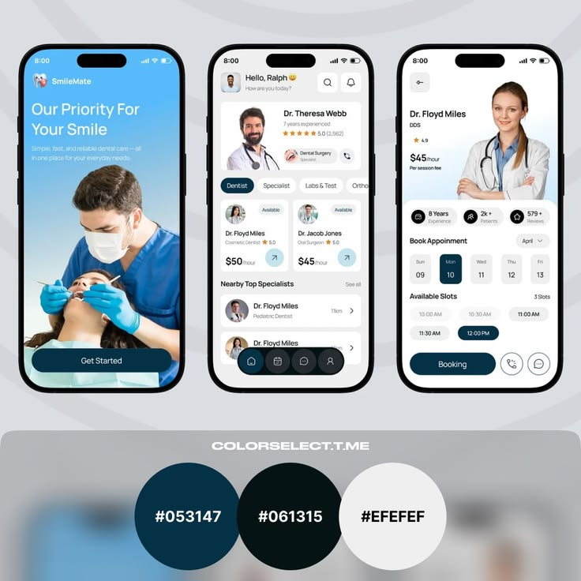
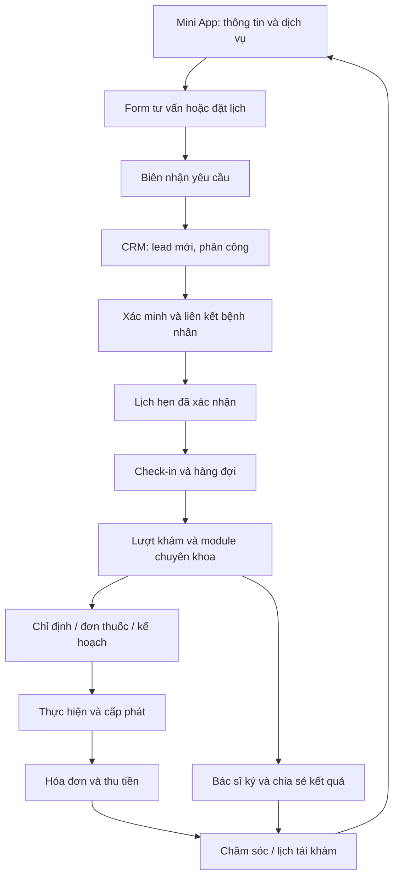
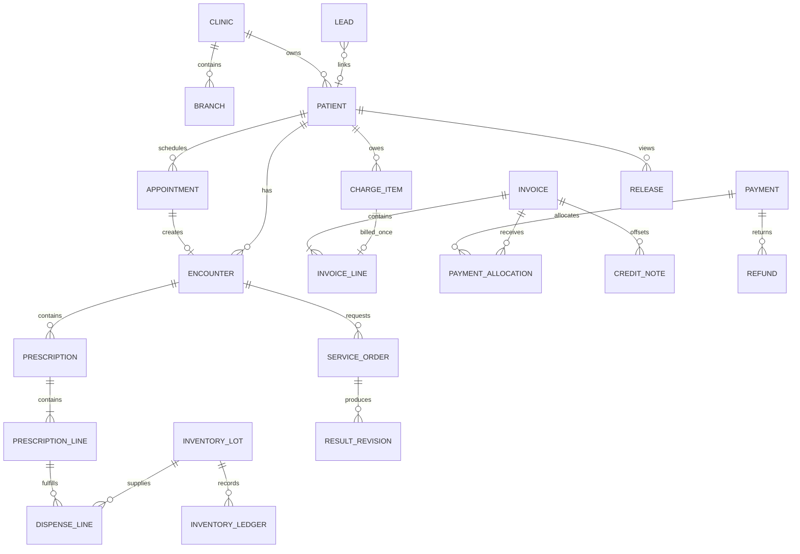

# 03 — Đặc tả Mini App + CRM phòng khám Đa khoa

> Phiên bản: 1.1 • Ngày: 2026-09-21 • Ngôn ngữ UI: tiếng Việt • Tiền tệ: VND • Múi giờ: Asia/Ho_Chi_Minh.
> Đây là đặc tả sản phẩm và phần mềm cho bản demo có backend. Quy tắc chuyên môn, danh mục thuốc, nội dung tư vấn và biểu mẫu ký phải được người phụ trách chuyên môn cấu hình trước khi vận hành thực tế. Không xây tính năng tự chẩn đoán hoặc tự chọn thuốc/liều.

## 1. Mục tiêu, phạm vi và quyết định triển khai

- Xây một hệ thống độc lập cho chuyên khoa trong tiêu đề, gồm Mini App cho bệnh nhân, CRM cho phòng khám và API dùng chung. Người triển khai chỉ cần file này; không phải đọc file chuyên khoa trước.
- Demo phải chạy xuyên suốt: xem dịch vụ → yêu cầu tư vấn/đặt lịch → tiếp nhận → xác minh bệnh nhân → khám → chỉ định/đơn thuốc → thực hiện/cấp phát → thu tiền → chia sẻ kết quả → tái khám. Dữ liệu đổi ở CRM phải xuất hiện trong Mini App sau khi tải lại.
- Ưu tiên Zalo Mini App; có bản web mobile chạy cùng luồng cho demo khi chưa có Mini App ID. Tách adapter danh tính, thông báo, tệp và thanh toán để đổi nhà cung cấp. Không dùng localStorage làm cơ sở dữ liệu nghiệp vụ.
- P0 bắt buộc: tất cả màn hình và luồng mô tả trong tài liệu, lưu DB, phân quyền server, dữ liệu giả, lịch sử thay đổi, báo cáo đối soát và test các invariant. Những phần ghi rõ P1 được phép chưa triển khai, phải có trạng thái “Chưa kết nối” nếu xuất hiện.
- P1: liên thông hệ thống bên ngoài, thanh toán thật, hóa đơn điện tử, chữ ký số có giá trị pháp lý, kết nối LIS/PACS, bảo hiểm, đa ngôn ngữ, ứng dụng native và tự động hóa marketing. Không giả lập thành trạng thái đã kết nối.
- Demo seed một phòng khám/hai chi nhánh để kiểm tra phạm vi; có clinic_id trong schema và fixture clinic thứ hai cho test cách ly. Ba hệ thống không chia sẻ bệnh nhân hoặc session dù có thể tái sử dụng thư viện code.
- Mặc định: lịch 08:00–17:00, nghỉ 12:00–13:00, thứ Hai–thứ Bảy; bước chọn giờ 15 phút; thời lượng theo dịch vụ; hold lịch 5 phút; ngưỡng nhắc việc lead 30 phút trong giờ làm; hủy tự phục vụ trước 2 giờ. Đây là cấu hình demo, không là chính sách bắt buộc cho mọi phòng khám.
- Định nghĩa hoàn tất: luồng chính và nhánh lỗi chạy được bằng thao tác UI, không sửa DB thủ công; không có nút giả thành công; đủ acceptance criteria ở cuối file.

## 2. Persona và phân công công việc

| Persona / role code | Mục tiêu | Quyền công việc chủ yếu |
|---|---|---|
| Khách chưa đăng nhập / guest | Tìm thông tin, hỏi tư vấn | Xem nội dung công khai; gửi form chống spam; không xem hồ sơ |
| Bệnh nhân / patient | Đặt lịch, theo dõi điều trị, xem giấy tờ | Chỉ dữ liệu của mình đã được chia sẻ |
| Người đại diện / guardian | Đặt lịch và theo dõi người được đại diện | Chỉ profile có liên kết đã xác minh, còn hạn và đúng phạm vi |
| Tư vấn / consultant | Xử lý liên hệ, chuyển thành lịch | Lead, ghi chú chăm sóc; không xem toàn bộ bệnh án |
| Lễ tân / receptionist | Xác minh, sắp lịch, check-in | Nhân khẩu học, lịch, hàng đợi; không sửa nội dung khám |
| Bác sĩ / doctor | Khám, lập kế hoạch, ký và chia sẻ | Hồ sơ được phân công; ký đơn/chỉ định trong chuyên môn |
| Điều dưỡng / nurse | Chuẩn bị, nhập đo đạc, hỗ trợ thực hiện | Lượt được phân công; không ký chẩn đoán/đơn thuốc |
| Dược/kho / pharmacist | Duyệt cấp phát và quản lý lô | Đơn đã ký, dị ứng liên quan, kho và phiếu cấp phát |
| Thu ngân / cashier | Thu tiền, đối soát công nợ | Hạng mục tính phí, phiếu thu/hoàn; không đọc ghi chú lâm sàng |
| Quản lý / manager | Điều phối và xem hiệu quả | Báo cáo vận hành; duyệt giảm giá/hoàn tiền; không mặc nhiên xem toàn bộ bệnh án |
| Quản trị / admin | Tài khoản, cấu hình, tích hợp | Quản trị kỹ thuật; không tự động có quyền bác sĩ |
| Kiểm soát / auditor | Kiểm tra truy cập và thay đổi | Audit được cấp; không sửa dữ liệu nghiệp vụ |

## 3. Sitemap và tiêu chuẩn giao diện

### 3.1 Mini App

```text
/mini
  /home                       Trang chủ
  /services                   Danh sách dịch vụ
  /services/:id               Chi tiết dịch vụ
  /doctors                    Bác sĩ
  /doctors/:id                Hồ sơ bác sĩ
  /contact                    Yêu cầu tư vấn
  /booking                    Wizard đặt lịch
  /requests/:id               Biên nhận yêu cầu
  /login                      Đăng nhập / xác minh
  /appointments               Lịch hẹn của tôi
  /appointments/:id           Chi tiết lịch, đổi/hủy
  /profiles                   Bản thân / người được đại diện
  /records                    Lịch sử đã chia sẻ
  /records/:id                Kết quả khám
  /prescriptions/:id          Đơn thuốc đã ký, đã chia sẻ
  /invoices/:id               Chi phí, trạng thái thanh toán
  /notifications              Thông báo
  /privacy                    Đồng ý và quản lý quyền chia sẻ
  /care                       Theo dõi chuyên khoa (mục 9)
```

### 3.2 CRM

```text
/crm
  /login, /dashboard
  /leads, /leads/:id
  /patients, /patients/:id
  /calendar, /appointments/:id, /queue
  /encounters/:id
  /orders, /orders/:id, /results/:id
  /prescriptions, /prescriptions/:id, /dispenses/:id
  /inventory, /inventory/items/:id, /inventory/receipts/new
  /inventory/transfers/:id, /inventory/counts/:id
  /billing, /invoices/:id, /payments, /refunds, /cash-sessions
  /care-tasks
  /reports, /exports
  /settings/catalogs, /settings/schedules, /settings/templates
  /settings/users, /settings/roles, /settings/integrations
  /audit
  + routes chuyên khoa tại mục 9
```

### 3.3 Quy ước UI áp dụng mọi màn hình

- Mini App tối ưu 360–430 px, điều hướng dưới: Trang chủ, Đặt lịch, Hồ sơ, Cá nhân. CRM sidebar 240 px, topbar có chi nhánh/ngày/tìm kiếm; desktop 1280–1440 px, tablet 768 px không mất hành động chính. Từng screen phải kiểm tra tại 375, 768 và 1440 px.
- Nền sáng, primary cấu hình theo thương hiệu; dùng cùng token spacing 4/8/12/16/24/32, font hệ thống, chữ nội dung tối thiểu 14 px, vùng bấm tối thiểu 44 px. Trạng thái có nhãn và biểu tượng, không chỉ dùng màu.
- Bảng: tìm kiếm debounce 300 ms, filter lưu vào URL, phân trang 25 mặc định/100 tối đa, sắp xếp ổn định theo thời gian rồi id. CSV theo đúng bộ lọc và quyền, chống công thức bắt đầu bằng =, +, -, @.
- Mọi màn hình có loading skeleton, empty state kèm CTA phù hợp, lỗi có mã request và thử lại, forbidden không lộ dữ liệu, xung đột phiên bản có tải lại/so sánh. Không bỏ dữ liệu form khi request lỗi.
- Form có nhãn, required, lỗi ngay trường và summary; focus được lỗi bằng bàn phím. Chặn double-submit, có xác nhận riêng cho ký/hủy/hoàn tiền; ghi rõ tác động. Autosave bản nháp khám mỗi 10 giây khi thay đổi, hiển thị lần lưu; chưa lưu phải cảnh báo khi rời trang.
- Thành công chỉ hiển thị sau API commit; cập nhật cache liên quan. Tải lại trang phải giữ trạng thái đã lưu. Khi offline chỉ cho xem cache không nhạy cảm; không queue offline đơn thuốc, thanh toán hoặc hồ sơ y tế.
- Chi tiết hồ sơ luôn hiện mã bệnh nhân, tên, ngày sinh và chi nhánh; thao tác ký/cấp thuốc đối chiếu hai thông tin định danh. Mọi demo có badge “DỮ LIỆU GIẢ LẬP”.

### 3.4 Yêu cầu thẩm mỹ P0 và cách sử dụng ảnh tham khảo

**Thiết kế đẹp, chuyên nghiệp và phù hợp từng phòng khám là tiêu chí nghiệm thu P0, ngang với chức năng.** AI coding agent phải thiết kế có chủ đích cho cả Mini App và CRM. Ba chuyên khoa phải có cách tổ chức nội dung, hình ảnh và thành phần nổi bật khác nhau; thay logo/màu trên cùng một trang chủ chưa đạt yêu cầu. Mỗi khách hàng trong cùng chuyên khoa cũng phải có bộ nhận diện và cấu hình bố cục riêng theo mục 3.7.



Ảnh trên là reference do người dùng cung cấp cho phong cách/bố cục; không phải màn hình đã triển khai hoặc bộ tài nguyên được cấp quyền dùng trong sản phẩm. Agent chỉ nhận file Markdown vẫn có thể triển khai từ các mô tả dưới đây; ảnh giúp đối chiếu trực quan khi có toàn bộ repo.

| Chi tiết quan sát trong ảnh | Yêu cầu chuyển thành thiết kế |
|---|---|
| Màn giới thiệu có ảnh bác sĩ thao tác lớn, tiêu đề ngắn và nút đáy | Tạo điểm nhấn bằng ảnh chất lượng, một thông điệp chính và CTA dễ tìm; ảnh/header điều chỉnh theo chuyên khoa ở mục 3.5 |
| Màn khám phá có lời chào, tìm kiếm, bác sĩ nổi bật và danh mục | Thứ bậc rõ: mục tiêu hiện tại của người dùng trước, nội dung khám phá sau; không dồn nhiều banner/carousel cạnh tranh |
| Màn bác sĩ có chân dung lớn, thông tin ngắn, chọn ngày/giờ | Hồ sơ bác sĩ là một bố cục hoàn chỉnh nối trực tiếp tới đặt lịch; thông tin thực, trạng thái slot đủ rõ |
| Thẻ bo góc, khoảng trống đều, nút tròn và màu xanh đậm trên nền sáng | Dùng hệ radius/spacing/token thống nhất; CTA có tương phản; shadow mỏng, không viền/đổ bóng dày mọi khối |
| Palette ghi trên ảnh: `#053147`, `#061315`, `#EFEFEF` | Đây là gợi ý cho Nha khoa; Da liễu/Đa khoa có palette riêng ở mục 3.5. Màu được gán vai trò semantic, không rải hex tự do trong code |

Chữ/giá/rating trong ảnh chỉ là nội dung minh họa. UI dự án dùng tiếng Việt tự nhiên và VND; không chép tên SmileMate, tên bác sĩ, đánh giá, giá USD hay watermark vào sản phẩm. Số năm kinh nghiệm, chứng chỉ, số bệnh nhân và sao đánh giá chỉ hiện khi có dữ liệu được xác minh; fixture phải gắn nhãn demo. CRM dùng cùng nhận diện với Mini App nhưng ưu tiên đọc bảng và làm việc liên tục.

### 3.5 Hướng thiết kế riêng cho chuyên khoa

**Định hướng: Đa khoa rõ ràng, tin cậy, dễ tiếp cận cho nhiều độ tuổi.** Xanh dương chuyên nghiệp, navy, trắng và teal hỗ trợ; nhấn vào tìm đúng khoa, chọn lịch, biết mình đang ở bước nào. Hình ảnh đội ngũ/cơ sở thật khi được cung cấp, icon chuyên khoa dễ hiểu có nhãn; mật độ thông tin cao hơn hai hệ thống còn lại nhưng vẫn có khoảng trắng và thứ bậc.

| Token / vai trò | Giá trị preset Đa khoa A |
|---|---|
| brand.primary / text on-primary | `#1D4ED8` / `#FFFFFF` |
| brand.accent / text on-accent | `#0F766E` / `#FFFFFF` |
| background / surface | `#F4F7FB` / `#FFFFFF` |
| text.primary / text.secondary | `#172B4D` / `#52627A` |
| surface.soft / text on-soft | `#E8F0FE` / `#173D8F` |
| border.decorative / border.control | `#D8E1EF` / `#74849B` |
| radius.card / radius.hero | `12px` / `20px` |

**Bố cục Mini App Đa khoa:**

- M01 Home: header clinic/chi nhánh → tìm dịch vụ/bác sĩ prominent → card Đặt lịch khám và Lịch hẹn của tôi → grid chuyên khoa hai cột với icon+nhãn đầy đủ → lịch gần nhất/tiến độ visit nếu có → đội ngũ/cơ sở. Hero gọn khoảng 160–200 px ở 375 px, không chiếm hết màn trước các lối vào chính.
- M02 Services: duyệt theo khoa, filter chi nhánh; có lối “Chưa biết chọn khoa” gửi nhu cầu tư vấn tới nhân viên. Không chatbot tự phân loại bệnh hoặc gán khoa từ triệu chứng. Card phân biệt phí khám/dịch vụ cận lâm sàng và thời lượng tham khảo.
- M04 Doctor: portrait nhỏ gọn bên cạnh tên/khoa/chi nhánh; nội dung chính là phạm vi dịch vụ và lịch. Có bộ lọc chuyên khoa trước danh sách bác sĩ; số lượng lớn dùng pagination/virtualization phù hợp, không carousel dài khó so sánh.
- M06 Booking: chọn profile bản thân/người được đại diện → khoa/dịch vụ → bác sĩ/ngày giờ → review; chỉ hiện profile có quyền, quan hệ đại diện đọc rõ. Hẹn đi nhiều khoa vẫn hiển thị giờ hẹn đầu và lời hướng dẫn, không hứa hoàn tất mọi khoa trong một slot.
- M17 Care: visit card có mã/ngày/cơ sở → timeline Tiếp nhận/Khám/Thực hiện chỉ định/Chờ kết quả/Hoàn tất theo dữ liệu thật → danh sách kết quả đã chia sẻ → đơn/lịch theo dõi. Kết quả pending có lời giải thích, không hiện biểu tượng tick xanh trước verified/released.

**Bố cục CRM Đa khoa:** header điều phối branch/ngày, sidebar navy gọn, workspace trắng; dashboard hàng đầu là lượt đến và hàng đợi theo khoa, các card chờ kết quả/nhân sự đặt phía sau, không áp hero marketing cho CRM. G01 Visit workspace dùng ba vùng desktop: identity và visit navigation 20%, danh sách encounter/order và nội dung 55%, task/tiến độ cần xử lý 25%; ở tablet giữ header bệnh nhân và tabs cho ba vùng. Queue hiển thị cột khoa, table gọn có thời gian chờ; kết quả xét nghiệm trình bày bảng value/unit/reference/flag, không decor làm khó đọc số. Đánh dấu việc cần xử lý bằng label/status thống nhất và assignee.

**Điểm nhận diện phải nhìn thấy:** tìm khoa ở đầu, các entry khám/lịch rõ, timeline visit và bảng điều phối nhiều phòng. Không dùng biểu tượng thành công để mô tả kết quả y tế “bình thường” khi dữ liệu mới chỉ cho biết đã trả kết quả.

**Brand fixture B cùng chuyên khoa:** phòng khám đa khoa gia đình dùng primary `#155E63`/text trắng, nền `#F6FAF8`, card 20 px, ảnh gia đình/nhân viên tư vấn. Home ưu tiên profile gia đình và lịch gần nhất, nhóm khoa dưới dạng list có mô tả ngắn thay grid; hero ảnh ngang nằm sau hành động chính. CRM sidebar sáng, dashboard bắt đầu bằng danh sách hẹn hôm nay và task chăm sóc, queue theo khoa vẫn truy cập nhanh. Khác biệt về composition, ảnh, palette/shape; vẫn là phần mềm khám chuyên nghiệp, không làm màu cảnh báo nhẹ đi theo brand.

### 3.6 Hệ thành phần, tương tác và bố cục cần triển khai

- Typography: một font sans có đầy đủ dấu tiếng Việt cho UI; dùng font hệ thống nếu chưa có font thương hiệu được cấp phép. H1 Mini App 28–32/line-height 1.2, section heading 20–24/1.3, body 16/1.5, label/table 14/1.4; CRM page title 24–28. Tối đa ba font-weight chính 400/500/600–700. Dùng tabular numerals cho tiền, tồn và thời gian. Không dùng chữ quá nhỏ như trong ảnh mẫu để nhồi nội dung.
- Grid: Mini App gutter 16–20 px; khoảng giữa section 24–32 px; CTA chính cao 48–52 px, tất cả target ≥44 px. CRM padding 24–32 px, gap 16–24 px; table row 48–56 px, header sticky. Sidebar desktop 240 px; tablet thu thành rail/drawer. Card 16–24 px radius theo palette chuyên khoa; input 12 px; dialog 20–24 px.
- Tương phản mục tiêu: text thông thường ≥4.5:1; text lớn và biên/control cần nhận biết ≥3:1. Kiểm tra cặp màu thực tế ở default/focus/selected/error; pastel là nền, dùng text tối tương ứng. Màu trang trí không dùng để truyền đạt trạng thái duy nhất.
- Component bắt buộc: ClinicHeader, ServiceCard, DoctorCard, DoctorProfileHero, DaySelector, TimeSlotButton, BookingSummary, PrimaryActionBar, PatientIdentityHeader, StatusBadge, MetricCard, FilterBar, DataTable, ClinicalTimeline, ConsentPanel, EmptyState, ErrorState, LoadingSkeleton. Có variant cho chuyên khoa/clinic thay vì copy cùng bố cục rồi đổi màu.
- DoctorCard: portrait cố định tỉ lệ 4:5 hoặc avatar phù hợp layout, tên tối đa hai dòng, chuyên môn, chi nhánh, slot gần nhất, CTA. Ảnh thiếu dùng initials/illustration trung tính có kích thước ổn định; không ảnh vỡ hoặc dùng ảnh stock như bác sĩ thật. Loading không làm nhảy layout.
- Booking: ngày hiển thị thứ+ngày, `selected` nền brand/text on-brand, `available` viền rõ, `unavailable` có nhãn/trạng thái disabled; slot cuối vừa bị đặt phải cập nhật. Summary rõ bác sĩ/dịch vụ/địa điểm/ngày giờ/giá tham khảo trước submit; “Gửi yêu cầu đặt lịch” cho requested, chỉ dùng “Lịch đã xác nhận” sau confirm.
- Thanh CTA đáy và bottom navigation có text label, vùng safe area do host cung cấp; không vẽ thanh status hoặc viền iPhone vào ứng dụng. Ở booking/detail có sticky CTA thì bố trí dưới nội dung và chừa padding đúng chiều cao, không chồng lên navigation/keyboard hoặc che dòng cuối. Trang chủ hữu ích ngay, màn welcome toàn ảnh nếu dùng phải skip được và chỉ hiện lần đầu.
- CRM table ưu tiên scan: mã/tên trái, tiền phải, status+label giữa cột riêng, action menu gọn; bulk action chỉ xuất hiện khi có selection. Patient header cố định khi cuộn, cảnh báo dị ứng và quyền chia sẻ luôn đọc được. Clinical workspace ưu tiên khoảng viết/read hơn card KPI trang trí.
- Chart/report dùng đúng câu hỏi vận hành; nhãn đơn vị/ngày rõ, legend đọc được, hover có số liệu và bảng tương đương. Không thêm biểu đồ giả/đường tăng trưởng chỉ để lấp chỗ trống. Khi chưa có dữ liệu, empty state có lời giải thích và CTA thực.
- Icon một họ nét thống nhất, stroke khoảng 1.5–2 px ở size 20–24; không trộn emoji, icon 3D và icon outline cho tác vụ. Motion 150–220 ms cho hover/focus/drawer, tôn trọng reduced-motion; không parallax/animation lặp trong quy trình khám.
- Assets: chọn ảnh giới thiệu đúng chuyên khoa, ánh sáng nhất quán, chất lượng đủ cho màn đích, crop không cắt mặt hoặc thao tác chính; alt text có nghĩa. Dùng tài sản người dùng có quyền hoặc hình minh họa được cấp phép; ghi nguồn/quyền sử dụng trong asset manifest. Ảnh bệnh án là nội dung riêng tư, không dùng cho hero/gallery marketing. Demo ưu tiên illustration/portrait placeholder có nhãn; không giả danh bác sĩ thật.
- UI copy cụ thể, chuyên nghiệp: “Đặt lịch khám”, “Xem kế hoạch điều trị”, “Tiếp nhận liên hệ”, “Lưu bản nháp”, “Ký và khóa nội dung”; thông báo lỗi nói rõ hành động có thể làm. Không dùng cam kết điều trị, số liệu tiếp thị hoặc lời giới thiệu chưa được phòng khám duyệt.

### 3.7 Mỗi phòng khám có bộ nhận diện riêng

Tạo `ClinicBrandProfile` riêng cho mỗi phòng khám, tách khỏi dữ liệu bệnh án: `clinic_id`, `brand_name`, `logo_asset_id`, `specialty_preset`, `palette`, `typography`, `shape_preset`, `imagery_style`, `tone_of_voice`, `home_sections[]`, `doctor_card_variant`, `booking_layout_variant`, `crm_density`, `approved_asset_manifest`, `version`, `status=draft/published`. Schema validate key/token và whitelist component; không cho nhập arbitrary HTML/JS/CSS qua cấu hình. Thay brand không thay permission, billing hay workflow.

1. Trước khi code màn chính, agent tạo `docs/DESIGN-BRIEF.md` cho clinic: khách hàng mục tiêu, cảm giác muốn truyền tải, thông tin nhận diện hiện có, màu/font/hình ảnh, bố cục Mini App/CRM và lý do chọn. Có thương hiệu sẵn thì tôn trọng; chưa có dùng preset trong file này, ghi “Thương hiệu demo”, tiếp tục làm việc mà không chặn tiến độ để hỏi lại.
2. Sinh `packages/ui/themes/<clinic-slug>/tokens.json` và theme mapping typed; tách semantic tokens brand/background/text/border/status, layout variants và content order. Theme published phải có phiên bản để rollback, không sửa raw database hay source mỗi lần đổi màu/logo.
3. Mỗi clinic khác trong cùng chuyên khoa phải khác có chủ đích ở ít nhất ba chiều, **trong đó ít nhất một chiều là bố cục hoặc thứ tự nội dung**: typography/shape, palette, hướng ảnh, hero composition, hierarchy dịch vụ/bác sĩ, treatment/booking entry, giọng văn. Không thay đổi vị trí hành động nguy hiểm tùy tiện để tạo khác biệt.
4. Tạo thêm một brand fixture B cùng chuyên khoa để kiểm chứng khả năng tùy biến (chỉ cấu hình design, không tạo thêm hệ thống backend ngoài phạm vi). Render home, doctor detail/booking và CRM dashboard với hai brand fixture trên cùng dữ liệu synthetic đã được phép; cung cấp ảnh đối chiếu. Chuyển fixture qua cơ chế preview chỉ có ở demo/design lab, không thêm bộ chọn clinic tùy ý vào app bệnh nhân.
5. Chi nhánh của cùng phòng khám thừa kế nhận diện clinic, chỉ đổi địa chỉ/giờ/đội ngũ theo config. Một phòng khám mới dùng profile mới; không reuse ảnh/logo/tên bệnh nhân/clinical files của clinic khác. Asset manifest phân biệt tài sản brand có thể công khai với ảnh lâm sàng private.
6. Nếu triển khai nhiều chuyên khoa, đối chiếu ba sản phẩm trên cùng kích thước: phải phân biệt được nhờ composition và nội dung đặc trưng cả khi ẩn logo; không chỉ dựa màu. Layout variants dùng component có sẵn và policy server như nhau, không nhân bản toàn bộ domain logic.

### 3.8 Nghiệm thu thiết kế và bằng chứng bàn giao

Design P0 phải có bản render thực tế từ app, không chỉ moodboard hoặc mô tả. Agent tự hoàn thiện mockup/prototype và rà soát trước khi đánh dấu màn hình hoàn tất; không mặc định mọi màn cần người dùng duyệt rồi mới làm tiếp.

| ID | Điều kiện kiểm tra | Kết quả phải đạt |
|---|---|---|
| DESIGN-AC01 | So home, bác sĩ/booking và CRM với brief mục 3.5 | Thứ bậc/ảnh/card/CTA đúng hướng chuyên khoa; các khác biệt bố cục xuất hiện trong app thực |
| DESIGN-AC02 | Render clinic fixture A và B khi tạm ẩn logo | Khác ít nhất ba chiều mục 3.7, có một chiều composition/content order; không chỉ đổi primary color |
| DESIGN-AC03 | Home/booking/profile có ảnh | Ảnh đúng chủ đề, crop không mất mặt, fallback ổn định, không tên/rating/brand sao chép từ reference; có asset manifest |
| DESIGN-AC04 | Kiểm tra typography/token trên Mini App và CRM | Cùng nhận diện, hierarchy rõ, tiền/số ngay hàng, dấu tiếng Việt đầy đủ; thành phần dùng theme tokens |
| DESIGN-AC05 | Đo màu và dùng keyboard trên form/slot/table/dialog | Cặp màu đạt mục tiêu tương phản; focus nhìn rõ, target ≥44 px; state có text/icon, không chỉ màu |
| DESIGN-AC06 | Chụp 375×812, 768×1024 và 1440×900; kiểm thêm bề ngang 360/430 | Không overflow toàn trang, cắt chữ hay che CTA; bảng rộng scroll trong vùng; safe area/keyboard không che trường nhập |
| DESIGN-AC07 | Tên dài, lịch kín, bảng 0/1/100 hàng, ảnh thiếu, API chậm/lỗi, trạng thái cấm | Vẫn gọn và đọc được; loading/empty/error/forbidden đầy đủ; không dùng nội dung bịa để lấp vùng trống |
| DESIGN-AC08 | Review màn chuyên khoa | Có bố cục chủ đạo của chuyên khoa ở mục 3.5: chart răng, workspace ảnh/liệu trình hoặc visit nhiều khoa; không thay tất cả bằng bảng CRUD giống nhau |
| DESIGN-AC09 | Thao tác booking/thu tiền/ký qua các view | CTA nói đúng trạng thái/ý nghĩa; phân cấp một primary/nhóm tác vụ, nguy hiểm tách rõ; không bỏ bước consent/guard để làm giao diện đơn giản hơn |
| DESIGN-AC10 | Kiểm tra gói bàn giao thiết kế | Có DESIGN-BRIEF.md, token/themes, component gallery, asset manifest, ảnh QA, ghi nhận vấn đề và kết quả sửa; không chỉ chụp app trong khung điện thoại |

Chấm chất lượng tối đa 100: phù hợp chuyên khoa/clinic 25; bố cục và hierarchy 25; chữ/màu/hình ảnh 20; trải nghiệm Mini App/CRM 20; độ hoàn thiện các trạng thái 10. Ngưỡng nghiệm thu đề xuất ≥85/100 và **tất cả DESIGN-AC pass**; không cho điểm cao bù lỗi chặn như cắt CTA, tương phản kém, ảnh thiếu quyền hoặc bỏ qua consent. Agent ghi bằng chứng và lý do chấm trong `docs/DESIGN-QA.md`; điểm tự chấm là công cụ review, không được tự nhận người dùng đã phê duyệt.

Bàn giao thêm `docs/design/screenshots/` (home, service/doctor, booking, patient, specialty workspace, CRM dashboard, calendar, billing), `docs/design/component-gallery/` hoặc route `/design-lab` chỉ demo, và `docs/design/asset-manifest.md`. Ưu tiên ảnh màn hình thật ở kích thước tự nhiên; mockup có khung điện thoại chỉ là ảnh trình bày bổ sung. Những yêu cầu này là đầu ra cho coding agent sau khi triển khai, không phải tuyên bố bộ đặc tả hiện đã có giao diện chạy được.

## 4. End-to-end flow và quy tắc liên kết



1. Guest đọc thông tin, gửi nhu cầu hoặc chọn dịch vụ/bác sĩ/giờ. Server nhận form với idempotency key, tạo Lead và (nếu đặt lịch) Appointment `requested`; biên nhận ghi “Đã nhận yêu cầu, đang chờ phòng khám xác nhận”. Không gọi đây là lịch đã xác nhận.
2. Consultant tiếp nhận, phân loại, ghi note có tác giả/thời gian và due_at, liên hệ. Việc gọi/chat ngoài hệ thống do nhân viên thực hiện; demo chỉ ghi kết quả liên hệ, không tự gửi tin thật.
3. Lễ tân tìm hồ sơ tương tự bằng tên/ngày sinh/điện thoại. Cùng số điện thoại chỉ gợi ý trùng, không tự gộp: trẻ em/người thân có thể dùng số của đại diện. Xác minh đúng đối tượng trước khi liên kết patient_id.
4. Confirm lịch yêu cầu khóa slot tài nguyên và gắn patient_id. Không có slot thì giữ `requested`, mời giờ khác. Walk-in cho phép lễ tân tạo bệnh nhân và appointment `confirmed` ở giờ hiện tại sau kiểm tra tài nguyên, rồi check-in.
5. Check-in tạo một Encounter và QueueTicket trong cùng transaction; retry không nhân đôi. Queue được xếp theo giờ/check-in và priority do nhân viên có quyền đặt, có lý do; không tự suy luận cấp cứu từ form.
6. Bác sĩ mở lượt, xem dị ứng/tiền sử, nhập khám và module chuyên khoa. Chẩn đoán, chỉ định và đơn thuốc đều do bác sĩ nhập/xác nhận. Hoàn tất thao tác chuyên khoa theo mục 9.
7. Chỉ định đã ký đi tới bộ phận thực hiện; đơn thuốc đã ký tới dược. Kết quả kỹ thuật viên nhập phải được người có quyền xác nhận; chia sẻ sang bệnh nhân là một hành động riêng.
8. Chi phí phát sinh thành ChargeItem đúng một lần. Thu ngân lập hóa đơn từ charge, nhận đặt cọc/thanh toán và cấp phiếu. Có thể thu trước dịch vụ theo cấu hình; tài chính không tự đóng lượt khám.
9. Ký lượt chỉ khi đủ trường bắt buộc, chỉ định còn mở đã được giải quyết hoặc có lý do chuyển follow-up; nội dung đã ký bất biến. Bác sĩ chia sẻ bản tóm tắt, đơn/kết quả được chọn, không chia sẻ ghi chú nội bộ.
10. Tạo FollowUpTask, gửi nhắc lịch qua mock adapter hoặc nhà cung cấp đã cấu hình. Bệnh nhân được mở hồ sơ của mình và đặt lịch tiếp theo; tái khám tạo Encounter mới, không ghi đè lần trước.

Nhánh lỗi phải có: từ chối quyền lấy số điện thoại → nhập tay và xác minh; gửi trùng → trả cùng biên nhận; không liên hệ được → chờ phản hồi với hẹn gọi lại; đổi lịch → đặt giờ mới atomically; không đến → no_show; bác sĩ nghỉ → phân công lại; thiếu thuốc → cấp một phần/backorder; hủy dịch vụ → credit/hoàn theo thực thu; kết quả chậm → task người chịu trách nhiệm.

## 5. Đặc tả từng màn hình Mini App

Ký hiệu `*` là bắt buộc; mọi ID lấy từ API, không cho người dùng sửa clinic_id/patient_id trong form.

| ID / route | Thành phần, dữ liệu | Hành động / điều kiện và kết quả |
|---|---|---|
| M01 `/home` | Tên/logo, chi nhánh, giờ làm, banner, dịch vụ và bác sĩ nổi bật, hotline | CTA đặt lịch/tư vấn; chi nhánh đổi danh mục và slot; không yêu cầu login để đọc |
| M02 `/services` | Tìm kiếm; category, duration_minutes, giá tham khảo, có/không nhận lịch | Filter không có kết quả có CTA xóa lọc; chỉ hiển thị dịch vụ active và publish=true |
| M03 `/services/:id` | Tên, mô tả, chuẩn bị do phòng khám duyệt, thời lượng, giá/đơn vị, bác sĩ | Đặt lịch mang service_id sang wizard; giá ghi tham khảo, hóa đơn dùng snapshot thực tế |
| M04 `/doctors` và `/:id` | Ảnh, tên, chuyên môn, giới thiệu, chi nhánh, lịch còn trống | Chọn bác sĩ chuyển wizard; không hiện lịch cá nhân/block reason nội bộ |
| M05 `/contact` | Họ tên* 2–120 ký tự, điện thoại*, nhu cầu* ≤2000, dịch vụ?, chi nhánh*, khung liên hệ?, consent_version* | Chống spam theo thiết bị/IP, không bắt chọn đồng ý marketing; chỉ gửi thành công một lần; trả biên nhận opaque |
| M06 `/booking` | Bước 1 profile*/dịch vụ*/chi nhánh*; 2 bác sĩ hoặc bất kỳ, ngày*/slot*; 3 nhu cầu, điện thoại*, đồng ý*; 4 kiểm tra | Yêu cầu đăng nhập khi đặt cho profile; hold 5 phút; hết hold cần chọn lại. Requested chưa giữ slot sau khi gửi; confirm phải recheck; trình bày rõ “Yêu cầu giờ hẹn” |
| M07 `/requests/:id` | Mã biên nhận, thời điểm, loại yêu cầu và trạng thái an toàn | Guest chỉ xem qua receipt token ngắn hạn, không lộ hồ sơ; “Chờ xác nhận” và hotline; login để theo dõi chi tiết |
| M08 `/login` | Zalo identity adapter hoặc OTP demo, thông báo sử dụng dữ liệu | Server xác thực token nhà cung cấp; OTP mock chỉ ở demo; từ chối quyền điện thoại vẫn nhập tay; không tìm hồ sơ công khai bằng số |
| M09 `/appointments` | Tabs sắp tới/đã qua, thời gian, bác sĩ, chi nhánh, trạng thái | Chỉ các profile được phép; mở chi tiết, không truy cập qua mã lịch đoán được |
| M10 `/appointments/:id` | Mã check-in opaque, lịch, hướng dẫn, trạng thái; lý do hủy? | Confirmed và còn ≥2h được hủy/đổi; requested được rút yêu cầu. Muộn hơn tạo task liên hệ; đổi lịch thành công mới giải phóng slot cũ |
| M11 `/profiles` | Tên*, ngày sinh*, giới tính tùy chọn, số đã xác minh, đại diện và quan hệ | Thêm đại diện gửi yêu cầu duyệt; không cấp quyền chỉ vì nhập cùng số. Thay đổi tên/ngày sinh đã xác minh tạo yêu cầu lễ tân duyệt |
| M12 `/records` và `/:id` | Timeline những phiên bản đã signed+released: ngày, bác sĩ, tóm tắt, kết quả được chọn | Xem/tải bản đã chia sẻ; không hiện nháp, note CRM, chi phí nội bộ. Thu hồi share làm URL mới thất bại; không hứa xóa bản đã tải |
| M13 `/prescriptions/:id` | Mã đơn, bác sĩ, ngày ký, từng dòng thuốc, cách dùng do bác sĩ nhập, trạng thái cấp phát | Chỉ đọc; đơn void hiện banner “Đã hủy”; không tự mua lại/tái cấp hoặc tự đổi liều |
| M14 `/invoices/:id` | Các dòng dịch vụ/thuốc, giảm giá, tổng, đã thu, còn nợ, phiếu thu/hoàn | Demo thanh toán có nhãn giả lập và mã giao dịch; không dùng return URL làm bằng chứng đã trả tiền |
| M15 `/notifications` | Loại, created_at, read_at, link nội bộ an toàn | Đánh dấu đọc, mở entity theo quyền hiện tại; push không chứa chẩn đoán/ảnh/đơn |
| M16 `/privacy` | Consent hiện tại/lịch sử, mục đích chăm sóc, liên hệ, ảnh và marketing độc lập | Thu hồi từng phạm vi áp dụng cho xử lý/chia sẻ tương lai; tạo yêu cầu dữ liệu/xóa để quản lý xử lý theo chính sách; không tự xóa hồ sơ đã ký |
| M17 `/care` | Nội dung chuyên khoa đã được chia sẻ, tiến độ, lịch kế tiếp | Hành động đặc thù ở mục 9; dữ liệu chỉ đọc trừ feedback/form được chỉ rõ |

## 6. Đặc tả từng màn hình CRM dùng chung

| ID / route | Dữ liệu và bố cục | Hành động / điều kiện |
|---|---|---|
| C01 `/login` | Email, mật khẩu/SSO adapter, chi nhánh được cấp | Rate limit; session có expiry; logout thu hồi; account inactive không vào được |
| C02 `/dashboard` | KPI, lịch hôm nay, lead chậm, kết quả chờ, tồn thấp; theo role | Card mở danh sách với cùng filter; định nghĩa số liệu mục 13 |
| C03 `/leads` | Bảng và Kanban: mã, tên, số mask, nguồn, nhu cầu, owner, status, due_at | Tìm kiếm, assign, đổi trạng thái hợp lệ; bulk assign tối đa 100 theo quyền; không bulk gửi tin |
| C04 `/leads/:id` | Liên hệ, attribution, timeline notes/calls/status, hồ sơ gợi ý trùng | Nhận xử lý, thêm note, follow-up, tạo/link bệnh nhân, đặt lịch, đóng lost với lý do; note lâm sàng không đặt ở đây |
| C05 `/patients` | Mã, tên, ngày sinh, phone mask, lần khám cuối, lịch tới | Tạo hồ sơ, xem cảnh báo trùng, export có quyền. Merge cần quyền riêng, xem trước quan hệ, chọn survivor và audit; không hard delete |
| C06 `/patients/:id` | Header định danh/dị ứng; tabs Tổng quan, Thông tin, Tiền sử, Lượt khám, Chuyên khoa, Đơn, Lịch, Tệp, Chi phí, Đồng ý | Mỗi tab kiểm tra quyền ở API; timeline newest first; addendum cho dữ liệu signed; quản lý liên kết đại diện có xác minh |
| C07 `/calendar` | Ngày/tuần, cột bác sĩ/phòng/tài nguyên; block nghỉ; filter dịch vụ | Tạo, kéo đổi giờ mở dialog xác nhận; check xung đột server; màu+nhãn status; không override double booking |
| C08 `/appointments/:id` | Thông tin lịch, profile, nhu cầu, hold/request, lịch sử đổi, nhắc hẹn | Confirm, check-in, reschedule, cancel, no-show đúng state; 409 giữ form; hủy phải có reason |
| C09 `/queue` | Mã lượt, giờ hẹn/đến, phòng, người phụ trách, priority, thời gian chờ | Gọi lượt, nhận khám, chuyển phòng với reason; bảng công khai chỉ mã không ghi triệu chứng/tên đầy đủ |
| C10 `/encounters/:id` | Header cảnh báo, tab SOAP/biểu mẫu chuyên khoa, chẩn đoán, chỉ định, đơn, charge, kết luận | Autosave draft; gán người phụ trách; sign kiểm tra required; complete và release tách biệt; amendment giữ bản cũ |
| C11 `/orders` và `/:id` | Hàng đợi theo loại, patient, encounter, yêu cầu, bộ phận, priority, due_at | Bác sĩ đặt/ký/hủy trước hoàn tất; bộ phận nhận/thực hiện; hủy sau thu tiền tạo yêu cầu credit; không tự refund |
| C12 `/results/:id` | Phiếu chỉ định, số đo/text/file, đơn vị, cờ bất thường do người nhập, người xác nhận | Save draft, submit review, verify, amend; release theo quyền bác sĩ; tệp chưa kiểm tra chưa cho tải |
| C13 `/prescriptions` và `/:id` | Tìm đơn theo ngày/status; form bệnh nhân/lượt, thuốc, dạng, liều, đường, tần suất, ngày dùng, SL | Bác sĩ ký; thuốc demo tách danh mục; hiển thị dị ứng và xác nhận review; void có lý do; không sửa đơn signed |
| C14 `/dispenses/:id` | Đơn signed, lượng đã cấp/còn lại, lô FEFO gợi ý, số lượng, kho | Dược xác nhận cấp theo lô; thiếu thì partial; xuất kho và tạo charge atomically; in phiếu; trả về khu cách ly |
| C15 `/inventory` và `/items/:id` | SKU, thuốc/vật tư, đơn vị cơ sở, tồn/đặt giữ/khả dụng, lô, hạn dùng, lịch sử | Catalog create/edit quyền riêng; không sửa tồn trực tiếp; ngừng dùng SKU vẫn giữ lịch sử |
| C16 `/inventory/receipts/new` | Kho*, nhà cung cấp*, mã chứng từ*, ngày*, dòng SKU*/lô*/SL*/đơn giá*, expiry theo loại | Save draft; post bắt buộc lô cho thuốc; cộng tồn một lần; chứng từ trùng cảnh báo; void sau post bằng reversal |
| C17 `/inventory/transfers/:id` | Kho đi/đến*, dòng và lô*, số lượng*, trạng thái | Draft → shipped → received; shipped vào in_transit, chưa khả dụng tại kho đến; hủy trước ship; chênh lệch nhận thành case |
| C18 `/inventory/counts/:id` | Kho, snapshot tồn, lượng đếm, chênh lệch, lý do | Khóa phạm vi lô trong lúc post count; manager duyệt chênh lệch; ghi adjustment ledger, không overwrite |
| C19 `/billing` và `/invoices/:id` | Charge chưa lập hóa đơn, snapshot giá, giảm/thuế, tổng, paid, credit, due | Draft → issue; chọn charge không trùng; discount cần đúng quyền; phiếu issued sửa bằng credit, không sửa dòng gốc |
| C20 `/payments`, `/refunds` | Phiếu thu, invoice, phương thức, amount, provider_ref, người thu, thời gian | Thu một phần; refund không quá eligible; manager approve, cashier execute; retry idempotent; trạng thái pending không tính thực thu |
| C21 `/cash-sessions` | Đầu ca, thu/hoàn tiền mặt, tồn kỳ vọng, kiểm đếm cuối, chênh lệch | Open/close một ca/người/quầy; đóng cần reason nếu lệch; không tính chuyển khoản vào quỹ tiền mặt |
| C22 `/care-tasks` | Loại, bệnh nhân/lead, owner*, due_at*, priority, status, kết quả | Open → in_progress → done/cancelled; quá hạn là cờ tính từ giờ; xử lý lỗi thông báo, tái khám, kết quả chậm |
| C23 `/reports`, `/exports` | Date range*, branch, doctor, service; summary và drilldown | Export async tối đa 100k hàng/job, link hết hạn; audit; role chỉ thấy cột được phép |
| C24 `/settings/catalogs` | Dịch vụ, SKU, bộ phận, tài nguyên, bảng giá có hiệu lực | Version danh mục; archive giữ FK; chặn duration ≤0 và giá âm |
| C25 `/settings/schedules` | Ca, nghỉ, bác sĩ–dịch vụ, phòng–dịch vụ, hiệu lực | Preview lịch bị ảnh hưởng; sửa ca không tự hủy lịch; tạo task xử lý lịch xung đột |
| C26 `/settings/templates` | Form schema version, trường bắt buộc, văn bản đồng ý, hướng dẫn | Draft/published/retired; lượt mới dùng version mới, lượt cũ giữ snapshot; không nhúng JS tùy ý |
| C27 `/settings/users`, `/roles` | User, role, branch scope, care-team scope, active | Quyền riêng để cấp vai trò; không tự nâng quyền; revoke session khi khóa tài khoản |
| C28 `/settings/integrations` | Provider, mode mock/live, trạng thái kết nối, outbox lỗi | Secret chỉ nhập, không trả về UI/log; test kết nối không gửi thông báo bệnh nhân; retry có dedupe |
| C29 `/audit` | Actor, action, entity, time, outcome, request_id; metadata đã lọc | Read only, filter và export theo quyền; không có nút xóa/sửa audit |

## 7. Trường dữ liệu và validation dùng chung

Quy ước: UUID/ULID cho ID; `?` nullable; timestamp ISO-8601 UTC, ngày sinh/hạn dùng là date; boolean không dùng null trừ dữ liệu y khoa chưa biết. `version` integer tăng mỗi mutation. Những trường không có `?` bắt buộc khi tạo, trừ trường do server sinh hoặc trường bắt buộc ở state ghi rõ. Chuỗi trim, giới hạn độ dài server; không loại dấu tiếng Việt.

| Entity | Trường chính và kiểu | Ràng buộc |
|---|---|---|
| Clinic / Branch | id, code, name, timezone, address, hotline, active | code unique trong phạm vi; branch thuộc một clinic |
| User / Membership | id, email, display_name, active; user_id, clinic_id, role_id, branch_ids | Unique email chuẩn hóa; mật khẩu hash; permission không nhận từ client |
| Lead | id, code, branch_id, full_name:string120, phone:string20, need:string2000, source:enum, service_id?, owner_id?, status, due_at?, patient_id?, loss_reason? | source=mini_app/walk_in/hotline/referral; phone normalize E.164, VN nhập 0 chuyển +84; status mới server gán new |
| LeadNote / Activity | lead_id, author_id, body:string4000, kind=note/call, outcome?, created_at | Sửa note giữ revision; không chứa đơn thuốc hoặc chẩn đoán; visibility internal |
| Patient | id, code, full_name:string120, date_of_birth:date, sex=male/female/other/unknown, phone?, email?, address?, identity_verified_at?, status=active/merged/inactive, merged_into_id? | DOB không tương lai; phone không unique; code unique clinic; không bắt CCCD cho demo |
| PatientIdentity / GuardianLink | patient_id, provider, subject_id; guardian_user_id, patient_id, relation, scope[], verified_by?, expires_at?, revoked_at? | Unique provider+subject+clinic cho identity; chỉ approved link mới có quyền; không auto link bằng phone |
| MedicalHistory / Allergy | patient_id, type, description, source, reviewed_by?, reviewed_at?; substance?, reaction?, severity?, status=unknown/none_known/present | Không coi trống là không dị ứng; tình trạng thai/tiền sử nhạy cảm là tự khai hoặc bác sĩ xác minh; truy cập theo role |
| Consent | patient_id hoặc lead_id, purpose, template_version, granted:bool, actor_id hoặc receipt_subject, captured_at, channel, evidence_ref? | Mỗi thay đổi thêm event; purpose=care/contact/photo_capture/photo_share/marketing/guardian_access; không precheck marketing |
| Appointment | id, code, patient_id? chỉ requested, lead_id?, branch_id, service_id, practitioner_id?, starts_at, ends_at, status, reason?, rescheduled_from_id? | Confirmed trở đi cần patient/practitioner/resources; end>start; requested chưa chiếm tài nguyên bền vững |
| Resource / Reservation | id, branch_id, type, capacity=1, status; appointment_id hoặc hold_id, resource_id, starts_at, ends_at | Slot chiếm cả buffer; áp dụng cho bác sĩ, phòng, ghế, thiết bị; không overlap reservation active |
| Encounter | id, patient_id, appointment_id?, branch_id, practitioner_id, specialty, status, chief_complaint?, subjective?, objective?, assessment?, plan?, signed_by?, signed_at?, template_version | Bắt buộc complaint/assessment/plan trước sign; unique appointment_id khi không null; một visit đa khoa có nhiều encounter ở mục 9 |
| Diagnosis | encounter_id, label, code?, code_system?, certainty=provisional/confirmed, is_primary | Không sinh code y khoa tự động; label bắt buộc; một primary tối đa trong lượt |
| Observation | encounter_id, code, label, value_number? / value_text?, unit?, observed_at, author_id | Chính xác một value; số phải finite; đơn vị bắt buộc với số; ngưỡng cảnh báo do chuyên môn cấu hình |
| ServiceOrder / Result | encounter_id, service_id, priority=routine/urgent, status, requester_id, due_at?; order_id, version, content, verified_by?, verified_at? | Nội dung theo schema phiên bản; không tự diễn giải kết quả; amended giữ lịch sử |
| Prescription / Line | encounter_id, prescriber_id, status, signed_at?, void_reason?; item_id, drug_name_snapshot, strength, dosage_form, dose_text, route, frequency_text, duration_days?, quantity:decimal, unit, instructions | quantity>0; đầy đủ thuốc/dạng/liều/đường/tần suất/SL/cách dùng trước ký; không suy ra duration từ quantity; nếu không xác định duration cần reason |
| Item / UnitConversion | id, sku, name, kind=drug/consumable/product, base_unit, track_lot, expiry_required, active; item_id, from_unit, factor:decimal | factor>0; không floating point cho số lượng; drug bắt buộc lot và expiry; đơn vị quy đổi snapshot trên giao dịch |
| InventoryLot / LedgerEntry | item_id, lot_code, expires_on?, warehouse_id, status, received_at; id, lot_id, quantity_delta, movement_type, source_type, source_id, actor_id | Lô unique item+lot+warehouse; quantity decimal(18,3), ledger append-only; nguồn giao dịch unique chống post trùng |
| ChargeItem | patient_id, encounter_id?, source_type, source_id, source_line_id, description, qty, unit_price_vnd, discount_vnd, tax_rate_bps, status | Unique source_type+source_id+source_line_id+charge_kind; server xác định giá; không tính phí hai lần một nguồn |
| Invoice / Line | patient_id, branch_id, number, status, issued_at?; charge_id, qty, unit_price_vnd, discount_vnd, tax_vnd, total_vnd | Tiền integer VND ≥0; issued giữ snapshot bất biến; số hóa đơn unique clinic |
| Payment / Allocation / Refund | method=cash/bank/mock_gateway, amount_vnd, status, provider_ref?, cashier_id; payment_id, invoice_id, amount_vnd; payment_id, amount_vnd, reason, approved_by?, executed_at? | Không vượt payment settled/unallocated; refund chỉ nguồn settled, trừ khoản đã refund; số tiền >0 |
| Attachment / Release | owner_type/id, object_key, mime, size_bytes, sha256, scan_status, visibility; entity_type/id, entity_version, patient_id, released_by, released_at, revoked_at? | jpg/png/pdf; ≤10MB/tệp, 20 tệp/lượt demo; file private; ký URL tối đa 5 phút và kiểm quyền mỗi lần cấp |
| FollowUpTask / Notification | subject_type/id, type, owner_id, due_at, status, result?; template_version, channel, recipient_ref, scheduled_at, state, dedupe_key | Nội dung thông báo tối thiểu; không nhúng dữ liệu y tế vào push; task bắt buộc owner |
| AuditEvent | id, clinic_id, actor_id?, action, entity_type/id?, changed_fields[], outcome, reason?, request_id, occurred_at, source_ip_hash? | Append-only; metadata không chứa raw token/OTP/nội dung bệnh án/ảnh |


Các bảng hỗ trợ cần triển khai để các luồng trên không phụ thuộc state ở frontend:

| Entity | Trường và ràng buộc bổ sung |
|---|---|
| AppointmentHold / StockReservation | owner_id/session_id, expires_at, state=active/consumed/released; hold có resource/time, stock reservation có lot_id/quantity/source_id. Unique nguồn, quantity>0; expired không khả dụng dù worker chưa dọn |
| QueueTicket / CareTeamAssignment | encounter_id, department_id?, room_id?, status, queued_at, called_at?, serving_at?, done_at?, priority, reason?; patient/encounter_id, user_id, permission_set, valid_from, valid_to? |
| Dispense / DispenseLine | prescription_id, warehouse_id, pharmacist_id, status, posted_at?; dispense_id, prescription_line_id, lot_id, quantity_base, sale_price_snapshot, reversal_of_line_id?; unique source line, không vượt remaining |
| CreditNote / CreditNoteLine | invoice_id, number, status=draft/issued/void, reason, approved_by?, issued_at?; invoice_line_id, quantity?, base_credit_vnd, tax_credit_vnd. Chỉ draft được void; issued đảo bằng chứng từ điều chỉnh mới có audit; không credit vượt phần chưa credit của dòng |
| RefundAllocation | refund_id, original_payment_allocation_id, amount_vnd; tổng bằng phần refund gắn invoice, không vượt phần allocation chưa refund; refund cọc unallocated lưu patient_credit reference riêng |
| PriceList / PriceVersion | service/item_id, branch_id, valid_from, valid_to?, unit_price_vnd, tax_rate_bps, billing_mode, charge_trigger; không overlap hiệu lực cùng đối tượng/chi nhánh; chứng từ dùng snapshot |
| CashSession | branch_id, cashier_id, register_id, opened_at, closed_at?, opening_cash_vnd, counted_cash_vnd?, expected_cash_vnd?, variance_reason?, status=open/closed; payment cash phải trỏ ca open |
| Amendment / ClinicalRevision | entity_type/id, revision_no, previous_revision_id?, content_hash, immutable_content, reason, author_id, signed_at?; unique entity+revision, release phải trỏ đúng revision |
| ExportJob / Outbox / ProcessedEvent | job: requester_id, report_key, filters, state, expires_at?, object_key?; outbox: event_id, type, aggregate_id/version, attempts, next_attempt_at; processed: consumer+event_id unique |
| MedicalHistoryReview | encounter_id, clinician_id, allergy_status, reviewed_at, information_incomplete_reason?; phải tồn tại trước sign encounter/prescription, không dùng một checkbox phía client làm bằng chứng |

Invoice có `due_on` (date, mặc định ngày issue), ChargeItem có `department_id?` snapshot; Payment có `settled_at?`, Refund có `executed_at?`; Lead có `accepted_at?`, `converted_at?`; Encounter có `started_at?`, `completed_at?`. Đây là trường nguồn cho SLA/report, không suy từ updated_at. InventoryLot có physical status `released/quarantined`; expired là cờ tính từ expires_on, in_transit là kho loại trung chuyển.

Mọi bảng nghiệp vụ có `clinic_id`, `created_at`, `created_by`, `updated_at`, `version` trừ ledger/audit chỉ tạo; FK phải kiểm tra cùng clinic bằng composite FK hoặc constraint tương đương. Enum và schema được dùng chung frontend/backend trong package contracts.

## 8. Trạng thái workflow và invariant

Không gom pipeline liên hệ, khám, thuốc và thu tiền thành một status. Bảng dưới là whitelist chuyển trạng thái; chuyển khác trả `422 INVALID_TRANSITION`. Bảng lịch sử lưu from/to/actor/reason/time trong cùng transaction với mutation.

| Đối tượng | State và chuyển hợp lệ | Actor / guard / side effect |
|---|---|---|
| Lead | new → accepted → contacted → waiting_response hoặc qualified; waiting_response → contacted/qualified; qualified → converted; new/accepted/contacted/waiting_response/qualified → lost | consultant/receptionist; accepted cần owner, waiting cần due_at; converted cần patient_id và lịch confirmed; lost cần reason. Mở lại lost → accepted do manager, có reason |
| Appointment | requested → confirmed/cancelled; confirmed → checked_in/cancelled/no_show; checked_in → in_service/cancelled; in_service → completed | receptionist confirm/cancel/check-in; doctor start/complete; confirmed cần reservations; no_show sau starts_at+15 phút; checked_in cancel chỉ khi lượt chưa bắt đầu, void encounter với reason |
| Reschedule | confirmed → confirmed hoặc requested → requested trên cùng ID | Có history old/new; confirmed chuyển atomically; checked_in/in_service không cho đổi; thực hiện lại lịch đã completed bằng appointment mới |
| QueueTicket | waiting → called → serving → done; called → waiting; waiting/called → cancelled | nurse/receptionist gọi, doctor nhận; serving theo encounter; một active ticket/lượt; chuyển phòng đóng ticket cũ và tạo ticket liên kết |
| Encounter | draft → in_progress → awaiting_results hoặc ready_to_sign; awaiting_results → in_progress/ready_to_sign; ready_to_sign → in_progress/signed; signed → completed; draft → void | doctor phụ trách; sign guard dữ liệu bắt buộc; completed không phụ thuộc trả hết nợ; signed/completed không sửa body, chỉ addendum ký riêng |
| ServiceOrder | draft → ordered → accepted → in_progress → completed; draft/ordered/accepted → cancelled; in_progress → cancelled cần reason quản lý chuyên môn | doctor order; nhân viên được phân công thực hiện; completed cần result verified hoặc procedure record signed theo loại |
| Result | draft → pending_review → verified; pending_review → draft; verified → amended (revision mới verified) | Bộ phận nhập, verifier có quyền; chia sẻ revision mới là explicit; không ghi đè revision cũ |
| Prescription | draft → signed → void; draft → discarded | doctor ký/hủy có lý do; dispense status tách not_dispensed/partial/dispensed; signed không tự trừ kho; void chặn cấp thêm, không đảo lượng đã cấp |
| Dispense | draft → posted; draft → cancelled; posted → reversed qua phiếu đảo riêng | pharmacist; transaction khóa lô, check còn hạn và SL; trả thuốc không tự vào stock khả dụng; void đơn không tự refund |
| Receipt / Adjustment | draft → posted; draft → cancelled; posted được đảo bằng chứng từ mới | kho post, manager duyệt adjustment; ledger không sửa/xóa; không tồn âm |
| Transfer | draft → shipped → received; draft → cancelled | Shipped chuyển lượng vào in_transit, received chuyển sang kho đích; partial nhận ghi số thực, phần thiếu case, không tự biến mất |
| Invoice | draft → issued → void; draft → discarded | cashier; issued không sửa; void chỉ khi chưa allocation và chưa delivery, nếu đã phát sinh dùng credit note |
| Trạng thái thanh toán suy ra | unpaid / partial / paid; credit/refund hiển thị trường riêng | Tính từ ledger, không client PATCH thành paid; invoice net có thể về 0 nhưng chưa refund thì hiện cần hoàn |
| Payment / Refund | pending → settled/failed; refund requested → approved/rejected → executed/failed (approved mới execute) | Callback đã kiểm chữ ký hoặc cashier cash; manager duyệt refund, người duyệt khác người thực hiện; unique provider_event_id |
| Notification | queued → sending → delivered/failed; failed → queued; queued → cancelled | Worker; delivered chỉ sau provider ack, demo ghi simulated; retry 1m/5m/15m tối đa 3 lần, sau đó task thủ công |

Hành động bắt đầu Encounter đồng thời chuyển Appointment checked_in → in_service và QueueTicket → serving; hoàn tất phần khám theo lịch chuyển ticket → done và appointment → completed. Đa khoa theo Visit ở mục 9: appointment gốc phản ánh phần hẹn đầu, các encounter chuyển khoa có ticket riêng. Mỗi hành động phải kiểm state nguồn, audit và version của tất cả bản ghi liên quan.

Các transaction bắt buộc: confirm/reschedule khóa tất cả tài nguyên; check-in tạo encounter+queue; dispense post tạo stock ledger+charge; invoice issue claim charge; payment settle tạo allocation; refund execute cập nhật ledger. Dùng `version`/`If-Match` khi sửa, trả 409 khi stale. Transaction và audit/outbox cùng commit; việc gửi mạng diễn ra sau commit qua worker.

## 9. Module chuyên khoa Đa khoa

### 9.1 Mục tiêu và phạm vi riêng

Điều phối một lần đến phòng khám qua nhiều phòng chuyên môn, chỉ định và kết quả, đồng thời giữ một hồ sơ bệnh nhân và một tài khoản thanh toán cho visit. P0 gồm tiếp nhận, sinh hiệu, phân luồng thủ công, nhiều encounter trong visit, xét nghiệm/chẩn đoán hình ảnh nhập tay, trả kết quả, chuyển khám nội bộ/ngoài và kế hoạch theo dõi. Các chuyên khoa seed: Nội tổng quát, Nhi, Tai Mũi Họng, Sản phụ khoa; form khác nhau nhưng không tự chỉ định khám. P1: nội trú/cấp cứu, giường bệnh, bảo hiểm và quyết toán, kết nối LIS/PACS/máy xét nghiệm, y tế doanh nghiệp, telemedicine và tự động chẩn đoán.

Không coi hệ thống là giải pháp vận hành cấp cứu. Priority trong demo do nhân viên có chuyên môn nhập; nội dung xử trí, ngưỡng sinh hiệu và checklist bệnh lý không hardcode thành quyết định y khoa.

### 9.2 Sitemap và màn hình riêng

| ID / route | Bố cục và dữ liệu | Hành động, guard và kết quả |
|---|---|---|
| G01 `/crm/visits` và `/:id` | Header patient, visit code, phòng điều phối; timeline các encounter, order, result, invoice; bảng người chịu trách nhiệm | Check-in tạo visit và encounter đầu; thêm phòng khám/chỉ định; đóng visit theo checklist; một phòng kết thúc không tự đóng toàn bộ visit |
| G02 `/crm/triage/:visitId` | Lý do đến, sinh hiệu, nguồn đo, thời điểm, priority, destination, người đánh giá | Nurse nhập, clinician xác nhận khi cần; lưu unknown cho chưa đo; không auto chẩn đoán; đổi priority phải có reason và audit |
| G03 `/crm/departments/queues` | Các cột Nội/Nhi/TMH/Sản phụ khoa/Cận lâm sàng, chờ/đang làm/xong | Chuyển nội bộ tạo referral+encounter mới; giữ mã visit; không kéo thẻ nếu thiếu assignee/phòng |
| G04 `/crm/consultations/:encounterId` | Tab form theo department, tiền sử, sinh hiệu, SOAP, diagnoses, orders, medication reconciliation | Bác sĩ chỉ sửa encounter của mình; đọc hồ sơ liên quan trong care team; sign độc lập; kết luận toàn visit do coordinator |
| G05 `/crm/diagnostics/orders` | Chỉ định theo xét nghiệm/hình ảnh/thăm dò; trạng thái mẫu và kết quả; bộ lọc priority/due_at | Nhận order đã ký; in nhãn mã mẫu giả; nhiều order cùng visit giữ order_id riêng, không ghép theo tên bệnh nhân |
| G06 `/crm/diagnostics/specimens/:id` | Mã mẫu, patient/visit/order, loại mẫu, collection time, collector, nhận/từ chối | Collect → receive/reject; reject cần lý do và tạo recollection mới; không sửa mã mẫu cũ để dùng lại |
| G07 `/crm/diagnostics/results/:id` | Bảng test/value/unit/reference text/flag, kết luận người nhập, file; reviewer | Draft, submit, verify, amend; critical flag do người có quyền đặt tạo task thông báo nội bộ; không tự release |
| G08 `/crm/imaging/results/:id` | Order, modality, body_region, performed_at, report text, PDF/ảnh private | Kỹ thuật viên nhập, doctor/verifier ký; demo viewer ảnh/PDF; không tuyên bố có PACS/DICOM nếu chưa kết nối |
| G09 `/crm/referrals` và `/:id` | Nguồn/đích, mục đích, tóm tắt được chia sẻ, mức ưu tiên, assignee, phản hồi | Internal accept tạo encounter mới trong visit; external ghi tổ chức nhận và tài liệu do bác sĩ duyệt, không tự gửi ra ngoài |
| G10 `/crm/visits/:id/reconciliation` | Các đơn đang hoạt động, thuốc tự khai, thuốc từ đơn cùng visit, người review | Bác sĩ đánh dấu continue/stop/change/review_pending và lý do; trùng item là cờ review, không tự hủy hoặc đổi liều |
| G11 `/crm/follow-up-plans/:id` | Vấn đề theo dõi, mục tiêu do bác sĩ nhập, lịch/task, owner, review date | Plan signed/released; task tái khám do nhân viên xác nhận; không tự đánh giá bệnh mạn từ đo đạc |
| G12 `/mini/care` | “Lần khám của tôi”: tiến độ phòng, kết quả đã chia sẻ, tóm tắt, đơn, hẹn tới | Hiển thị pending không nhạy cảm; bệnh nhân không thấy kết quả draft/chưa release hoặc ghi chú chuyển nội bộ |

### 9.3 Form theo khoa và trường dữ liệu

| Form | Trường có cấu trúc P0 | Quy tắc |
|---|---|---|
| Tiếp nhận/sinh hiệu | complaint, height_cm?, weight_kg?, temperature_c?, pulse_bpm?, respiratory_rate?, systolic_mmhg?, diastolic_mmhg?, spo2_pct?, measured_at, measured_by | Lưu đơn vị và người đo; spo2 0–100; height/weight>0; dữ liệu chưa đo không thành 0; khoảng cảnh báo cấu hình bởi chuyên môn |
| Nội tổng quát | onset_text, symptom_course, relevant_history, examination, diagnosis_labels, plan | Complaint/assessment/plan bắt buộc khi sign; không tự tạo diagnosis từ sinh hiệu |
| Nhi | guardian_link, reporter_relation, feeding_history?, development_note?, vaccination_history_source?, weight_kg? | Trẻ có DOB, ngày khám để hiển thị tuổi chính xác; không tự tính liều theo cân nặng; vaccination là lịch sử khai báo, không khẳng định đã tiêm khi thiếu nguồn |
| Tai Mũi Họng | ear_findings?, nose_findings?, throat_findings?, laterality?, scope_attachment_ids[] | Chọn bên khi finding có laterality; tệp riêng theo consent và quyền |
| Sản phụ khoa | reason, menstrual_history?, pregnancy_status=unknown/not_pregnant/pregnant, obstetric_history?, examination?, sensitive_note? | Các trường nhạy cảm chỉ clinical scope; không ép phụ nữ khai tình trạng thai khi không liên quan; clinician quyết định required theo form version |

| Entity | Trường bổ sung | Validation / quan hệ |
|---|---|---|
| Visit | patient_id, branch_id, originating_appointment_id?, coordinator_id, status, checked_in_at, completed_at?, completion_reason? | Một appointment đầu tối đa một visit; một visit nhiều encounter; unique patient+active visit không bắt buộc vì bệnh nhân có thể quay lại ngày khác |
| Department / Room | code, name, specialty_code, active; room_id, department_id, resources[] | Practitioner membership xác định được làm khoa nào; room resources vẫn check overlap |
| TriageAssessment | visit_id, observation_ids[], priority=routine/priority/urgent, destination_department_id, assessed_by, assessed_at, reason? | Priority khác routine bắt buộc reason; không dùng tiền thanh toán để xác định priority |
| GeneralEncounter | encounter_id, visit_id, department_id, referral_id?, form_version, responsible_doctor_id, outcome=discharge/internal_referral/external_referral/follow_up? | Một encounter một responsible doctor; encounter mới cho mỗi tư vấn khác, có thể cùng khoa; signed/complete giữ độc lập |
| DiagnosticOrder | service_order_id, visit_id, category=lab/imaging/functional, specimen_required, due_at, assigned_department_id, requester_id | Ordered phải do doctor ký; service catalog chứa schema kết quả, không tự suy test cần làm |
| Specimen / SpecimenOrder | id, barcode, specimen_type, collected_at?, collector_id?, received_at?, receiver_id?, status, rejection_reason?, replaces_specimen_id?; specimen_id, order_id | Barcode unique clinic; một mẫu có thể nhiều order tương thích cùng patient/visit; phải validate bằng catalog, không ghép tùy ý |
| DiagnosticResult / Value | order_id, specimen_id?, version, status, verified_by?, verified_at?; test_code, label, value_number? / value_text?, unit?, reference_text?, flag=unassessed/normal/abnormal/critical | Một result current revision/order; reference_text do bộ phận cung cấp, không hardcode theo tuổi; flag không auto từ số nếu chưa có rule được duyệt |
| ImagingReport | order_id, modality, body_region, performed_at, findings_text, impression_text, attachments[], verifier_id?, signed_at? | Text do chuyên môn nhập; ảnh/PDF P0; completed order cần report verified |
| Referral | visit_id, source_encounter_id, type=internal/external, target_department_id? / external_org_text?, reason, priority, summary, status, target_encounter_id? | Chính xác một target theo type; internal accept có doctor/room được phân công; unique target_encounter_id |
| MedicationReconciliation | visit_id, version, entries[{source,line_id?,reported_text?,decision,reason?}], reviewed_by?, reviewed_at?, status | Decision=continue/stop/change/review_pending; signed visit cần không review_pending hoặc documented defer; change đơn cũ bằng void/new theo quyền |
| FollowUpPlan | patient_id, visit_id, title, goals_text, owner_doctor_id, review_on, status, task_ids[], release_id? | Review date do doctor nhập; completed khi task xử lý, không auto kết luận khỏi bệnh |
| CriticalResultAck | result_id, result_version, assigned_doctor_id, notified_at?, acknowledged_at?, acknowledged_by?, action_note? | Unique result version; bác sĩ acknowledged cần note; task chưa acknowledged được escalation theo cấu hình 15 phút demo |

Quan hệ: Patient 1–N Visit; Visit 1–N Encounter/Order/Invoice; Encounter 1–N Diagnosis/Prescription/Referral; Specimen M–N Order qua SpecimenOrder; Order 1–N ResultRevision; Visit có một coordinator. Thêm visit_id? vào Invoice/Charge/Appointment; lịch chuyển phòng liên kết cùng visit khi cùng lần đến, lịch tái khám ngày khác tạo visit mới.

### 9.4 Workflow đặc thù

| Đối tượng | Chuyển trạng thái | Guard / side effect |
|---|---|---|
| Visit | registered → checked_in → in_progress → awaiting_results/ready_to_close; awaiting_results → in_progress/ready_to_close; ready_to_close → completed; registered/checked_in → cancelled | Coordinator có quyền đóng; completed khi encounters signed/completed, orders giải quyết hoặc deferred có owner+due_at, reconciliation review; tài chính độc lập |
| Triage | draft → recorded → amended bằng revision | Nurse ghi; priority thay đổi cần reason; không là chữ ký chẩn đoán |
| Specimen | expected → collected → received → processing → completed; collected/received → rejected; expected → cancelled | Rejected cần reason, creates new expected specimen replaces old; không gắn result final cho mẫu rejected |
| Referral internal | draft → ordered → accepted → completed; draft/ordered → cancelled; ordered → declined | Accept tạo encounter/queue một lần và ghi nhận check-in khoa đích; tạo phí khám theo service charge_trigger=check_in đúng một lần nếu dịch vụ standalone; completed khi encounter đích signed; declined cần reason và task nguồn |
| Referral external | draft → ordered → document_ready → handed_over → feedback_received/closed; draft/ordered → cancelled | Handed_over ghi recipient/evidence bởi nhân viên; không đồng nghĩa đã khám; closed cần reason |
| CriticalResultAck | pending → acknowledged | Doctor được assign xác nhận version hiện tại; result amended critical cần ack mới; worker overdue tạo task/escalation một lần |
| FollowUpPlan | draft → signed → active → completed/paused; paused → active/cancelled | Signed chỉ doctor; release riêng; lịch tái khám có patient/guardian authorize |

Mỗi encounter dùng trạng thái mục 8. Lịch hẹn đầu có thể completed khi phần khám theo lịch kết thúc, trong khi Visit `awaiting_results`; UI phải hiện hai nhãn riêng. Coordinator chịu trách nhiệm tổng hợp, không ký thay bác sĩ khoa khác. Kết quả đến sau khi visit completed phải tạo task follow-up, review/release phiên bản mới; không tự mở lại hoặc âm thầm thay bản tóm tắt đã ký.

### 9.5 Luồng chuyên khoa chính và ngoại lệ

1. Bệnh nhân đặt “Khám Nội tổng quát”, lễ tân xác minh, check-in tạo Visit + Encounter Nội + QueueTicket.
2. Điều dưỡng ghi sinh hiệu demo và priority routine; bác sĩ Nội nhận khám, chỉ định “Xét nghiệm DEMO” và “Chẩn đoán hình ảnh DEMO”, mỗi order có code và phụ trách riêng.
3. Lấy mẫu: in barcode DEMO, collect, receive. Kỹ thuật viên nhập kết quả text/số fixture, submit review; người có quyền verify. Kết quả hình ảnh có báo cáo và PDF placeholder.
4. Bác sĩ có thể chuyển khám Tai Mũi Họng: Referral ordered → accepted tạo Encounter thứ hai cùng Visit; bác sĩ đích ký kết luận riêng. Không tự thêm phí nếu chưa tạo charge cho lượt tư vấn mới.
5. Coordinator xem kết quả, reconcile các đơn trong visit, ký kết luận và follow-up. Release từng kết quả/tóm tắt; patient chỉ xem bản được chia sẻ.
6. Thu ngân tạo một invoice từ các charge cùng visit (hoặc nhiều invoice khi thu trước); unique charge assignment bảo đảm không trùng. Cấp phát thuốc kiểm tra tổng còn lại của từng đơn, không gộp các đơn có hoạt chất giống nhau thành một đơn mới.
7. Mẫu bị từ chối giữ barcode cũ, tạo mẫu lấy lại với liên kết; không tự thu lại phí, quyết định thêm charge cần quyền và lý do. Kết quả critical là flag nhân viên đặt: tạo task cho requester, ack theo version, escalation 15 phút demo.
8. Kết quả trả sau ngày khám: visit giữ awaiting_results hoặc complete với deferred task đã ký; trả kết quả không tự báo “bình thường”. Kết quả amended lưu revision, hủy quyền xem bản cũ hiện hành qua release pointer và chia sẻ bản mới sau review; lịch sử bản cũ vẫn thể hiện đúng quyền.

### 9.6 API chuyên khoa

| Method / path (sau `/api/v1`) | Input tối thiểu | Output / quyền |
|---|---|---|
| POST `/visits/check-in` | appointment_id, coordinator_id, expected_version | Visit + encounter + queue, idempotent; receptionist |
| GET `/visits/:id` | — | Các encounter/order/charges theo field permissions |
| POST `/visits/:id/triage` | observations[], priority, destination_department_id, reason? | Recorded assessment; nurse trong branch |
| POST `/visits/:id/encounters` | department_id, doctor_id, referral_id? | Encounter mới; doctor/coordinator có quyền |
| POST `/diagnostic-orders` | encounter_id, service_id, category, due_at | Draft; sign qua `/diagnostic-orders/:id/order` |
| POST `/specimens` | order_ids[], specimen_type | Expected specimen + barcode; validate cùng patient/visit |
| POST `/specimens/:id/transitions` | action=collect/receive/reject/start/complete/cancel, reason?, timestamp, material_usages? | State mới; collect + post actual usage cùng transaction; reject tạo recollection task, không tự đổi specimen_id kết quả |
| POST `/diagnostic-results` | order_id, specimen_id?, values[] | Draft; `/submit`, `/verify`, `/amend` là action riêng |
| POST `/imaging-reports` | order_id, modality, body_region, findings_text, impression_text, attachment_ids | Draft; `/imaging-reports/:id/verify` theo quyền chuyên môn |
| POST `/referrals` | source_encounter_id, type, target, reason, summary | Draft; `/referrals/:id/transitions` xử lý state |
| POST `/visits/:id/reconciliation` | entries[], expected_version | Draft; `/reconciliation/:id/sign` do coordinator/doctor được cấp |
| POST `/critical-result-acks/:id/acknowledge` | result_version, action_note | Ack đúng phiên bản; reject stale 409 |
| POST `/visits/:id/complete` | resolution_notes, deferred_order_tasks[], expected_version | Completed khi đủ guard, trả unresolved items nếu 422 |
| POST `/follow-up-plans` | visit_id, title, goals_text, owner_doctor_id, review_on | Draft; `/follow-up-plans/:id/sign` và `/releases` riêng |
| GET `/me/visits/:id` | profile đã authorize | Tiến độ an toàn và released records; không trả draft results |

### 9.7 Báo cáo chuyên khoa

- Visit khác Encounter: “Lượt đến” = count Visit checked_in trong ngày, “Lượt khám chuyên khoa” = count Encounter bắt đầu; tổng encounter có thể lớn hơn tổng visit. Dashboard phải ghi rõ tên chỉ số.
- Thời gian chờ khoa = started_at encounter − queued_at ticket tương ứng; median và P90 từ ticket có đủ hai thời gian; không gộp thời gian chờ xét nghiệm thành thời gian khám.
- TAT xét nghiệm = result verified_at − specimen received_at; TAT hình ảnh = report verified_at − order accepted_at; loại cancelled/rejected chưa có kết quả, hiển thị số pending riêng.
- Kết quả chưa được xác nhận nhận tin = critical ack pending; tỷ lệ hoàn tất đúng hạn = verified_at ≤ due_at / tổng orders completed có due_at, mẫu số 0 hiện N/A.
- Doanh thu theo khoa từ ChargeItem.department_id snapshot; payment allocation phân bổ xuống invoice lines theo tỷ lệ net_line, làm tròn VND theo largest remainder để tổng bằng payment amount. Tiền cọc chưa allocation không gán vào khoa.

### 9.8 Seed và demo scenario đa khoa

Seed prefix `GEN`, DEMO_NOW cấu hình mặc định 2026-09-21 09:00 +07; một clinic/hai branch, 4 departments, 4 bác sĩ, 2 điều dưỡng, 1 kỹ thuật viên, 1 người xác nhận kết quả có clinical verifier permission, 4 phòng và 1 phòng cận lâm sàng; 12 bệnh nhân giả gồm 2 trẻ có guardian link đã xác minh.

- 8 leads, 10 lịch, 6 visit, 9 encounters, 6 orders, 3 specimens (received/rejected/completed), 3 results (draft/verified/amended), 1 internal referral, 1 external referral, 1 critical ack pending.
- Catalog giá fixture: khám Nội 200.000, xét nghiệm DEMO 150.000, hình ảnh DEMO 300.000, khám TMH 200.000. Không có thuế/giảm giá trong happy path. Vật tư lấy mẫu LOT-GEN-A tồn 10, +90 ngày; LOT-GEN-X tồn 3 hết hạn.
- GEN-S01: mini booking → check-in → visit Nội → triage → chỉ định xét nghiệm/hình ảnh → mẫu collect/receive dùng 1 vật tư A → results verified → referral TMH accept/sign → coordinator reconcile/sign → invoice 850.000 → thu tiền 850.000 → release → follow-up. Kỳ vọng 1 visit, 2 encounters, 2 orders, 4 charges, 1 invoice; tồn A=9, thực thu=850.000, due=0. Thuốc không nằm trong tổng này.
- GEN-S02: specimen rejected → recollection specimen mới → kết quả gắn mẫu mới; barcode cũ giữ lịch sử, không tự thêm 150.000 lần hai.
- GEN-S03: kết quả critical do verifier đặt → pending ack → doctor ack → amend sang critical revision 2 → cần ack mới; mini chưa thấy revision 2 trước release.
- GEN-S04: bác sĩ Nội thử sửa encounter TMH không được phân công → 403; guardian trẻ 1 mở hồ sơ trẻ 2 không có link → 404/403.
- GEN-S05: còn order pending, complete visit không có deferred owner/due_at → 422; bổ sung task được coordinator ký → complete; kết quả về sau tạo review task mà không sửa summary cũ.

### 9.9 Acceptance criteria chuyên khoa

| ID | Given / When | Then |
|---|---|---|
| GEN-AC01 | Check-in một appointment retry ba lần | Một visit, một encounter đầu và một ticket, không ba bản |
| GEN-AC02 | Internal referral accepted hai lần | Chỉ một encounter đích; cùng visit/patient, đúng department và assignee |
| GEN-AC03 | Barcode mẫu của patient A dùng cho order B | 422 PATIENT_MISMATCH; không nhận kết quả vào B |
| GEN-AC04 | Specimen bị rejected và lấy lại | Mã mới liên kết mã cũ, không overwrite, chưa có thêm charge tự động |
| GEN-AC05 | Result draft hoặc verified chưa released | Patient/guardian không đọc/tải được ở mọi endpoint |
| GEN-AC06 | Critical result revision 2 xuất hiện | Ack revision 1 không đủ; task mới đúng doctor; worker retry không nhân task |
| GEN-AC07 | Một encounter completed, visit có order chưa xử lý | Visit chưa tự completed; close bắt buộc giải quyết hoặc deferred task hợp lệ |
| GEN-AC08 | Hai đơn trong visit chứa cùng item | UI đánh dấu cần bác sĩ review; không tự sửa/void/cộng liều |
| GEN-AC09 | Chạy GEN-S01 | Dashboard 1 lượt đến, 2 lượt khám, 850.000 thực thu, tồn A=9; drilldown đúng chứng từ |
| GEN-AC10 | Guardian chỉ có quyền profile trẻ 1 | Không truy cập hồ sơ trẻ 2 bằng URL, export hoặc attachment ID |

## 10. Lịch hẹn, hồ sơ, đơn thuốc và kho: quy tắc nghiệp vụ chi tiết

### 10.1 Đặt lịch và nguồn lực

- Availability = giao của ca bác sĩ, chi nhánh, dịch vụ và nguồn lực cần thiết, trừ nghỉ/bảo trì/reservations/holds còn hạn. Duration lấy từ service snapshot + buffer_before/after (mặc định 0). Khoảng dùng `[start,end)` nên lịch 09:00–09:30 không trùng 09:30–10:00 khi buffer=0.
- Giữ slot cần server clock, hold_id, expires_at. Chỉ người sở hữu hold được submit; hold hết hạn được dọn bằng worker nhưng điều kiện DB vẫn xét expires_at, không phụ thuộc worker chạy đúng lúc.
- Requested không phải booking bảo đảm. Submit release hold; confirm mới chiếm nguồn lực lâu dài. API/UX phải nói rõ lịch đề nghị có thể thay đổi. Nếu muốn auto-confirm P1, dùng cùng transaction kiểm tra tài nguyên; không chỉ đổi nhãn UI.
- Chống overlap ở DB, không chỉ frontend; khóa resources theo thứ tự ID để tránh deadlock; trùng trả 409 `SLOT_CONFLICT`. Một request nhiều tài nguyên phải thành công toàn bộ hoặc rollback.
- Đổi lịch atomically giữ slot mới, cập nhật starts/ends/reservations rồi bỏ slot cũ. Worker hủy reminders cũ và tạo mới với dedupe_key theo appointment+schedule_version+template+time; worker phải recheck schedule_version trước gửi.
- Mọi ngày hiển thị theo branch timezone, báo cáo theo ngày địa phương. DB lưu UTC. Filter ngày 2026-09-21 ở Việt Nam tương ứng `[2026-09-20T17:00Z,2026-09-21T17:00Z)`.
- Reminders demo 24h và 2h trước lịch; nếu lịch tạo muộn bỏ reminder đã qua, không gửi dồn. User hủy → cancel reminders. No-show chỉ staff xác nhận sau thời gian cấu hình, không dùng tự động để phạt.

### 10.2 Hồ sơ bệnh nhân và ký nội dung

- Tách Lead (nhu cầu/chăm sóc), Patient (con người), Appointment (thời gian), Encounter (lần khám), và Release (nội dung được bệnh nhân xem). Không chuyển nguyên note lead thành chẩn đoán.
- Gộp hồ sơ: receptionist đề nghị, manager có `patient.merge` phê duyệt, xem preview encounter/appointment/payment/guardian links; chưa xác minh thì không auto merge. Transaction chuyển các liên kết phù hợp, đánh dấu hồ sơ cũ merged; URL cũ chuyển server-side đến survivor khi người gọi có quyền.
- Merge không tự union PatientIdentity/GuardianLink để tránh cấp quyền sai người. Tạm giữ pending những link chưa xác minh, lưu mapping và audit; no hard delete. Tách/gỡ merge tự động là P1, demo chỉ có correction task và lịch sử merge đầy đủ.
- Sign yêu cầu account active, doctor assigned, đúng version, dữ liệu required, reviewed allergies, xác nhận đúng patient. Server lưu signer_id/time, hash payload và template version. Đây là khóa nội dung trong ứng dụng; không gọi là chữ ký số pháp lý.
- Sửa sau ký bằng addendum chứa reason, nội dung mới, liên kết revision gốc, tác giả và thời gian ký. Bản gốc không bị update. Release trỏ exact entity_version; thay đổi bản mới không tự chia sẻ.
- Quyền bệnh nhân xem hồ sơ yêu cầu authenticated subject + PatientIdentity/GuardianLink approved + Release còn hiệu lực. Biết số điện thoại hoặc mã bệnh nhân không đủ quyền. Export/PDF/thumbnail áp dụng cùng kiểm tra.

### 10.3 Đơn thuốc, cấp phát và truy vết

- Bác sĩ kê từ formulary clinic đã phê duyệt hoặc catalog DEMO; snapshot tên, dạng, hàm lượng, liều, đường dùng, tần suất, thời gian/cách dùng và số lượng. Không điền sẵn phác đồ, không tự tính liều từ tuổi/cân nặng.
- Dị ứng unknown cần doctor ghi đã đánh giá hoặc lý do thông tin chưa đầy đủ; có trùng chất catalog đánh dấu review, không tự thay thuốc. Tính tương tác/chống chỉ định đầy đủ chỉ P1 khi có nguồn chuyên môn được duyệt.
- Signed prescription không trừ kho. Dược tạo DispenseLine trỏ prescription_line_id + lot_id + quantity_base. `remaining = prescribed_qty - sum(posted dispenses) + sum(approved dispensing reversals)`; không dùng số thuốc trả về tự khai để tự mở lại quyền cấp.
- `dispensed_quantity` không vượt prescribed. Nếu thiếu thuốc, cho posted partial theo từng dòng, giữ outstanding; không tự đổi hoạt chất/dạng. Bác sĩ thay đơn tạo đơn mới link replaces_id và void phần chưa cấp của đơn cũ.
- Void prescription chặn cấp tiếp, không xóa lịch sử cấp, thu tiền hoặc tồn; hiển thị cảnh báo cho dược/doctor. Return về quarantine, người có quyền quyết định hủy/điều chỉnh; không mặc định tái bán.
- PDF đơn có patient, encounter, doctor, thời điểm ký, từng dòng, version và watermark DEMO. Không in token/ghi chú riêng. Thuốc seed không chứa chỉ dẫn điều trị thực tế.

### 10.4 Kho thuốc, vật tư và giao dịch

- `on_hand = sum(ledger quantity_delta)` theo item/lot/warehouse. `available = released_on_hand - active_stock_reservations`; expired/quarantined/in_transit không khả dụng. Tách phân loại chứng từ với trạng thái vật lý lô.
- FEFO: chọn lô còn hạn sớm nhất, hòa thì received_at rồi lot_id. Cho dược đổi lô còn hợp lệ với reason. Demo coi expires_on còn dùng đến hết ngày địa phương ghi trên lô; quy tắc này cấu hình được trước vận hành thật.
- Receipt post → cộng ledger; dispense/material usage post → trừ; transfer ship → trừ kho đi+cộng kho trung chuyển, receive → trừ trung chuyển+cộng kho đến. Mất mát cần adjustment được duyệt. Mọi reversal tạo ledger bù, không sửa entry.
- Tại start thủ thuật/buổi, giữ lượng vật tư dự kiến nếu có; tại ký/complete giải phóng hold và post lượng thực dùng trong một transaction. Thiếu lượng thực dùng trả 409, giữ form và yêu cầu kho xử lý; không ghi completed với tồn âm.
- Trường hợp đã sử dụng vật tư nhưng thủ thuật stopped: ghi actual_usage, post qua action riêng `record-usage`, không đợi completion; source_line_id ổn định để lần sign/complete sau không trừ lần hai. Tương tự vật tư lấy mẫu post khi collect, không chờ result verified.
- Số lượng dùng decimal base unit, conversion factor snapshot. Làm tròn quantity theo precision của item; không cho đổi factor trên chứng từ đã post. Các item có base unit viên/cái yêu cầu integer; chất lỏng cho decimal theo cấu hình.
- Alert tồn thấp khi available < reorder_point; gần hết hạn ≤30 ngày cấu hình. Dashboard đếm SKU theo warehouse, không cộng giá trị tồn expired vào available. Kiểm kê có snapshot/recount; nếu phát sinh movement sau snapshot phải reconcile hoặc khóa ngắn khi post.

## 11. Billing, công nợ và đối soát

### 11.1 Nguồn charge và thời điểm tính phí

| Nguồn | Thời điểm tạo charge | Chống trùng / ngoại lệ |
|---|---|---|
| Phí khám | Lễ tân check-in theo service snapshot | Một charge/encounter+service; hủy trước khám xử lý void/credit riêng |
| Chỉ định cận lâm sàng | Order signed/ordered | Cho thu trước; cancelled chưa thực hiện → credit request; không tạo thêm khi result verified |
| Thủ thuật lẻ | Procedure signed; có thể advance charge nếu chính sách clinic bật | Chỉ một source service line; nếu đã advance phải reconcile, không thêm full charge |
| Gói liệu trình | Khi bệnh nhân chấp thuận revision của gói, trước khi tạo invoice | Session included không charge thêm; add-on phải báo giá/chấp thuận và có source riêng |
| Thuốc | Dispense posted theo lượng thực cấp | Prescription signed chưa phải bán thuốc; mỗi dispense line tạo một charge |
| Vật tư | Nội bộ included mặc định; chỉ tính riêng khi service catalog ghi chargeable | Không cùng lúc included và standalone; ledger tiêu hao vẫn có dù không charge |
| Sản phẩm bán lẻ | Sale/issue posted | Không giả làm prescription; trả hàng có credit và stock quarantine |

Catalog service phải có `charge_trigger=check_in/order_signed/procedure_signed/package_accepted/sale_posted`, `billing_mode=standalone/included/internal`, `price_version`, `tax_rate_bps`, `department_id?`. Một item không áp dụng hai trigger; package session luôn included trừ add-on được chấp thuận. Chấp thuận gói tạo charge, issue invoice claim charge, activate course cấp entitlement; chuỗi này không phụ thuộc vòng giữa invoice và charge. Hủy revision đã chấp thuận phải xử lý charge/credit của revision cũ trước khi issue phần thay thế. Catalogue chuyên khoa seed phải khớp scenario.

### 11.2 Công thức tiền và ví dụ kiểm tra

Dùng integer VND, quantity decimal chính xác và round-half-up cho mỗi dòng; không tính tiền bằng float JavaScript thông thường. Giá demo chưa thuế, tax_rate_bps=0; đây là fixture, không là kết luận thuế cho phòng khám.

```text
gross_line = round_half_up(quantity × unit_price_vnd)
base_line = gross_line - discount_line_vnd      # 0 ≤ discount_line ≤ gross_line
tax_line = round_half_up(base_line × tax_rate_bps / 10000)
line_total = base_line + tax_line
invoice_total = sum(line_total)
net_billed = invoice_total - sum(issued_credit_note_total)
net_allocated = sum(settled_payment_allocations) - sum(executed_refund_allocations)
balance = net_billed - net_allocated
amount_due = max(balance, 0)
refundable_credit = max(-balance, 0)
net_cash_received = sum(settled_payments) - sum(executed_refunds)
```

- Không trừ credit note hai lần vào `net_allocated`; credit làm giảm nghĩa vụ trả tiền, refund làm giảm tiền giữ của bệnh nhân. Refund thông thường cần credit và không vượt refundable_credit của invoice lẫn số tiền nguồn payment còn hoàn được; hoàn khoản cọc chưa allocation dùng unallocated balance.
- Giảm toàn hóa đơn phải phân bổ về dòng theo gross còn lại bằng largest remainder để tổng discount không lệch một đồng. Manager duyệt mọi discount>0 trong demo; cashier không tự đổi giá. Tax config có version, không sửa hồi tố issued.
- Payment có thể allocation nhiều invoice cùng patient/clinic; tổng allocation ≤ payment settled. Thu trước chưa invoice tạo patient credit chưa phân bổ. Không để số tiền thừa mất khỏi ledger hoặc gán vào doanh thu hai lần.
- Invoice payment label: net_billed>0 và net_allocated=0 → unpaid; 0<net_allocated<net_billed → partial; net_allocated≥net_billed → paid. Khi net_billed=0 hiển thị “Đã bù trừ”; nếu balance<0 thêm “Cần hoàn”, không che bằng paid.
- Ví dụ: invoice 1.000.000, thu 600.000 → due 400.000. Credit 200.000 → net_billed 800.000, due 200.000. Thu tiếp 200.000 → due 0. Credit thêm 100.000 → refundable_credit 100.000; refund 100.000 → net_allocated 700.000, net_billed 700.000, due 0, refundable_credit 0.
- Payment pending/failed không tăng paid; webhook phải xác minh signature, amount, currency, invoice binding và provider event unique. Browser redirect chỉ để hiển thị, không settle. Mock gateway đi qua cùng server state machine nhưng namespace `mock_*`.

### 11.3 Kiểm soát và chứng từ

Invoice issued, payment settled, credit note issued và refund executed bất biến. Hủy sai tạo chứng từ bù có reason/approver; không xóa dòng doanh thu. PDF/phiếu demo đánh dấu “Chứng từ demo, không phải hóa đơn điện tử”. Số chứng từ server sinh theo branch/type/year/sequence, unique và concurrency-safe. Thu ngân đóng ca phải đối chiếu thu hoàn cash; chênh lệch cần reason và manager review. Các báo cáo tiền phân biệt ngày issue, ngày settle và ngày refund, không mặc định chung ngày khám.

## 12. Phân quyền, audit log và bảo vệ dữ liệu

### 12.1 Ma trận quyền tối thiểu

`R` đọc, `W` tạo/sửa nháp, `S` ký/xác nhận, `A` phê duyệt, `—` không quyền. Dấu quyền luôn kèm phạm vi clinic+branch+assignment/ownership, không là quyền toàn bộ DB.

| Nhóm dữ liệu | Patient / guardian | Consultant | Receptionist | Doctor | Nurse / technician | Pharmacist | Cashier | Manager | Admin | Auditor |
|---|---|---|---|---|---|---|---|---|---|---|
| Nội dung công khai | R | R | R | R | R | R | R | RW | RW | R |
| Lead / CRM note | Own receipt | RW | RW | Tóm tắt nhu cầu được giao | — | — | — | RWA | Cấu hình | Audit metadata |
| Patient nhân khẩu | R, request edit | Giới hạn liên hệ | RW | R | R | Tối thiểu định danh | Tối thiểu định danh | R theo việc | — | Metadata |
| Lịch / hàng đợi | Own RW theo rule | RW | RW | R, start/end | R, call/transfer | R liên quan cấp | R | RWA | Cấu hình | Metadata |
| Bệnh án / ảnh | R released | — | — | RWS assigned | RW phần được phân công | Dị ứng+đơn liên quan | — | — mặc định | — | — mặc định |
| Đơn thuốc | R released | — | — | RWS | R assigned | R + dispense | Charge only | Aggregate | — | Metadata |
| Kết quả kỹ thuật | R released | — | Trạng thái | RWS assigned | RW, S nếu có verifier riêng | — | Charge only | Aggregate | — | Metadata |
| Kho | — | — | — | R available | R, usage assigned | RW post | Giá bán cần thiết | RA adjustment | Cấu hình | R ledger |
| Billing | R own | Dự toán được chia sẻ | Trạng thái nợ | R giá công khai cần tư vấn | — | Dòng cấp phát | RW execute | RA discount/refund | Cấu hình | R ledger |
| Consent / Release | Own consent | Contact consent | Capture, verify guardian | Clinical release | Capture photo consent | — | — | Review request | Template only | Metadata |
| Role / tài khoản | Own profile | — | — | — | — | — | — | Yêu cầu cấp | RWA | R metadata |
| Audit | — | — | — | Own activity hạn chế | — | — | — | R vận hành | R kỹ thuật đã lọc | R export |

Kỹ thuật viên, labo và người xác nhận kết quả là các permission set mở rộng: `labcase.manage`, `diagnostic.write`, `diagnostic.verify`, `sterilization.release`; không cấp cả doctor để làm một việc. `clinical.release` dành cho bác sĩ được phân công. `patient.merge`, `billing.approve_refund`, `billing.execute_refund`, `clinical.read_restricted`, `audit.export` là quyền riêng. Mặc định người request/approve/execute refund phải tuân thủ ít nhất approve khác execute; fixture có hai account tách biệt.

### 12.2 Enforcement và audit

Mặc định từ chối; kiểm tra quyền trên mỗi API/object và field, kể cả export và ảnh. Đây là nền tảng áp dụng từ [OWASP Authorization Cheat Sheet](https://cheatsheetseries.owasp.org/cheatsheets/Authorization_Cheat_Sheet.html). Client ẩn nút chỉ phục vụ UX. Clinic lấy từ session/membership, không tin clinic_id gửi ở payload. SQL luôn scope, bổ sung RLS nếu stack hỗ trợ; unit/integration test phải chứng minh không đọc chéo clinic bằng ID hợp lệ.

Audit event bắt buộc cho: login fail/success, đọc hồ sơ/ảnh/đơn nhạy cảm, tạo/sửa/đổi status/assign, ký/addendum/release/revoke, export, merge, kho post/reverse, price change, thu/hoàn tiền và cấp/thu hồi quyền. Mỗi event lưu actor/action/entity/time/outcome/request_id, changed_fields và reason phù hợp. Diff nội dung lâm sàng lưu trong revision store có clinical permission, audit chỉ trỏ revision. Không lưu token, OTP, mật khẩu, ảnh và nội dung bệnh án đầy đủ trong application log; hướng dẫn tham chiếu [OWASP Logging Cheat Sheet](https://cheatsheetseries.owasp.org/cheatsheets/Logging_Cheat_Sheet.html).

Audit/ledger append-only ở application và DB role; người dùng/admin app không có API sửa/xóa. Audit của mutation cùng transaction; nếu ghi audit thất bại thì mutation rollback. Audit read thất bại phải chặn cấp dữ liệu nhạy cảm và báo lỗi có mã request, không âm thầm bỏ log. Worker và access export cũng ghi audit. Tất cả external URLs dùng allowlist provider, không nhận URL download tùy ý từ client.

### 12.3 Session, tệp và vận hành

- Staff dùng session HttpOnly/Secure/SameSite phù hợp môi trường, idle 30 phút demo, max 8h; backend vẫn enforce. Mini App token giữ theo adapter, không cất hồ sơ y tế trong localStorage; revoke guardian/account có hiệu lực ngay ở API.
- Identity provider token được backend kiểm theo tài liệu hiện hành; phone là thuộc tính liên hệ, không là khóa truy cập. Demo login chỉ có khi APP_MODE=demo, không được hoạt động với APP_MODE=production.
- Upload dùng allowlist MIME/extension, kiểm magic bytes/size/hash, quarantine tới khi scan sạch. PDF/ảnh private; serve Content-Disposition phù hợp, không thực thi file. Xóa EXIF vị trí ở derivative; original private.
- Mã hóa đường truyền, secret chỉ server và cấu hình môi trường; `.env.example` dùng giá trị giả. Không commit credentials hoặc dữ liệu bệnh nhân thật. Log hạ tầng redact request bodies nhạy cảm.
- Retention và yêu cầu xóa có config riêng cho hồ sơ, ảnh, audit, backup; không hardcode thời hạn pháp lý trong demo. Trước go-live, chủ phòng khám duyệt quyền, consent, lưu trữ, danh mục và các tích hợp áp dụng. Tài liệu không tuyên bố đạt chứng nhận pháp lý/y tế.
- Backup DB và object store đồng bộ phiên bản; demo có script tạo/restore fixture. Target vận hành đề xuất RPO 24h, RTO 4h, cần đo bằng restore drill trước dùng thật. Không chạy reset seed ngoài môi trường demo/test.

## 13. Dashboard và báo cáo

Filter chung: `[from,to)` theo ngày branch, branch_id, practitioner_id, service_id, source; có thời điểm cập nhật. Mỗi KPI có drilldown cùng điều kiện và định nghĩa mẫu số; không có dữ liệu hiển thị N/A cho tỷ lệ, 0 cho số đếm/tổng. Báo cáo phải query dữ liệu persisted, không hardcode từ seed.

| Báo cáo / KPI | Định nghĩa và nguồn | Người xem / drilldown |
|---|---|---|
| Lead mới | Count Lead.created_at trong kỳ | Consultant/manager → leads |
| Chuyển đổi lead | Leads cohort tạo trong kỳ có converted_at tính đến thời điểm report / tổng cohort; ghi as_of | Manager → cohort và lead converted; không lấy booked trong ngày chia lead mới ngày |
| SLA tiếp nhận | accepted_at − created_at theo phút trong giờ làm; median/P90 và quá 30 phút demo | Manager → owner/lead; thời gian ngoài ca không cộng SLA |
| Lịch hôm nay | Count appointments starts_at trong ngày, nhóm status, không cancelled trừ filter yêu cầu | Receptionist/doctor → calendar/list |
| No-show rate | no_show / (completed + no_show) cho cohort lịch đã đến hạn; requested/cancelled không ở mẫu số | Manager → lịch; ongoing hiển thị riêng |
| Bệnh nhân mới / quay lại | Patient có first completed encounter trong kỳ / có completed encounter kỳ này và trước kỳ | Manager → patient cohort theo quyền |
| Khám/điều trị hoàn tất | Count Encounter.completed_at; đa khoa hiển thị thêm Visit theo mục 9 | Doctor/manager → encounters |
| Giá trị hóa đơn | Tổng invoice issued theo issued_at trừ credit notes theo issued_at của credit; tên rõ “Phát sinh thuần trong kỳ” | Cashier/manager → invoices và credit notes |
| Thực thu | Sum settled payment trong kỳ − executed refund trong kỳ theo settle/execute time; cọc nằm mục riêng | Cashier/manager → payment/refund ledger |
| Công nợ tại thời điểm | Tổng max(balance,0) của từng invoice tại as_of, không chỉ invoice phát sinh trong kỳ | Cashier/manager → aging 0–7/8–30/>30 ngày kể từ due_on |
| Refund / credit | Tổng executed refund và issued credit trình bày riêng | Manager/auditor → chứng từ |
| Kho | Tồn theo lô và kho; available/reorder/expired; nhập–xuất–tồn đầu kỳ+phát sinh=cuối kỳ | Pharmacist/manager → ledger |
| Đơn chưa cấp đủ | Đơn signed không void có remaining>0; nhóm partial/not_dispensed | Pharmacist → prescription/dispense |
| Việc cần xử lý | Task open/in_progress, due_at<now; owner và age | Theo assignment → care tasks |
| Báo cáo chuyên khoa | Chỉ số, công thức và scenario ở mục 9 | Theo specialty permission |

Report export chạy background với permission snapshot nhưng recheck quyền khi tải, có schema_version/filters/as_of/row_count, link tối đa 5 phút. Dữ liệu nhạy cảm không vào báo cáo tổng quan manager nếu chưa có quyền; mask phone. Cash report bảo toàn tổng sau filter, không nhân payment khi join nhiều invoice lines.

## 14. Kiến trúc, API và data model gợi ý

### 14.1 Kiến trúc triển khai

Đề xuất TypeScript monorepo: Mini App React + Vite với Zalo adapter; CRM React; API modular monolith (NestJS hoặc framework tương đương); PostgreSQL; worker job/outbox; object storage S3-compatible. Dùng một hệ API và DB cho từng hệ thống, không microservices P0. Có thể dùng ORM phù hợp; những constraint overlap/ledger phải xuống migration DB. Chọn phiên bản dependency được hỗ trợ khi bắt đầu và khóa lockfile; tài liệu không ép phiên bản SDK chưa kiểm tra.

HTTP contract do OpenAPI 3.1 mô tả; schema form/enum dùng package contracts. Mỗi module có controller/service/repository/policy/schema. Domain service chịu transaction và invariants; UI không sửa status trực tiếp. Production provider không phải điều kiện demo hoàn tất: mock adapter có payload/status và failure simulation giống interface live.

### 14.2 Quy ước API

- Base `/api/v1`, JSON camelCase hay snake_case phải thống nhất; tài liệu này dùng snake_case cho payload. ID opaque không tuần tự trên public API. CRUD tạo qua POST, đọc GET, sửa nháp PATCH; workflow qua POST action, không generic PATCH status.
- Success `{data, meta:{request_id}}`; list `{data:[],meta:{next_cursor,total?,request_id}}`; action trả entity version mới và side-effect IDs. Cursor ổn định; filter whitelist và maximum limit=100.
- Error `{error:{code,message,field_errors?,request_id}}`; 400 format, 401 chưa login, 403 thiếu quyền, 404 không thấy/không trong scope, 409 conflict/stale/stock, 422 business validation, 429 rate limit, 503 dependency unavailable.
- `Idempotency-Key` bắt buộc cho submit contact/booking và mọi POST có side effect tài chính/kho/workflow. Unique theo clinic+actor/guest-session+route+key; cùng body trả output gốc, cùng key khác body 409. TTL response cache 24h; uniqueness chứng từ/source/provider event giữ lâu dài chống replay sau TTL.
- `If-Match: "<version>"` cho update/action trên bản ghi tồn tại; ví dụ body có expected_version được coi là alias, nếu cả hai gửi phải khớp. Chưa có version trả 428 PRECONDITION_REQUIRED; version sai trả 409 VERSION_CONFLICT.
- Server validate FK clinic, enum, permission và guards trong transaction. Không tin amount, roles, signed_by, total hoặc stock client. Rate limit demo contact 5/min/IP và 20/day/session; auth 5 fail/15m/account, không hiển thị account tồn tại.

### 14.3 Danh sách API core

| Method / endpoint | Payload/query chính | Kết quả / quyền |
|---|---|---|
| GET `/public/branches`, `/public/services`, `/public/doctors` | branch_id, q?, cursor? | Danh mục published, không dữ liệu cá nhân |
| POST `/public/leads` | full_name, phone, need, branch_id, consent, service_id? | lead receipt, status=new; rate limit và opaque token |
| GET `/public/requests/:receipt` | receipt token | Trạng thái an toàn; expires 24h, không phone đầy đủ |
| POST `/auth/mini/exchange`, `/auth/staff/login` | provider token hoặc credentials | Session; xác minh server, mock theo APP_MODE |
| POST `/auth/logout`; GET `/me` | — | Revoke; profile và permissions hiệu lực |
| GET `/me/profiles`; POST `/me/guardian-link-requests` | relation, target info | Danh sách approved; yêu cầu pending, không tự cấp |
| POST `/guardian-links/:id/verify`; POST `/:id/revoke` | evidence_ref, scope, expires_at?, reason? | receptionist có quyền verify; revocation audit |
| GET `/availability` | branch_id, service_id, practitioner_id?, date | Slots từ tất cả resource constraints |
| POST `/appointment-holds` | service_id, practitioner_id, resource_ids, starts_at | hold_id, expires_at; expiry tự kiểm ở server |
| POST `/appointments` | profile_id, branch_id, service_id, starts_at, ends_at, hold_id?, need | Requested; staff walk-in action riêng cần quyền |
| GET `/appointments`; GET `/:id` | filters/cursor | Scope theo role/owner |
| POST `/appointments/:id/confirm` | patient_id, practitioner_id, resources[], expected_version | Confirmed và reservations hoặc 409 |
| POST `/appointments/:id/reschedule` | new_starts_at, resources[], reason, expected_version | Same appointment/new version, reminders replaced |
| POST `/appointments/:id/cancel`, `/no-show` | reason, expected_version | Status và history; /no-show chỉ staff |
| POST `/appointments/:id/check-in` | expected_version | Encounter + ticket; đa khoa trả thêm visit theo adapter |
| GET `/leads`; GET `/leads/:id`; PATCH `/leads/:id` | filters hoặc thuộc tính nháp/owner | CRM scope; immutable field không sửa |
| POST `/leads/:id/transitions`, `/notes` | action/reason/due_at hoặc body/kind/outcome | Lead + history/note |
| POST `/patients`; GET `/patients`; GET/PATCH `/patients/:id` | demographics hoặc filters | Validation DOB và duplicate suggestions |
| POST `/patients/merge-preview`; POST `/patients/merge` | source_id, target_id, reason, verification_ref | Preview; execute riêng có quyền và version |
| GET/PATCH `/encounters/:id`; POST `/encounters/:id/start` | draft fields hoặc expected_version | Draft update/start theo care-team |
| POST `/encounters/:id/sign`, `/complete`, `/addenda` | expected_version, reason?/content? | Signed/completed hoặc addendum linked, không overwrite |
| POST `/service-orders`; POST `/service-orders/:id/transitions` | encounter_id, service_id, priority, due_at? hoặc action | Order + task/charge theo trigger |
| POST `/results`; POST `/results/:id/submit`, `/verify`, `/amend` | order_id/content hoặc expected_version | Revision và status, role verifier |
| POST `/prescriptions`; PATCH `/prescriptions/:id` | encounter_id, lines[], note? | Draft; bác sĩ phụ trách |
| POST `/prescriptions/:id/sign`, `/void` | expected_version, reason? | Signed hoặc void, không stock movement |
| POST `/dispenses`; POST `/dispenses/:id/post`, `/reverse` | prescription_id, warehouse_id, lines[{prescription_line_id,lot_id,quantity}] | Dispense/movement/charge IDs; pharmacist |
| GET `/inventory/balances`, `/inventory/ledger` | warehouse_id, item_id?, dates? | Ledger-backed totals, scope kho |
| POST `/inventory/receipts`, `/transfers`, `/counts`, `/adjustments` | header + lines theo entity | Draft, không đổi stock tới action post |
| POST `/inventory/:type/:id/actions` | action=post/ship/receive/approve/reverse, reason?, expected_version | Áp dụng state machine tương ứng, unique nguồn |
| POST `/material-usages/record` | procedure/session/specimen source, lines[], reason? | Usage + movements, khóa lô; retry không trừ lại |
| GET `/charges`; POST `/invoices` | patient_id, charge_ids[], due_on? | Invoice draft giá server tính |
| POST `/invoices/:id/issue`, `/void` | expected_version, reason? | Snapshot immutable, claim charge atomically |
| POST `/credit-notes`; POST `/credit-notes/:id/issue` | invoice_id, line amounts/qty, reason | Credit không vượt line eligible; approval nếu giảm giá/hoàn |
| POST `/payments`; POST `/payments/:id/settle` | patient_id, amount, method, allocations[] | Cash staff settle hoặc mock provider; không arbitrary live settle |
| POST `/refunds`; POST `/refunds/:id/approve`, `/execute` | payment_id, invoice_id?, amount, reason hoặc expected_version | Approved/executed theo segregation và eligible credit |
| POST `/webhooks/payments/:provider` | Raw provider body+signature | Verify, dedupe, settle server-side; không patient JWT |
| POST `/cash-sessions`; POST `/cash-sessions/:id/close` | opening_amount hoặc counted_cash/reason | Session và variance |
| POST `/attachments/upload-intents`; POST `/attachments/:id/finalize` | owner_type/id, mime, size, hash | Quarantine upload rồi scan state; không auto public |
| GET `/attachments/:id/download` | — | Signed URL khi current permission và scan clean |
| POST `/consents`; POST `/consents/:id/revoke` | subject, purpose, template_version, evidence? hoặc reason | Append consent event; không xóa lịch sử |
| POST `/releases`; POST `/releases/:id/revoke` | entity_type/id/version, patient_id | Release exact version; doctor scope |
| GET `/me/records`, `/me/prescriptions/:id`, `/me/invoices/:id` | profile scope | Patient-safe projection, không serialize raw entity |
| GET/POST `/care-tasks`; POST `/care-tasks/:id/transitions` | filters hoặc type/subject/owner/due_at/action | Assigned tasks, state validated |
| GET `/reports/:report_key`; POST `/exports`; GET `/exports/:id` | filters và report_key | Aggregates/job/url có quyền; không raw SQL |
| GET `/audit-events` | actor/action/entity/date/cursor | Auditor và quyền giới hạn |
| GET/POST/PATCH `/settings/:catalog` | allowlist catalog, versioned schema | admin/manager theo permission, không arbitrary table access |

Action endpoint không nêu input riêng dùng `{expected_version,reason?}` và guard tại state machine. List/detail screen dùng GET collection/GET `/:id` cho entity tương ứng; endpoint chuyên khoa chi tiết ở mục 9 là phần bắt buộc bổ sung. Generate OpenAPI phải enumerate từng route, không để path wildcard chung chung trong bản triển khai.

### 14.4 Payload ví dụ và lỗi

```json
{
  "full_name": "Bệnh nhân DEMO 01",
  "phone": "+84000000001",
  "need": "Muốn được tư vấn dịch vụ demo",
  "branch_id": "00000000-0000-4000-8000-000000000101",
  "consent": {
    "purpose": "contact",
    "granted": true,
    "template_version": "contact-v1"
  }
}
```

Phone trên là fixture cố ý không gọi được: mock adapter whitelist fixture khi APP_MODE=demo; production phải reject nếu không hợp lệ theo quy tắc nhà cung cấp. Không đặt quy tắc nới lỏng này ở form dùng chung production.

```json
{
  "data": {
    "receipt_id": "demo_receipt_opaque_01",
    "status": "new",
    "message": "Đã nhận yêu cầu, đang chờ phòng khám xác nhận"
  },
  "meta": { "request_id": "req_demo_001" }
}
```

```json
{
  "error": {
    "code": "SLOT_CONFLICT",
    "message": "Giờ này vừa được đặt. Vui lòng chọn giờ khác.",
    "field_errors": [{ "field": "starts_at", "code": "UNAVAILABLE" }],
    "request_id": "req_demo_002"
  }
}
```

Các mã cần có: `CONSENT_REQUIRED`, `PATIENT_MISMATCH`, `STOCK_INSUFFICIENT`, `LOT_EXPIRED`, `DOCUMENT_SIGNED`, `RELEASE_REQUIRED`, `INVALID_TRANSITION`, `VERSION_CONFLICT`, `DUPLICATE_SOURCE`, `REFUND_EXCEEDS_ELIGIBLE`, `RESOURCE_UNAVAILABLE`. Error không tiết lộ patient/clinic khác.

### 14.5 Mô hình quan hệ và index



ER trên là core; thêm quan hệ specialized ở mục 9 (đa khoa Appointment tạo Visit và nhiều Encounter, thay cạnh appointment–encounter thành appointment–visit–encounter). Release polymorphic phải có constraint/validation owner patient đúng entity; không cho chỉ đổi patient_id để chia sẻ nhầm.

Index tối thiểu: `(clinic_id,patient_code)` unique, `(clinic_id,phone_normalized)` non-unique, `(clinic_id,branch_id,starts_at,status)`, `(clinic_id,patient_id,created_at DESC)`, `(clinic_id,owner_id,status,due_at)`, `(clinic_id,warehouse_id,item_id,expires_on)`, `(clinic_id,invoice_id,status)`, `(clinic_id,occurred_at,action)`. Unique source cho charge/ledger, unique event cho callback, unique active reservation overlap ở DB. Không index raw nội dung nhạy cảm vào search bên ngoài.

Migration phải tạo FK/check/index/enum và seed bằng ID ổn định; test rollback. Dùng numeric/decimal cho quantity, bigint cho tiền, timestamptz cho thời gian, jsonb chỉ cho form versioned và nội dung phù hợp; không nhét toàn bộ hồ sơ/ledger vào một JSON blob. Search tiếng Việt hỗ trợ bỏ dấu ở index tìm tên nhưng lưu nguyên tên.

### 14.6 Sự kiện và tích hợp

Outbox event `{event_id,type,clinic_id,aggregate_id,aggregate_version,occurred_at,payload_ref}`. Bắt buộc: `lead.created`, `appointment.confirmed/rescheduled/cancelled`, `encounter.signed`, `prescription.signed/voided`, `dispense.posted`, `invoice.issued`, `payment.settled`, `result.verified`, `record.released`, `stock.low`, `task.overdue`. Payload không nhúng bệnh án. Worker at-least-once; consumer có processed_event unique và recheck current state; lỗi worker không rollback giao dịch đã commit.

Zalo adapter triển khai theo [cổng tài liệu Zalo Mini App chính thức](https://miniapp.zaloplatforms.com/documents/), cần kiểm tra API identity/quyền người dùng/cấu hình khi nối thật. Spec không giả định mọi tài khoản đều có sẵn quyền gửi thông báo hoặc lấy số. `IdentityProvider`, `NotificationProvider`, `PaymentProvider`, `FileStorage`, `MalwareScanner` đều có mock/live implementations và integration status.

Có thể thiết kế mapping xuất dữ liệu theo FHIR sau này. Phân biệt yêu cầu kê thuốc với việc cấp thuốc theo [HL7 FHIR R4 MedicationRequest](https://hl7.org/fhir/R4/medicationrequest.html); nội bộ Prescription chứa nhiều dòng, khi mapping FHIR cần từng MedicationRequest theo thuốc. Đây là gợi ý tương thích khái niệm, không tuyên bố API hiện tại đạt chuẩn FHIR. Các mapping khác cần profile/terminology và validation riêng trong P1.

## 15. Cấu trúc thư mục và hướng dẫn cho AI coding agent

```text
clinic-system/
  README.md
  .env.example
  package.json
  pnpm-workspace.yaml
  apps/
    mini-app/src/
      app/                  routes, auth, profile context
      features/             services, booking, records, care, billing
      adapters/             zalo, web-demo
    crm/src/
      app/                  layout, routing, session
      features/             leads, patients, calendar, encounters, specialty
      components/           patient-header, status-badge, data-table
    api/src/
      modules/              identity, crm, patients, scheduling, clinical
                            specialty, pharmacy, inventory, billing, reports
      policies/             role, ownership, clinic and branch scopes
      infrastructure/       database, files, adapters, audit
    worker/src/             outbox, reminders, exports, retries
  packages/
    contracts/              DTOs, validation, enums, OpenAPI
    ui/                     tokens, form controls, tables, dialogs, themes/<clinic-slug>
    domain/                 pure state transitions, money and quantity rules
    demo-data/              deterministic fixtures and scenario IDs
  db/
    migrations/
    seeds/
  tests/
    unit/                   states, money, permissions, quantities
    integration/            transactions, concurrency, cross-clinic, API
    e2e/                    Mini App to CRM, role access, specialty scenarios
    fixtures/               dummy images and PDFs, never real patient data
  docs/
    SPEC.md                 Copy file đặc tả này
    DESIGN-BRIEF.md          Art direction cho clinic, bố cục Mini App/CRM
    DESIGN-QA.md             Checklist DESIGN-AC, ảnh đối chiếu và kết quả
    design/                 screenshots, component gallery, asset manifest
    API.md                  How to run/open generated OpenAPI
    DEMO.md                 Accounts, scripts and expected numbers
    DECISIONS.md            Implementation choices and differences from spec
    OPERATIONS.md           Backup, restore, adapter config, limitations
  infra/
    compose.yaml            database, object storage, local app services
  scripts/
    seed-demo.*
    reset-demo.*
    verify-demo.*
```

`specialty/` chỉ chứa module cho chuyên khoa hiện tại; có thể chia domain folders theo tên ở mục 9. Không bắt người dùng chọn chuyên khoa để vào một sản phẩm chung. Tái sử dụng core bằng packages khi làm hệ thống sau, nhưng app config, database, identity và seed phải độc lập.

Trình tự bàn giao cho AI:

1. Đọc toàn file, liệt kê P0/P1 và lập checklist screen IDs + AC IDs; ghi quyết định stack vào DECISIONS.md. Không hỏi lại những mặc định đã chốt ở đây. Thiết kế là P0: thực hiện DESIGN-BRIEF và theme tại mục 3.4–3.8, làm prototype/render home, doctor/booking và workspace chuyên khoa để tự rà soát trước khi nhân rộng layout.
2. Tạo project skeleton, schema/constraints, migrations, contracts, auth/policy và seed. Cung cấp `.env.example` chạy demo không cần tài khoản dịch vụ thật.
3. Hoàn thành vertical slice M01→M07→C03/C04→C07/C08→C10 trước; dữ liệu persist thật. Thử từ hai phiên trình duyệt để chứng minh đồng bộ.
4. Xây module chuyên khoa mục 9, đơn/cấp phát/kho/billing; transaction và lỗi có thông điệp UI. Mỗi màn hình có route thật và dữ liệu thực từ DB.
5. Thêm release về Mini App, consent/guardian, báo cáo/audit và mock notifications. Không đưa quyền ký đơn/hoàn tiền vào nút demo bypass.
6. Chạy acceptance scenario, test đồng thời và phân quyền; sửa lỗi tới khi pass. Quay/chụp luồng demo tại ba kích thước và ghi số liệu đối soát.
7. Bàn giao source, lockfile, migrations, seed/reset, OpenAPI, DEMO.md, OPERATIONS.md và kết quả test. Liệt kê P1 chưa kết nối bằng tên cụ thể, không ghi “đã hoàn thành” nếu chỉ là màn hình tĩnh.

Các lệnh dự án cần cung cấp (agent có thể chọn runner khác nhưng phải ghi lệnh tương đương rõ trong README): `install`, `dev`, `db:migrate`, `db:seed`, `demo:reset`, `lint`, `typecheck`, `test`, `test:integration`, `test:e2e`, `build`. Reset phải từ chối APP_MODE khác demo/test và DB không có demo marker.

## 16. Seed, tài khoản demo và tiêu chí nghiệm thu tổng thể

### 16.1 Seed và trạng thái kiểm thử

- Scenario mục 9 chạy trên fixture reset độc lập; các bản ghi “background demo” đánh tag `background`, happy path tag `scenario_s01`. Report/verification filter branch+ngày+scenario (scenario filter chỉ demo) để số liệu kỳ vọng không bị cộng dữ liệu nền.
- Sinh account cho từng role, mỗi user một role mặc định; doctor/nurse có assignment, manager/admin tách; credentials demo sinh từ script và ghi trong DEMO.md cục bộ, không dùng mật khẩu mặc định cho production. Mock patient login có profile IDs rõ và guardian approve/revoke fixtures.
- Seed ít nhất một clinic thứ hai dành cho negative test, cùng mã patient/SKU ở clinic khác để kiểm composite scope. Seed lô còn hạn/gần hạn/hết hạn/quarantine, thuốc thiếu tồn, đơn partial, invoice partial/credit/refund, tài liệu signed/draft/released/revoked.
- Mọi timestamp theo DEMO_NOW; IDs deterministic; seed nhiều lần không nhân đôi. Reset chỉ xóa dữ liệu tenant demo đã đánh marker; khóa khi APP_MODE=production. Mock notifications có inbox, lỗi retry và delivered simulated, không gửi ra số/email thật.
- Fixture patient/ảnh/nội dung và thuốc đều giả. File PDF demo có watermark. Với thuốc DEMO, instructions ghi dữ liệu kiểm thử; scenario đo hoạt động phần mềm, không mô phỏng liều điều trị thật.

### 16.2 Acceptance criteria core

| ID | Given / When | Then / bằng chứng |
|---|---|---|
| CORE-AC01 | Hai tab Mini App/CRM; gửi contact một lần và retry cùng key | Một lead mới, cùng receipt; CRM thấy trong ≤5 giây qua refresh/poll; full reload không mất |
| CORE-AC02 | Requested chưa được confirm | Mini App chỉ hiện đang chờ; chưa coi slot là confirmed; consultant ghi note và due_at được |
| CORE-AC03 | Hai request confirm trùng doctor/resource/time chạy đồng thời | Một success, một 409; DB không có overlap; slot cũ được giữ nếu reschedule thất bại |
| CORE-AC04 | Cùng phone với hai người khác DOB | Chỉ gợi ý trùng, không auto merge/link quyền; xác minh riêng được |
| CORE-AC05 | Patient A thay ID sang patient B/clinic khác trên hồ sơ/tệp/export | Mọi endpoint từ chối, không body/URL lộ dữ liệu; audit outcome phù hợp |
| CORE-AC06 | Consultant/cashier/admin thử ký bệnh án/đơn qua API trực tiếp | 403; không signed_at, không stock/charge phát sinh |
| CORE-AC07 | Hồ sơ signed; PATCH body hoặc gửi version cũ | DOCUMENT_SIGNED hoặc VERSION_CONFLICT; addendum giữ bản gốc và release đúng version |
| CORE-AC08 | Đơn signed SL=4; cấp 2 rồi 2, retry request post | Remaining 2 rồi 0; tổng ledger -4; cấp lần ba bị chặn; signed đơn không tự trừ kho |
| CORE-AC09 | Lô expired/quarantine hoặc tồn không đủ; post dispense/material usage | Không post, không tồn âm, không charge lẻ mồ côi; transaction rollback |
| CORE-AC10 | Invoice 1.000.000, thanh toán/credit/refund theo ví dụ mục 11 | Mỗi bước balance đúng; cuối net_billed=700.000, net_allocated=700.000, due=0; ledger không mất bản gốc |
| CORE-AC11 | Hai worker xử lý cùng payment event hoặc cùng source charge | Một lần settle/charge; total không gấp đôi; cùng key khác payload 409 |
| CORE-AC12 | Patient có đơn signed nhưng chưa release; gọi list/detail/PDF | Không đọc được; doctor release đúng version thì thấy; revoke chặn URL mới |
| CORE-AC13 | Thu hồi guardian/account khi đang đăng nhập | Request tiếp bị từ chối; không đợi UI refresh để chặn quyền |
| CORE-AC14 | Hủy/đổi lịch sau khi đã xếp reminder | Reminder cũ không gửi; reminder mới một lần; mock failure retry đủ rồi tạo task |
| CORE-AC15 | Mutation nghiệp vụ thành công | Audit có actor/action/entity/time/version/request; log không có mật khẩu/token/bệnh án raw |
| CORE-AC16 | Manager xem report tiền/kho theo filter và drilldown | Tổng report bằng ledger/chứng từ; export cùng filter không vượt quyền; N/A đúng khi mẫu số 0 |
| CORE-AC17 | Form network fail, 409 hoặc 403; mobile/tablet/desktop | Có trạng thái rõ, giữ draft, keyboard dùng được; không có nút báo thành công giả |
| CORE-AC18 | Restart API/browser sau happy path | DB giữ lịch/đơn/phiếu; hai client thấy cùng trạng thái; không phụ thuộc localStorage |
| CORE-AC19 | Refund người approve cũng execute hoặc vượt eligible | Server chặn; đổi sang cashier khác/amount hợp lệ mới execute |
| CORE-AC20 | Reset seed chạy trên DB production hoặc không có demo marker | Từ chối trước khi xóa; seed demo hai lần không nhân đôi |
| CORE-AC21 | Transfer shipped nhưng chưa received | Hàng ở in_transit, không available tại kho đến; receive/retry không nhân tồn |
| CORE-AC22 | Đơn void sau đã cấp một phần | Không cấp thêm; vẫn thấy lần đã cấp và tiền/kho, không tự đảo ledger |
| CORE-AC23 | Upload file sai MIME/quá size/chưa scan | Bị reject/quarantine; không cấp download URL; ảnh/PDF hợp lệ dùng đúng scope |
| CORE-AC24 | Mọi role chạy scenario P0 và route đã liệt kê | Screen IDs M01–M17/C01–C29 và specialty có UI hoạt động; không dead-end không giải thích |

### 16.3 Test và Definition of Done

- Unit: whitelist transitions, money/credit/refund, FEFO/units, entitlement hoặc logic chuyên khoa, permission predicates.
- Integration PostgreSQL thật: overlap transactions, simultaneous dispensing, idempotent payment/charge, rollback khi stock/audit lỗi, FK cùng clinic, immutable signed documents, reminders stale version.
- E2E: happy path mục 9 + missing consent + unauthorized role + stock thiếu + partial pay/refund + retry và refresh. Chạy seed reset cho từng scenario số học; không assertion dựa vào thứ tự test trước.
- UX QA: screenshots các screen trọng tâm home/booking/lead/patient/encounter/specialty/billing/report tại 375/768/1440; font không bị cắt, bảng scroll trong container, dialog focus đúng, status có nhãn, empty/error dùng được.
- Performance target đề xuất cho demo trên môi trường được ghi rõ: 10.000 patients, 50.000 encounters, 20 staff đồng thời; API list p95 <800 ms, availability p95 <1s, report tháng <3s hoặc chuyển async. Đo bằng load script với dataset synthetic, không tuyên bố đạt nếu chưa chạy.
- DoD: lint/typecheck/build pass; CORE-AC, chuyên khoa và DESIGN-AC01–10 pass; brief/theme/ảnh QA bàn giao đủ; OpenAPI khớp routes và payload; không credentials/PHI trong repo; demo reset/replay thành công; có hướng dẫn mở hai client; dashboard reconcile đúng số; limitations P1 ghi rõ. Không yêu cầu test tích hợp live nếu chưa có provider credentials, nhưng mock phải kiểm cả lỗi/retry.

## 17. Nguồn tham khảo và ranh giới áp dụng

Tài liệu này là quyết định thiết kế sản phẩm cho dự án, không sao chép chuẩn bệnh án hay phác đồ. Các nguồn đã kiểm tra ngày 2026-09-21 chỉ hỗ trợ các điểm ghi rõ:

- [Zalo Mini App — tài liệu chính thức](https://miniapp.zaloplatforms.com/documents/): điểm bắt đầu để agent kiểm tra SDK và tích hợp khi triển khai; không cam kết ứng dụng đã được Zalo duyệt.
- [OWASP — Authorization](https://cheatsheetseries.owasp.org/cheatsheets/Authorization_Cheat_Sheet.html): deny-by-default và kiểm tra quyền ở server.
- [OWASP — Logging](https://cheatsheetseries.owasp.org/cheatsheets/Logging_Cheat_Sheet.html): thiết kế log bảo mật và tránh ghi bí mật/dữ liệu nhạy cảm.
- [HL7 FHIR R4 — MedicationRequest](https://hl7.org/fhir/R4/medicationrequest.html): phân biệt yêu cầu thuốc với cấp phát; mapping bên ngoài thuộc P1.

Các giá, lịch làm việc, timeout, SLA, ngưỡng cảnh báo vận hành và quy trình phê duyệt là mặc định demo đề xuất. Những nội dung lâm sàng, thuế, quy định dữ liệu và chữ ký cần được chủ phòng khám/chuyên gia phù hợp xác nhận cho môi trường thật; không tự gắn nhãn tuân thủ khi chưa có đánh giá.
